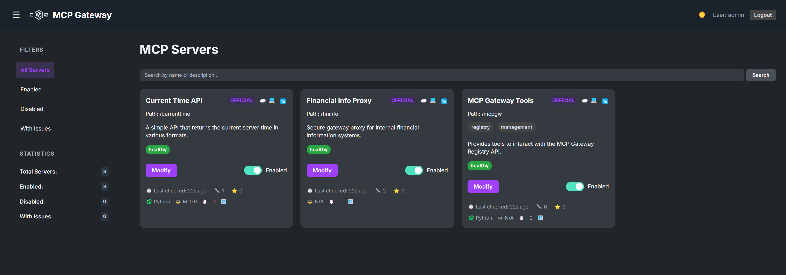

# MCP Gateway & Registry

[Model Context Protocol (MCP)](https://modelcontextprotocol.io/introduction) is an open standard protocol that allows AI Models to connect with external systems, tools, and data sources. While MCP simplifies tool access for Agents and solves data access and internal/external API connectivity challenges, several critical obstacles remain before enterprises can fully realize MCP's promise.

**Discovery & Access Challenges:**
- **Service Discovery**: How do developers find and access approved MCP servers?
- **Governed Access**: How do enterprises provide secure, centralized access to curated MCP servers?
- **Tool Selection**: With hundreds of enterprise MCP servers, how do developers identify the right tools for their specific agents?
- **Dynamic Discovery**: How can agents dynamically find and use new tools for tasks they weren't originally designed for?

The MCP Gateway & Registry solves these challenges by providing a unified platform that combines centralized access control with intelligent tool discovery. The Registry offers both visual and programmatic interfaces for exploring available MCP servers and tools, while the Gateway ensures secure, governed access to all services. This enables developers to programmatically build smarter agents and allows agents to autonomously discover and execute tools beyond their initial capabilities.

| Resource | Link |
|----------|------|
| **Demo Video** | _coming soon_ |
| **Blog Post** | [How the MCP Gateway Centralizes Your AI Model's Tools](https://community.aws/content/2xmhMS0eVnA10kZA0eES46KlyMU/how-the-mcp-gateway-centralizes-your-ai-model-s-tools) |

You can deploy the gateway and registry on Amazon EC2 or Amazon EKS for production environments. Jump to [installation on EC2](#installation-on-ec2) or [installation on EKS](#installation-on-eks) for deployment instructions.

## What's New

* **IdP Integration with Amazon Cognito:** Complete identity provider integration supporting both user identity and agent identity modes
* **Fine-Grained Access Control (FGAC) for MCP servers and tools:** Granular permissions system allowing precise control over which agents can access specific servers and tools
* **Integration with [Strands Agents](https://github.com/strands-agents/sdk-python):** Enhanced agent capabilities with the Strands SDK
* **Dynamic tool discovery and invocation:** User agents can discover new tools through the registry and have limitless capabilities
* **[Installation on EKS](#installation-on-eks):** Deploy on Kubernetes for production environments

## Architecture

The Gateway works by using an [Nginx server](https://docs.nginx.com/nginx/admin-guide/web-server/reverse-proxy/) as a reverse proxy, where each MCP server is handled as a different _path_ and the Nginx reverse proxy sitting between the MCP clients (contained in AI Agents for example) and backend server forwards client requests to appropriate backend servers and returns the responses back to clients. The requested resources are then returned to the client.

The MCP Gateway provides a single endpoint to access multiple MCP servers and the Registry provides discoverability and management functionality for the MCP servers that an enterprise wants to use. An AI Agent written in any framework can connect to multiple MCP servers via this gateway, for example to access two MCP servers one called `weather`,  and another one called `currenttime` and agent would create an MCP client pointing `https://my-mcp-gateway.enterprise.net/weather/` and another one pointing to `https://my-mcp-gateway.enterprise.net/currenttime/`.  **This technique is able to support both SSE and Streamable HTTP transports**. 


## Features

*   **MCP Tool Discovery:** Enables automatic tool discovery by AI Agents and Agent developers. Fetches and displays the list of tools (name, description, schema) based on natural language queries (e.g. _do I have tools to get stock information?_).
*   **Unified access to a governed list of MCP servers:** Access multiple MCP servers through a common MCP gateway, enabling AI Agents to dynamically discover and execute MCP tools.
*   **Service Registration:** Register MCP services via JSON files or the web UI/API.
*   **Web UI:** Manage services, view status, and monitor health through a web interface.
*   **Authentication:** Secure login system for the web UI and API access.
*   **Health Checks:**
    *   Periodic background checks for enabled services (checks `/sse` endpoint).
    *   Manual refresh trigger via UI button or API endpoint.
*   **Real-time UI Updates:** Uses WebSockets to push health status, tool counts, and last-checked times to all connected clients.
*   **Dynamic Nginx Configuration:** Generates an Nginx reverse proxy configuration file (`registry/nginx_mcp_revproxy.conf`) based on registered services and their enabled/disabled state.
*   **Service Management:**
    *   Enable/Disable services directly from the UI.
    *   Edit service details (name, description, URL, tags, etc.).
*   **Filtering & Statistics:** Filter the service list in the UI (All, Enabled, Disabled, Issues) and view basic statistics.
*   **UI Customization:**
    *   Dark/Light theme toggle (persisted in local storage).
    *   Collapsible sidebar (state persisted in local storage).
*   **State Persistence:** Enabled/Disabled state is saved to `registry/server_state.json` (and ignored by Git).

## Prerequisites

*   **Amazon EC2 Instance:** An Amazon EC2 machine (`ml.t3.2xlarge`) with a standard Ubuntu AMI for running this solution.

*   **SSL Certificate Options:**
    - **Production Deployments:** SSL certificate is preferred for secure communication to the Gateway
    - **Testing/Development:** Can use localhost when running on EC2, or EC2 domain name for testing
    - **Default Configuration:** Gateway is available over HTTP for development

*   **Security Group Configuration:** Configure your EC2 security group based on your deployment scenario:
    - **HTTPS with SSL certificate:** Only port **443** needs to be opened
    - **HTTP with EC2 domain name:** Only port **80** needs to be opened
    - **HTTP with localhost (port forwarding):** Ports **80**, **7860**, and **8888** need to be opened

*   **External API Keys (Optional):** One of the example MCP servers uses the [`Polygon`](https://polygon.io/stocks) API for stock ticker data. Get an API key from [here](https://polygon.io/dashboard/signup?redirect=%2Fdashboard%2Fkeys). The server will still start without the API key but you will get a 401 Unauthorized error when using the tools provided by this server.

*   **Authentication Setup:** Setup authentication using Amazon Cognito as per instructions [here](docs/auth.md).

## Installation

### Installation on EC2

The Gateway and Registry are deployed using Docker Compose with separate containers for each service, providing a scalable and maintainable architecture.

#### Docker Compose Architecture

The deployment includes these containers:
- **Nginx Reverse Proxy**: Routes requests to appropriate services and handles SSL termination
- **Auth Server**: Handles authentication with Amazon Cognito and GitHub OAuth
- **Registry MCP Server**: Provides service discovery, management, and the web UI
- **Example MCP Servers**:
  - Current Time server (port 8000)
  - Financial Info server (port 8001)
  - Real Server Fake Tools server (port 8002)
  - MCP Gateway server (port 8003)

#### Quick Start Installation

1.  **Clone the repository:**
    ```bash
    git clone https://github.com/agentic-community/mcp-gateway-registry.git
    cd mcp-gateway-registry
    ```

2. **Configure environment variables:**
   ```bash
   # Copy the template and edit with your values
   cp .env.template .env
   nano .env  # or use your preferred editor
   ```
   
   **Required configuration in `.env`:**
   - `ADMIN_PASSWORD`: Set to a secure password (replace "your-secure-password-here")
   - `COGNITO_USER_POOL_ID`: Your AWS Cognito User Pool ID
   - `COGNITO_CLIENT_ID`: Your Cognito App Client ID
   - `COGNITO_CLIENT_SECRET`: Your Cognito App Client Secret
   - `AWS_REGION`: AWS region where your Cognito User Pool is located
   
   **Optional configuration:**
   - `POLYGON_API_KEY`: For financial data tools (get from [Polygon.io](https://polygon.io/dashboard/signup))
   - `SECRET_KEY`: Auto-generated by build script if not provided

3. **Deploy with the build and run script:**
   ```bash
   ./build_and_run.sh
   ```
   
   The script will:
   - Validate your `.env` configuration
   - Generate `SECRET_KEY` if not provided
   - Build all Docker images using Docker Compose
   - Start all services in the correct order
   - Verify service health and display status

4. **Access the Registry:**
   Navigate to `http://localhost:7860` and you will have two authentication options:
   
   **Option 1 - Amazon Cognito (Recommended for Production):**
   - Click "Login with Cognito" to authenticate via your configured Cognito User Pool
   - Access permissions will be based on the Cognito group you are a member of
   - Provides fine-grained access control based on your organizational roles
   
   **Option 2 - Username/Password (Testing Only):**
   - Use the traditional login with:
     - **Username:** Value of `ADMIN_USER` (default: admin)
     - **Password:** Value of `ADMIN_PASSWORD` from your `.env` file
   - Provides admin access by default
   - **Note:** This approach should only be used for testing and will soon require setting `ENABLE_DEV_MODE=true` in your `.env` file

   

#### Post-Installation

1. **View logs from all services:**
   ```bash
   # View logs from all services
   docker-compose logs -f
   
   # View logs from a specific service
   docker-compose logs -f registry
   docker-compose logs -f auth-server
   ```

2. **View MCP server metadata:**
   Metadata about all MCP servers is available in `/opt/mcp-gateway/servers` directory. The metadata includes information gathered from `ListTools` as well as information provided during server registration.

3. **Test the Gateway and Registry:**
   The repo includes a test agent that can connect to the Registry to discover tools and invoke them:

   ```bash
   python agents/agent.py --mcp-registry-url http://localhost/mcpgw/sse --message "what is the current time in clarksburg, md"

   # With Strands agent
   # python agents/strands_agent.py --mcp-registry-url http://localhost/mcpgw/sse --message "what is the current time in clarksburg, md"
   ```

   You can also run the full test suite:

   ```bash
   python agents/test_suite.py --mcp-registry-url http://localhost/mcpgw/sse
   # With Strands agent
   # python agents/test_suite.py --mcp-registry-url http://localhost/mcpgw/sse --use-strands
   ```

   Test results are available in the `agents/test_results` folder with accuracy metrics and detailed logs.

#### Running the Gateway over HTTPS

For production deployments with SSL certificates:

1. **Configure Security Group:** Enable access to TCP port 443 from the IP addresses of your MCP clients in the inbound rules of your EC2 instance's security group.

2. **Prepare SSL Certificates:** You need an HTTPS certificate and private key for your domain. For example, if you use `your-mcp-gateway.com` as the domain, you'll need an SSL certificate for `your-mcp-gateway.com`. MCP servers behind the Gateway will be accessible as `https://your-mcp-gateway.com/mcp-server-name/sse`.

3. **Place SSL Certificates:** Copy your SSL certificates to `/home/ubuntu/ssl_data/` on your EC2 instance:
   ```bash
   sudo mkdir -p /home/ubuntu/ssl_data/certs
   sudo mkdir -p /home/ubuntu/ssl_data/private
   # Copy your certificate and private key files to these directories
   ```

4. **Deploy with HTTPS:** Run the deployment script as normal:
   ```bash
   ./build_and_run.sh
   ```
   
   The Docker Compose configuration automatically mounts the SSL certificates from `/home/ubuntu/ssl_data` to the appropriate container paths.

5. **Access via HTTPS:** Your services will be available at:
   - Main interface: `https://your-domain.com`
   - Registry API: `https://your-domain.com:7860` (if port 7860 is opened in security group)
   - MCP servers: `https://your-domain.com/server-name/sse`

### Installation on EKS

For production deployments you might want to run this solution on EKS, the [Distributed Training and Inference on EKS](https://github.com/aws-samples/amazon-eks-machine-learning-with-terraform-and-kubeflow) repo contains the helm chart for running the gateway and registry on an EKS cluster. Refer to [Serve MCP Gateway Registry](https://github.com/aws-samples/amazon-eks-machine-learning-with-terraform-and-kubeflow/tree/master/examples/agentic/mcp-gateway-registry) README for step  by step instructions.

## Usage

The MCP Gateway & Registry can be used in multiple ways depending on your needs:

### Web Interface Usage

1.  **Login:** Use the `ADMIN_USER` and `ADMIN_PASSWORD` specified while starting the Gateway container.
2.  **Manage Services:**
    *   Toggle the Enabled/Disabled switch. The Nginx config automatically comments/uncomments the relevant `location` block.
    *   Click "Modify" to edit service details.
    *   Click the refresh icon (🔄) in the card header to manually trigger a health check and tool list update for enabled services.
3.  **View Tools:** Click the tool count icon (🔧) in the card footer to open a modal displaying discovered tools and their schemas for healthy services.
4.  **Filter:** Use the sidebar links to filter the displayed services.

### MCP Client Integration

The MCP Registry provides an [API](#api-endpoints-brief-overview) that is also exposed as an MCP server, allowing you to manage the MCP Registry programmatically. Any MCP client that supports remote MCP servers over SSE can connect to the registry.

#### Configuration for MCP Clients

To connect your MCP client to the registry, use the following configuration pattern:

```json
{
  "mcpServers": {
    "mcpgw": {
      "url": "https://your-mcp-gateway.com/mcpgw/sse"
    }
  }
}
```

> **Note:** Using the MCP Gateway with remote clients requires HTTPS. See instructions [here](#running-the-gateway-over-https) for setting up SSL certificates.

#### Programmatic Access

Once connected, your MCP client can:
- Discover available tools through natural language queries
- Register new MCP servers programmatically
- Manage server configurations
- Monitor server health and status

### API Usage

#### Adding New MCP Servers

**Option 1 - Via MCP Client (_recommended_):**
Connect any MCP client that supports SSE to the registry and use natural language to register new servers. The registry will guide you through the registration process.

**Option 2 - Direct API Access:**
Use the REST API endpoints directly. First authenticate, then use the registration endpoint:

```bash
# Login to get the session cookie
curl -X POST \
  -H "Content-Type: application/x-www-form-urlencoded" \
  -d "username=admin&password=$ADMIN_PASSWORD" \
  -c cookies.txt \
  http://localhost:7860/login

# Register a new MCP server
curl -X POST http://localhost:7860/register \
  -H "Content-Type: application/x-www-form-urlencoded" \
  -b cookies.txt \
  --data-urlencode "name=My New Service" \
  --data-urlencode "description=A fantastic new service" \
  --data-urlencode "path=/new-service" \
  --data-urlencode "proxy_pass_url=http://localhost:8004" \
  --data-urlencode "tags=new,experimental" \
  --data-urlencode "num_tools=2" \
  --data-urlencode "num_stars=0" \
  --data-urlencode "is_python=true" \
  --data-urlencode "license=MIT"
```

#### Integration Example

**Python MCP Client:**
```python
import mcp
from mcp.client.sse import sse_client

# Connect to the MCP Gateway with authentication
headers = {
    'Authorization': f'Bearer {auth_token}',
    'X-User-Pool-Id': user_pool_id,
    'X-Client-Id': client_id,
    'X-Region': region
}

async with sse_client(server_url, headers=headers) as (read, write):
    async with mcp.ClientSession(read, write) as session:
        # Initialize the connection
        await session.initialize()
        
        # Call a tool with arguments
        result = await session.call_tool(tool_name, arguments=arguments)
        
        # Process the result
        response = ""
        for r in result.content:
            response += r.text + "\n"
```


## API Endpoints (Brief Overview)

See the full API spec [here](docs/registry_api.md).

*   `POST /register`: Register a new service (form data).
*   `POST /toggle/{service_path}`: Enable/disable a service (form data).
*   `POST /edit/{service_path}`: Update service details (form data).
*   `GET /api/server_details/{service_path}`: Get full details for a service (JSON).
*   `GET /api/tools/{service_path}`: Get the discovered tool list for a service (JSON).
*   `POST /api/refresh/{service_path}`: Manually trigger a health check/tool update.
*   `GET /login`, `POST /login`, `POST /logout`: Authentication routes.
*   `WebSocket /ws/health_status`: Real-time connection for receiving server health status updates.

*(Authentication via session cookie is required for most non-login routes)*

## Roadmap

1. Store the server information in persistent storage.
1. Use GitHub API to retrieve information (license, programming language etc.) about MCP servers.
1. Add option to deploy MCP servers.

## License

This project is licensed under the Apache-2.0 License.
