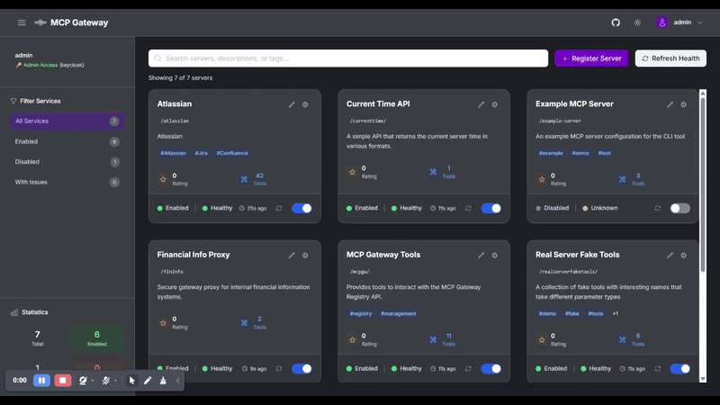
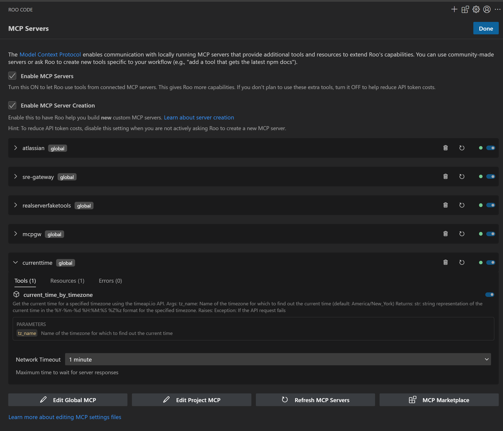
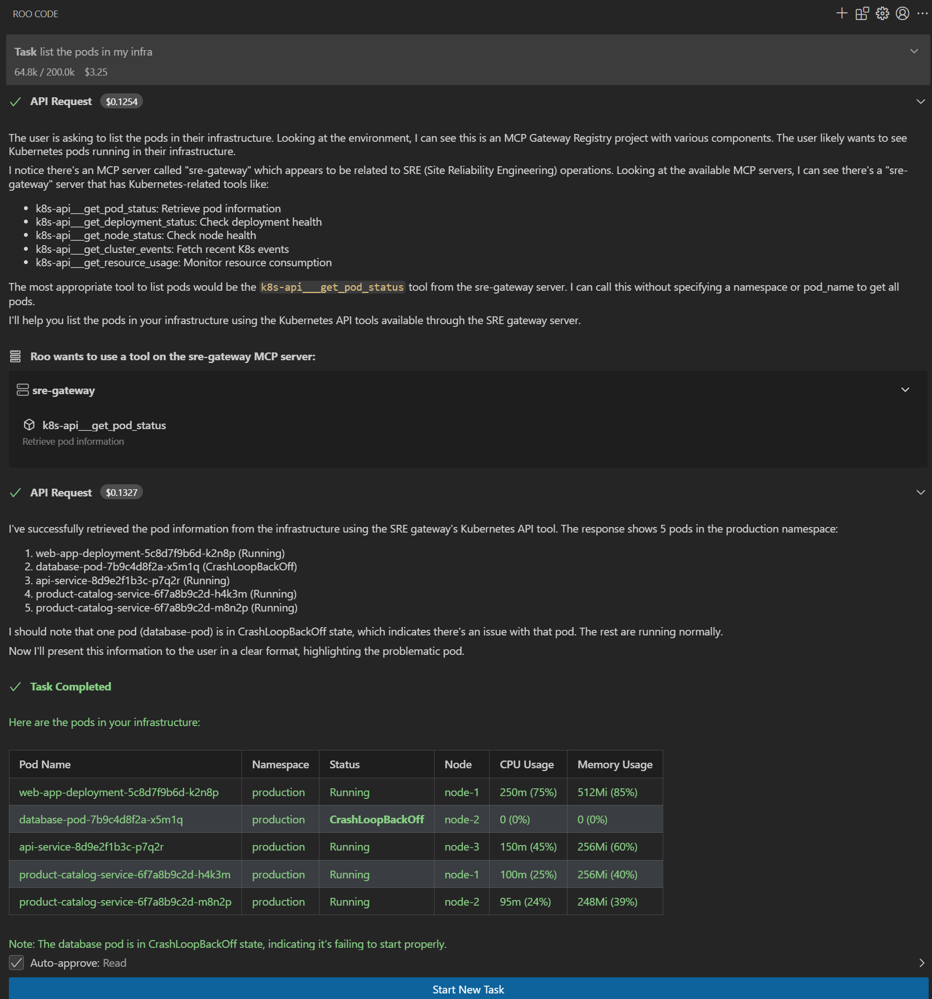
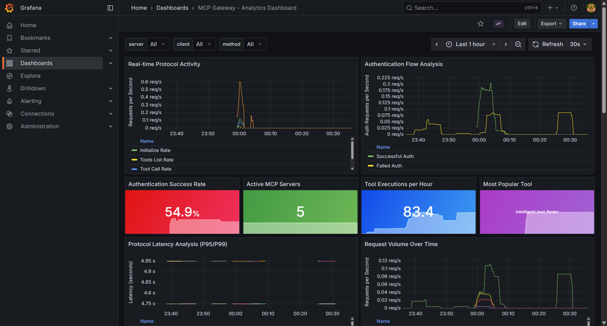

<div align="center">


**Enterprise-Ready Gateway for AI Development Tools**

[](https://github.com/agentic-community/mcp-gateway-registry/stargazers)
[](https://github.com/agentic-community/mcp-gateway-registry/network)
[](https://github.com/agentic-community/mcp-gateway-registry/issues)
[](https://github.com/agentic-community/mcp-gateway-registry/blob/main/LICENSE)
[](https://github.com/agentic-community/mcp-gateway-registry/releases)

[🚀 Get Running Now](#option-a-pre-built-images-instant-setup) | [Quick Start](#quick-start) | [Documentation](docs/) | [Enterprise Features](#enterprise-features) | [Community](#community)

**Demo Videos:** [Full End-to-End Functionality](https://github.com/user-attachments/assets/5ffd8e81-8885-4412-a4d4-3339bbdba4fb) | [OAuth 3-Legged Authentication](https://github.com/user-attachments/assets/3c3a570b-29e6-4dd3-b213-4175884396cc) | [Dynamic Tool Discovery](https://github.com/user-attachments/assets/cee25b31-61e4-4089-918c-c3757f84518c)

</div>

---

## What is MCP Gateway & Registry?

The **MCP Gateway & Registry** is an enterprise-ready platform that centralizes access to AI development tools using the [Model Context Protocol (MCP)](https://modelcontextprotocol.io/introduction). Instead of managing hundreds of individual tool configurations across your development teams, provide secure, governed access to curated AI tools through a single platform.

**Transform this chaos:**
```
❌ AI agents require separate connections to each MCP server
❌ Each developer configures VS Code, Cursor, Claude Code individually
❌ Developers must install and manage MCP servers locally
❌ No standard authentication flow for enterprise tools
❌ Scattered API keys and credentials across tools  
❌ No visibility into what tools teams are using
❌ Security risks from unmanaged tool sprawl
❌ No dynamic tool discovery for autonomous agents
❌ No curated tool catalog for multi-tenant environments
```

**Into this organized approach:**
```
✅ AI agents connect to one gateway, access multiple MCP servers
✅ Single configuration point for VS Code, Cursor, Claude Code
✅ Central IT manages cloud-hosted MCP infrastructure via streamable HTTP
✅ Developers use standard OAuth 2LO/3LO flows for enterprise MCP servers
✅ Centralized credential management with secure vault integration
✅ Complete visibility and audit trail for all tool usage
✅ Enterprise-grade security with governed tool access
✅ Dynamic tool discovery and invocation for autonomous workflows
✅ Registry provides discoverable, curated MCP servers for multi-tenant use
```

```
┌─────────────────────────────────────┐     ┌──────────────────────────────────────┐
│          BEFORE: Chaos              │     │       AFTER: MCP Gateway             │
├─────────────────────────────────────┤     ├──────────────────────────────────────┤
│                                     │     │                                      │
│  Developer 1 ──┬──► MCP Server A    │     │  Developer 1 ──┐                     │
│                ├──► MCP Server B    │     │                │                     │
│                └──► MCP Server C    │     │  Developer 2 ──┼──► MCP Gateway      │
│                                     │     │                │         │           │
│  Developer 2 ──┬──► MCP Server A    │ ──► │  AI Agent 1 ───┘         ├──► MCP A  │
│                ├──► MCP Server D    │     │                          ├──► MCP B  │
│                └──► MCP Server E    │     │  AI Agent 2 ─────────────├──► MCP C  │
│                                     │     │                          ├──► MCP D  │
│  AI Agent 1 ───┬──► MCP Server B    │     │  AI Agent 3 ─────────────├──► MCP E  │
│                ├──► MCP Server C    │     │                          └──► MCP F  │
│                └──► MCP Server F    │     │                                      │
│                                     │     │          Single Connection           │
│  ❌ Multiple connections per user  │      │         ✅ One gateway for all      │
│  ❌ No centralized control         │     │          ✅ Dynamic discovery        │
│  ❌ Credential sprawl               │     │         ✅ Unified governance       │
└─────────────────────────────────────┘     └──────────────────────────────────────┘
```

## MCP Tools in Action

<div align="center">

</div>

*Experience dynamic tool discovery and intelligent MCP server integration in real-time*

---

## What's New

- **🔌 Anthropic MCP Registry REST API v0 Compatibility** -  Compatibility with Anthropic's official MCP Registry REST API specification. List servers, get versions, and retrieve server details programmatically with JWT authentication. Includes comprehensive test scripts and curl examples. [API Documentation](docs/anthropic_registry_api.md)
- **🚀 Pre-built Images - Get Running in Under 10 Minutes** - Deploy the complete MCP Gateway solution instantly with pre-built Docker images. No compilation required - just download and run! [Get Started Now](#option-a-pre-built-images-instant-setup) | [macOS Setup Guide](docs/macos-setup-guide.md) | [Pre-built Images Documentation](docs/prebuilt-images.md)
- **🔐 Keycloak Identity Provider Integration** - Enterprise-grade authentication with individual AI agent audit trails, group-based authorization, and production-ready service account management. [Learn more](docs/keycloak-integration.md)
- **Amazon Bedrock AgentCore Gateway Integration** - Seamlessly integrate Amazon Bedrock AgentCore Gateways with dual authentication (Keycloak ingress + Cognito egress), passthrough token mode, and complete MCP protocol support. Deploy customer support assistants and other AgentCore services through the registry. [Integration Guide](docs/agentcore.md)
- **Real-Time Metrics & Observability** - Comprehensive monitoring via Grafana dashboards with metrics stored in SQLite and exposed through OpenTelemetry (OTEL). Track server health, tool usage, authentication events, and performance metrics in real-time for complete visibility into your MCP infrastructure. [Observability Guide](docs/OBSERVABILITY.md)
- **Service & User Management Utilities** - Comprehensive CLI scripts for complete lifecycle management: server registration, health validation, user provisioning, and group-based access control with automated verification and testing. [Learn more](docs/service-management.md)
- **Tag-Based Tool Filtering** - Enhanced intelligent_tool_finder now supports filtering tools by server tags for precise categorical discovery alongside semantic search
- **Three-Legged OAuth (3LO) Support** - External service integration (Atlassian, Google, GitHub)
- **JWT Token Vending Service** - Self-service token generation for automation
- **Automated Token Refresh Service** - Background token refresh to maintain continuous authentication
- **Modern React Frontend** - Complete UI overhaul with TypeScript and real-time updates
- **Dynamic Tool Discovery** - AI agents autonomously find and execute specialized tools
- **Fine-Grained Access Control** - Granular permissions for servers, methods, and individual tools

---

## Core Use Cases

### AI Agent & Coding Assistant Governance
Provide both autonomous AI agents and human developers with secure access to approved tools through AI coding assistants (VS Code, Cursor, Claude Code) while maintaining IT oversight and compliance.

### Enterprise Security & Compliance  
Centralized authentication, fine-grained permissions, and comprehensive audit trails for SOX/GDPR compliance pathways across both human and AI agent access patterns.

### Dynamic Tool Discovery
AI agents can autonomously discover and execute specialized tools beyond their initial capabilities using intelligent semantic search, while developers get guided tool discovery through their coding assistants.

### Unified Access Gateway
Single gateway supporting both autonomous AI agents (machine-to-machine) and AI coding assistants (human-guided) with consistent authentication and tool access patterns.

---

## Architecture

The MCP Gateway & Registry provides a unified platform for both autonomous AI agents and AI coding assistants to access enterprise-curated tools through a centralized gateway with comprehensive authentication and governance.

```mermaid
flowchart TB
    subgraph Human_Users["Human Users"]
        User1["Human User 1"]
        User2["Human User 2"]
        UserN["Human User N"]
    end

    subgraph AI_Agents["AI Agents"]
        Agent1["AI Agent 1"]
        Agent2["AI Agent 2"]
        Agent3["AI Agent 3"]
        AgentN["AI Agent N"]
    end

    subgraph EC2_Gateway["<b>MCP Gateway & Registry</b> (Amazon EC2 Instance)"]
        subgraph NGINX["NGINX Reverse Proxy"]
            RP["Reverse Proxy Router"]
        end
        
        subgraph AuthRegistry["Authentication & Registry Services"]
            AuthServer["Auth Server<br/>(Dual Auth)"]
            Registry["Registry<br/>Web UI"]
            RegistryMCP["Registry<br/>MCP Server"]
        end
        
        subgraph LocalMCPServers["Local MCP Servers"]
            MCP_Local1["MCP Server 1"]
            MCP_Local2["MCP Server 2"]
        end
    end
    
    %% Identity Provider
    IdP[Identity Provider<br/>Keycloak/Cognito]
    
    subgraph EKS_Cluster["Amazon EKS/EC2 Cluster"]
        MCP_EKS1["MCP Server 3"]
        MCP_EKS2["MCP Server 4"]
    end
    
    subgraph APIGW_Lambda["Amazon API Gateway + AWS Lambda"]
        API_GW["Amazon API Gateway"]
        Lambda1["AWS Lambda Function 1"]
        Lambda2["AWS Lambda Function 2"]
    end
    
    subgraph External_Systems["External Data Sources & APIs"]
        DB1[(Database 1)]
        DB2[(Database 2)]
        API1["External API 1"]
        API2["External API 2"]
        API3["External API 3"]
    end
    
    %% Connections from Human Users
    User1 -->|Web Browser<br>Authentication| IdP
    User2 -->|Web Browser<br>Authentication| IdP
    UserN -->|Web Browser<br>Authentication| IdP
    User1 -->|Web Browser<br>HTTPS| Registry
    User2 -->|Web Browser<br>HTTPS| Registry
    UserN -->|Web Browser<br>HTTPS| Registry
    
    %% Connections from Agents to Gateway
    Agent1 -->|MCP Protocol<br>SSE with Auth| RP
    Agent2 -->|MCP Protocol<br>SSE with Auth| RP
    Agent3 -->|MCP Protocol<br>Streamable HTTP with Auth| RP
    AgentN -->|MCP Protocol<br>Streamable HTTP with Auth| RP
    
    %% Auth flow connections
    RP -->|Auth validation| AuthServer
    AuthServer -.->|Validate credentials| IdP
    Registry -.->|User authentication| IdP
    RP -->|Tool discovery| RegistryMCP
    RP -->|Web UI access| Registry
    
    %% Connections from Gateway to MCP Servers
    RP -->|SSE| MCP_Local1
    RP -->|SSE| MCP_Local2
    RP -->|SSE| MCP_EKS1
    RP -->|SSE| MCP_EKS2
    RP -->|Streamable HTTP| API_GW
    
    %% Connections within API GW + Lambda
    API_GW --> Lambda1
    API_GW --> Lambda2
    
    %% Connections to External Systems
    MCP_Local1 -->|Tool Connection| DB1
    MCP_Local2 -->|Tool Connection| DB2
    MCP_EKS1 -->|Tool Connection| API1
    MCP_EKS2 -->|Tool Connection| API2
    Lambda1 -->|Tool Connection| API3

    %% Style definitions
    classDef user fill:#fff9c4,stroke:#f57f17,stroke-width:2px
    classDef agent fill:#e1f5fe,stroke:#29b6f6,stroke-width:2px
    classDef gateway fill:#e8f5e9,stroke:#66bb6a,stroke-width:2px
    classDef nginx fill:#f3e5f5,stroke:#ab47bc,stroke-width:2px
    classDef mcpServer fill:#fff3e0,stroke:#ffa726,stroke-width:2px
    classDef eks fill:#ede7f6,stroke:#7e57c2,stroke-width:2px
    classDef apiGw fill:#fce4ec,stroke:#ec407a,stroke-width:2px
    classDef lambda fill:#ffebee,stroke:#ef5350,stroke-width:2px
    classDef dataSource fill:#e3f2fd,stroke:#2196f3,stroke-width:2px
    
    %% Apply styles
    class User1,User2,UserN user
    class Agent1,Agent2,Agent3,AgentN agent
    class EC2_Gateway,NGINX gateway
    class RP nginx
    class AuthServer,Registry,RegistryMCP gateway
    class IdP apiGw
    class MCP_Local1,MCP_Local2 mcpServer
    class EKS_Cluster,MCP_EKS1,MCP_EKS2 eks
    class API_GW apiGw
    class Lambda1,Lambda2 lambda
    class DB1,DB2,API1,API2,API3 dataSource
```



**Key Architectural Benefits:**
- **Unified Gateway**: Single point of access for both AI agents and human developers through coding assistants
- **Dual Authentication**: Supports both human user authentication and machine-to-machine agent authentication
- **Scalable Infrastructure**: Nginx reverse proxy with horizontal scaling capabilities
- **Multiple Transports**: SSE and Streamable HTTP support for different client requirements

---

## Key Advantages

### **Enterprise-Grade Security**
- OAuth 2.0/3.0 compliance with IdP integration
- Fine-grained access control at tool and method level  
- Zero-trust network architecture
- Complete audit trails and comprehensive analytics for compliance

### **AI Agent & Developer Experience**
- Single configuration works across autonomous AI agents and AI coding assistants (VS Code, Cursor, Claude Code, Cline)
- Dynamic tool discovery with natural language queries for both agents and humans
- Instant onboarding for new team members and AI agent deployments
- Unified governance for both AI agents and human developers

### **Production Ready**
- High availability with multi-AZ deployment
- Container-native (Docker/Kubernetes)
- Real-time health monitoring and alerting
- Dual authentication supporting both human and machine authentication

---

## Quick Start

> **📱 Running on macOS?** See our [macOS Setup Guide](docs/macos-setup-guide.md) for platform-specific instructions and optimizations.

### Option A: Pre-built Images (Instant Setup)

Get running in under 2 minutes with pre-built containers:

**Step 1: Clone and setup**
```bash
git clone https://github.com/agentic-community/mcp-gateway-registry.git
cd mcp-gateway-registry
cp .env.example .env
```

**Step 2: Download embeddings model**
Download the required sentence-transformers model to the shared models directory:
```bash
hf download sentence-transformers/all-MiniLM-L6-v2 --local-dir ${HOME}/mcp-gateway/models/all-MiniLM-L6-v2
```

**Step 3: Configure environment**
Complete: **[Initial Environment Configuration](docs/complete-setup-guide.md#initial-environment-configuration)** - Configure domains, passwords, and authentication
```bash
export DOCKERHUB_ORG=mcpgateway
```

**Step 4: Deploy with pre-built images**
```bash
./build_and_run.sh --prebuilt
```

For detailed information about all Docker images used with `--prebuilt`, see [Pre-built Images Documentation](docs/prebuilt-images.md).

**Step 5: Initialize Keycloak**
Complete: **[Initialize Keycloak Configuration](docs/complete-setup-guide.md#initialize-keycloak-configuration)** - Set up identity provider and security policies

**Step 6: Access the registry**
```bash
open http://localhost:7860
```

**Step 7: Create your first agent**
Complete: **[Create Your First AI Agent Account](docs/complete-setup-guide.md#create-your-first-ai-agent-account)** - Create agent credentials for testing

**Step 8: Restart auth server to apply new credentials**
```bash
docker-compose down auth-server && docker-compose rm -f auth-server && docker-compose up -d auth-server
```

**Step 9: Test the setup**
Complete: **[Testing with mcp_client.py and agent.py](docs/complete-setup-guide.md#test-with-python-mcp-client)** - Validate your setup works correctly

**Benefits:** No build time • No Node.js required • No frontend compilation • Consistent tested images

### Option B: Build from Source

**New to MCP Gateway?** Start with our [Complete Setup Guide](docs/complete-setup-guide.md) for detailed step-by-step instructions from scratch on AWS EC2.

### Testing & Integration Options

**Python Scripts:**
- `./cli/mcp_client.py` - Core MCP operations (ping, list tools, call tools)
- `./tests/mcp_cmds.sh` - Shell-based MCP testing operations

**Python Agent:**
- `agents/agent.py` - Full-featured Python agent with advanced AI capabilities

**Next Steps:** [Testing Guide](docs/testing.md) | [Complete Installation Guide](docs/installation.md) | [Authentication Setup](docs/auth.md) | [AI Assistant Integration](docs/ai-coding-assistants-setup.md)

---

## Enterprise Features

### AI Agents & Coding Assistants Integration

Transform how both autonomous AI agents and development teams access enterprise tools with centralized governance:

<table>
<tr>
<td width="50%">

<p><em>Enterprise-curated MCP servers accessible through unified gateway</em></p>
</td>
<td width="50%">

<p><em>AI assistants executing approved enterprise tools with governance</em></p>
</td>
</tr>
<tr>
<td colspan="2">

### Observability

Comprehensive real-time metrics and monitoring through Grafana dashboards with dual-path storage: SQLite for detailed historical analysis and OpenTelemetry (OTEL) export for integration with Prometheus, CloudWatch, Datadog, and other monitoring platforms. Track authentication events, tool executions, discovery queries, and system performance metrics. [Learn more](docs/OBSERVABILITY.md)


<p><em>Real-time metrics and observability dashboard tracking server health, tool usage, and authentication events</em></p>
</td>
</tr>
</table>


### Authentication & Authorization

**Multiple Identity Modes:**
- **Machine-to-Machine (M2M)** - For autonomous AI agents and automated systems
- **Three-Legged OAuth (3LO)** - For external service integration (Atlassian, Google, GitHub)
- **Session-Based** - For human developers using AI coding assistants and web interface

**Supported Identity Providers:**
- **[Keycloak](https://www.keycloak.org/)** - Enterprise-grade open-source identity and access management with individual agent audit trails
- **Amazon Cognito** - Amazon managed identity service
- Any OAuth 2.0 compatible provider

**Fine-Grained Permissions:**
- Tool-level access control
- Method-level restrictions  
- Team-based permissions
- Temporary access grants

### Production Deployment

**Cloud Platforms:**
- **Amazon EC2** - Single instance or auto-scaling groups
- **Amazon EKS** - Kubernetes-native microservices deployment

**High Availability:**
- Multi-AZ deployment with automatic failover
- Health monitoring and alerting
- Rolling updates with zero downtime
- Backup and disaster recovery

---

## Documentation

| Getting Started | Enterprise Setup | Developer & Operations |
|------------------|-------------------|------------------------|
| [Complete Setup Guide](docs/complete-setup-guide.md)<br/>**NEW!** Step-by-step from scratch on AWS EC2 | [Authentication Guide](docs/auth.md)<br/>OAuth and identity provider integration | [AI Coding Assistants Setup](docs/ai-coding-assistants-setup.md)<br/>VS Code, Cursor, Claude Code integration |
| [Installation Guide](docs/installation.md)<br/>Complete setup instructions for EC2 and EKS | [Keycloak Integration](docs/keycloak-integration.md)<br/>Enterprise identity with agent audit trails | [API Reference](docs/registry_api.md)<br/>Programmatic registry management |
| [Quick Start Tutorial](docs/quick-start.md)<br/>Get running in 5 minutes | [Amazon Cognito Setup](docs/cognito.md)<br/>Step-by-step IdP configuration | [Token Refresh Service](docs/token-refresh-service.md)<br/>Automated token refresh and lifecycle management |
| [Configuration Reference](docs/configuration.md)<br/>Environment variables and settings |  | [Observability Guide](docs/OBSERVABILITY.md)<br/>**NEW!** Metrics, monitoring, and OpenTelemetry setup |
| | [Fine-Grained Access Control](docs/scopes.md)<br/>Permission management and security | [Dynamic Tool Discovery](docs/dynamic-tool-discovery.md)<br/>Autonomous agent capabilities |
| | [Service Management](docs/service-management.md)<br/>Server lifecycle and operations | |
| | | [Production Deployment](docs/installation.md)<br/>Complete setup for production environments |
| | | [Troubleshooting Guide](docs/FAQ.md)<br/>Common issues and solutions |

---

## Community

### Get Involved

**Join the Discussion**
- [GitHub Discussions](https://github.com/agentic-community/mcp-gateway-registry/discussions) - Feature requests and general discussion
- [GitHub Issues](https://github.com/agentic-community/mcp-gateway-registry/issues) - Bug reports and feature requests

**Resources**
- [Demo Videos](https://github.com/agentic-community/mcp-gateway-registry#demo-videos) - See the platform in action

**Contributing**
- [Contributing Guide](CONTRIBUTING.md) - How to contribute code and documentation
- [Code of Conduct](CODE_OF_CONDUCT.md) - Community guidelines
- [Security Policy](SECURITY.md) - Responsible disclosure process

### Star History

[](https://star-history.com/#agentic-community/mcp-gateway-registry&Date)

### Roadmap

The following GitHub issues represent our current development roadmap and planned features:

**Major Features**

- **[#171 - Feature: Import Servers from Anthropic MCP Registry](https://github.com/agentic-community/mcp-gateway-registry/issues/171)** 🚧 **IN PROGRESS**
  Add functionality to import and synchronize MCP servers from the Anthropic MCP Registry, enabling seamless integration with the broader MCP ecosystem.

- **[#170 - Architectural Proposal: Separate Gateway and Registry Containers](https://github.com/agentic-community/mcp-gateway-registry/issues/170)** 🚧 **IN PROGRESS**
  Architectural enhancement to separate gateway and registry functionality into independent containers for improved scalability, maintainability, and deployment flexibility.

- **[#37 - Multi-Level Registry Support](https://github.com/agentic-community/mcp-gateway-registry/issues/37)** 🚧 **IN PROGRESS**
  Add support for federated registries that can connect to other registries, enabling hierarchical MCP infrastructure with cross-IdP authentication.

- **[#132 - Registry UI: Add MCP Configuration Generator](https://github.com/agentic-community/mcp-gateway-registry/issues/132)** 🚧 **IN PROGRESS**
  Add copy-paste MCP configuration generator to Registry UI for seamless integration with AI coding assistants (VS Code, Cursor, Claude Code).

- **[#129 - Virtual MCP Server Support - Dynamic Tool Aggregation and Intelligent Routing](https://github.com/agentic-community/mcp-gateway-registry/issues/129)** 🚧 **IN PROGRESS**
  Enable logical grouping of tools from multiple backend servers with intelligent routing using Lua/JavaScript scripting. Provides purpose-built virtual servers that abstract away backend complexity.

- **[#121 - Migrate to OpenSearch for Server Storage and Vector Search](https://github.com/agentic-community/mcp-gateway-registry/issues/121)**
  Replace current storage with OpenSearch to provide advanced vector search capabilities and improved scalability for large server registries.

- **[#118 - Agent-as-Tool Integration: Dynamic MCP Server Generation](https://github.com/agentic-community/mcp-gateway-registry/issues/118)**
  Convert existing AI agents into MCP servers dynamically, enabling legacy agent ecosystems to participate in the MCP protocol without code rewrites.

- **[#98 - Complete GDPR and SOX Compliance Implementation](https://github.com/agentic-community/mcp-gateway-registry/issues/98)**
  Full compliance implementation for GDPR and SOX requirements, including data retention policies, audit trails, and privacy controls.

- **[#39 - Tool Popularity Scoring and Rating System](https://github.com/agentic-community/mcp-gateway-registry/issues/39)**
  Enhance tool discovery with popularity scores and star ratings based on usage patterns and agent feedback.

**Authentication & Identity**

- **[#128 - Add Microsoft Entra ID (Azure AD) Authentication Provider](https://github.com/agentic-community/mcp-gateway-registry/issues/128)** 🚧 **IN PROGRESS**
  Extend authentication support beyond Keycloak to include Microsoft Entra ID integration. Enables enterprise SSO for organizations using Azure Active Directory.

**DevOps & Operations**

- **[#48 - Update EKS Helm Chart for Multi-Container Architecture](https://github.com/agentic-community/mcp-gateway-registry/issues/48)**
  Update Helm charts to support the new multi-container Docker Compose architecture for Kubernetes deployments.

- **[#70 - Docker Build & Runtime Performance Optimization](https://github.com/agentic-community/mcp-gateway-registry/issues/70)**
  Optimize Docker build times and runtime performance for faster development and deployment cycles.

**Completed**

- **[#159 - Add scope management: create/delete Keycloak groups with scope configuration](https://github.com/agentic-community/mcp-gateway-registry/issues/159)** ✅ **COMPLETED**
  Dynamic scope management functionality implemented with create-group, delete-group, list-groups, and server-to-group assignment commands through service management CLI. Includes comprehensive user management with group-based access control. [Service Management Guide](docs/service-management.md)

- **[#160 - Documentation: Add Amazon Bedrock AgentCore Gateway integration example](https://github.com/agentic-community/mcp-gateway-registry/issues/160)** ✅ **COMPLETED**
  Comprehensive documentation and examples for integrating Amazon Bedrock AgentCore Gateway with dual authentication (Keycloak ingress + Cognito egress), passthrough token mode, and complete MCP protocol flow. [Integration Guide](docs/agentcore.md)

- **[#158 - Replace /opt/mcp-gateway with ${HOME}/mcp-gateway to eliminate sudo requirements](https://github.com/agentic-community/mcp-gateway-registry/issues/158)** ✅ **COMPLETED**
  Installation experience improved by using user home directory instead of /opt, removing the need for sudo privileges during setup.

- **[#111 - Standalone Metrics Collection Service](https://github.com/agentic-community/mcp-gateway-registry/issues/111)** ✅ **COMPLETED**
  Dedicated metrics collection service implemented for comprehensive monitoring and analytics across all MCP Gateway components. [Documentation](docs/OBSERVABILITY.md)

- **[#38 - Usage Metrics and Analytics System](https://github.com/agentic-community/mcp-gateway-registry/issues/38)** ✅ **COMPLETED**
  Comprehensive usage tracking implemented across user and agent identities, with metrics emission from auth server, registry, and intelligent tool finder. [Documentation](docs/OBSERVABILITY.md)

- **[#120 - CLI Tool for MCP Server Registration and Health Validation](https://github.com/agentic-community/mcp-gateway-registry/issues/120)** ✅ **COMPLETED**
  Command-line interface for automated server registration, health checks, and registry management. Streamlines DevOps workflows and CI/CD integration. [Documentation](docs/service-management.md)

- **[#119 - Implement Well-Known URL for MCP Server Discovery](https://github.com/agentic-community/mcp-gateway-registry/issues/119)** ✅ **COMPLETED**
  Standardized discovery mechanism using /.well-known/mcp-servers endpoint for automatic server detection and federation across organizations.

- **[#18 - Add Token Vending Capability to Auth Server](https://github.com/agentic-community/mcp-gateway-registry/issues/18)** ✅ **COMPLETED**
  Auth server token vending capabilities implemented for enhanced authentication workflows with OAuth token management and service account provisioning.

- **[#5 - Add Support for KeyCloak as IdP Provider](https://github.com/agentic-community/mcp-gateway-registry/issues/5)** ✅ **COMPLETED**
  KeyCloak integration implemented with individual agent audit trails, group-based authorization, and production-ready service account management. [Documentation](docs/keycloak-integration.md)

For the complete list of open issues, feature requests, and bug reports, visit our [GitHub Issues page](https://github.com/agentic-community/mcp-gateway-registry/issues).

---

## License

This project is licensed under the Apache-2.0 License - see the [LICENSE](LICENSE) file for details.

---

<div align="center">

**⭐ Star this repository if it helps your organization!**

[Get Started](docs/installation.md) | [Documentation](docs/) | [Contribute](CONTRIBUTING.md)

</div>
