<div align="center">


**Enterprise-Ready Gateway for AI Development Tools**

[](https://github.com/agentic-community/mcp-gateway-registry/stargazers)
[](https://github.com/agentic-community/mcp-gateway-registry/network)
[](https://github.com/agentic-community/mcp-gateway-registry/issues)
[](https://github.com/agentic-community/mcp-gateway-registry/blob/main/LICENSE)
[](https://github.com/agentic-community/mcp-gateway-registry/releases)

[Quick Start](#quick-start) | [Documentation](docs/) | [Enterprise Features](#enterprise-features) | [Community](#community)

</div>

---

## What is MCP Gateway & Registry?

The **MCP Gateway & Registry** is an enterprise-ready platform that centralizes access to AI development tools using the [Model Context Protocol (MCP)](https://modelcontextprotocol.io/introduction). Instead of managing hundreds of individual tool configurations across your development teams, provide secure, governed access to curated AI tools through a single platform.

**Transform this chaos:**
```
❌ Each developer configures VS Code, Cursor, Claude Code individually
❌ Scattered API keys and credentials across tools  
❌ No visibility into what tools teams are using
❌ Security risks from unmanaged tool sprawl
```

**Into this organized approach:**
```
✅ Centralized tool catalog with enterprise governance
✅ Single sign-on through your identity provider
✅ Complete audit trail and compliance ready
✅ Consistent developer experience across all AI assistants
```

---

## Core Use Cases

### AI Agent & Coding Assistant Governance
Provide both autonomous AI agents and human developers with secure access to approved tools through AI coding assistants (VS Code, Cursor, Claude Code) while maintaining IT oversight and compliance.

### Enterprise Security & Compliance  
Centralized authentication, fine-grained permissions, and comprehensive audit trails for SOX/GDPR compliance pathways across both human and AI agent access patterns.

### Dynamic Tool Discovery
AI agents can autonomously discover and execute specialized tools beyond their initial capabilities using intelligent semantic search, while developers get guided tool discovery through their coding assistants.

### Unified Access Gateway
Single gateway supporting both autonomous AI agents (machine-to-machine) and AI coding assistants (human-guided) with consistent authentication and tool access patterns.

---

## Architecture

The MCP Gateway & Registry provides a unified platform for both autonomous AI agents and AI coding assistants to access enterprise-curated tools through a centralized gateway with comprehensive authentication and governance.

```mermaid
flowchart TB
    subgraph Human_Users["Human Users"]
        User1["Human User 1"]
        User2["Human User 2"]
        UserN["Human User N"]
    end

    subgraph AI_Agents["AI Agents"]
        Agent1["AI Agent 1"]
        Agent2["AI Agent 2"]
        Agent3["AI Agent 3"]
        AgentN["AI Agent N"]
    end

    subgraph EC2_Gateway["<b>MCP Gateway & Registry</b> (Amazon EC2 Instance)"]
        subgraph NGINX["NGINX Reverse Proxy"]
            RP["Reverse Proxy Router"]
        end
        
        subgraph AuthRegistry["Authentication & Registry Services"]
            AuthServer["Auth Server<br/>(Dual Auth)"]
            Registry["Registry<br/>Web UI"]
            RegistryMCP["Registry<br/>MCP Server"]
        end
        
        subgraph LocalMCPServers["Local MCP Servers"]
            MCP_Local1["MCP Server 1"]
            MCP_Local2["MCP Server 2"]
        end
    end
    
    %% Identity Provider
    IdP[Identity Provider<br/>Amazon Cognito]
    
    subgraph EKS_Cluster["Amazon EKS/EC2 Cluster"]
        MCP_EKS1["MCP Server 3"]
        MCP_EKS2["MCP Server 4"]
    end
    
    subgraph APIGW_Lambda["Amazon API Gateway + AWS Lambda"]
        API_GW["Amazon API Gateway"]
        Lambda1["AWS Lambda Function 1"]
        Lambda2["AWS Lambda Function 2"]
    end
    
    subgraph External_Systems["External Data Sources & APIs"]
        DB1[(Database 1)]
        DB2[(Database 2)]
        API1["External API 1"]
        API2["External API 2"]
        API3["External API 3"]
    end
    
    %% Connections from Human Users
    User1 -->|Web Browser<br>Authentication| IdP
    User2 -->|Web Browser<br>Authentication| IdP
    UserN -->|Web Browser<br>Authentication| IdP
    User1 -->|Web Browser<br>HTTPS| Registry
    User2 -->|Web Browser<br>HTTPS| Registry
    UserN -->|Web Browser<br>HTTPS| Registry
    
    %% Connections from Agents to Gateway
    Agent1 -->|MCP Protocol<br>SSE with Auth| RP
    Agent2 -->|MCP Protocol<br>SSE with Auth| RP
    Agent3 -->|MCP Protocol<br>Streamable HTTP with Auth| RP
    AgentN -->|MCP Protocol<br>Streamable HTTP with Auth| RP
    
    %% Auth flow connections
    RP -->|Auth validation| AuthServer
    AuthServer -.->|Validate credentials| IdP
    Registry -.->|User authentication| IdP
    RP -->|Tool discovery| RegistryMCP
    RP -->|Web UI access| Registry
    
    %% Connections from Gateway to MCP Servers
    RP -->|SSE| MCP_Local1
    RP -->|SSE| MCP_Local2
    RP -->|SSE| MCP_EKS1
    RP -->|SSE| MCP_EKS2
    RP -->|Streamable HTTP| API_GW
    
    %% Connections within API GW + Lambda
    API_GW --> Lambda1
    API_GW --> Lambda2
    
    %% Connections to External Systems
    MCP_Local1 -->|Tool Connection| DB1
    MCP_Local2 -->|Tool Connection| DB2
    MCP_EKS1 -->|Tool Connection| API1
    MCP_EKS2 -->|Tool Connection| API2
    Lambda1 -->|Tool Connection| API3

    %% Style definitions
    classDef user fill:#fff9c4,stroke:#f57f17,stroke-width:2px
    classDef agent fill:#e1f5fe,stroke:#29b6f6,stroke-width:2px
    classDef gateway fill:#e8f5e9,stroke:#66bb6a,stroke-width:2px
    classDef nginx fill:#f3e5f5,stroke:#ab47bc,stroke-width:2px
    classDef mcpServer fill:#fff3e0,stroke:#ffa726,stroke-width:2px
    classDef eks fill:#ede7f6,stroke:#7e57c2,stroke-width:2px
    classDef apiGw fill:#fce4ec,stroke:#ec407a,stroke-width:2px
    classDef lambda fill:#ffebee,stroke:#ef5350,stroke-width:2px
    classDef dataSource fill:#e3f2fd,stroke:#2196f3,stroke-width:2px
    
    %% Apply styles
    class User1,User2,UserN user
    class Agent1,Agent2,Agent3,AgentN agent
    class EC2_Gateway,NGINX gateway
    class RP nginx
    class AuthServer,Registry,RegistryMCP gateway
    class IdP apiGw
    class MCP_Local1,MCP_Local2 mcpServer
    class EKS_Cluster,MCP_EKS1,MCP_EKS2 eks
    class API_GW apiGw
    class Lambda1,Lambda2 lambda
    class DB1,DB2,API1,API2,API3 dataSource
```



**Key Architectural Benefits:**
- **Unified Gateway**: Single point of access for both AI agents and human developers through coding assistants
- **Dual Authentication**: Supports both human user authentication and machine-to-machine agent authentication
- **Scalable Infrastructure**: Nginx reverse proxy with horizontal scaling capabilities
- **Multiple Transports**: SSE and Streamable HTTP support for different client requirements

---

## Key Advantages

### **Enterprise-Grade Security**
- OAuth 2.0/3.0 compliance with IdP integration
- Fine-grained access control at tool and method level  
- Zero-trust network architecture
- Complete audit trails for compliance

### **AI Agent & Developer Experience**
- Single configuration works across autonomous AI agents and AI coding assistants (VS Code, Cursor, Claude Code, Cline)
- Dynamic tool discovery with natural language queries for both agents and humans
- Instant onboarding for new team members and AI agent deployments
- Consistent experience across all AI systems and development environments

### **Production Ready**
- High availability with multi-AZ deployment
- Container-native (Docker/Kubernetes)
- Real-time health monitoring and alerting
- Horizontal scaling support

### **Extensible & Open**
- Based on open Model Context Protocol standard
- Custom MCP server integration
- API-first design for programmatic management
- Plugin architecture for extensions

---

## Quick Start

Get up and running in 5 minutes with Docker Compose:

```bash
# Clone the repository
git clone https://github.com/agentic-community/mcp-gateway-registry.git
cd mcp-gateway-registry

# Configure environment
cp .env.example .env
# Edit .env with your Cognito credentials

# Generate authentication credentials
./credentials-provider/generate_creds.sh

# Deploy with Docker Compose
./build_and_run.sh

# Access the registry
open http://localhost:7860
```

**That's it!** Your enterprise MCP gateway is now running.

➡️ **Next Steps:** [Complete Installation Guide](docs/installation.md) | [Authentication Setup](docs/auth.md) | [AI Assistant Integration](docs/ai-coding-assistants-setup.md)

---

## Enterprise Features

### AI Agents & Coding Assistants Integration

Transform how both autonomous AI agents and development teams access enterprise tools with centralized governance:

<table>
<tr>
<td width="50%">

<p><em>Enterprise-curated MCP servers accessible through unified gateway</em></p>
</td>
<td width="50%">

<p><em>AI assistants executing approved enterprise tools with governance</em></p>
</td>
</tr>
</table>

**Supported AI Systems:**

**Autonomous AI Agents:**
- **Custom AI Agents** - Machine-to-machine authentication for autonomous operation
- **Multi-Agent Systems** - Coordinated agent workflows with shared tool access
- **CI/CD Agents** - Automated deployment and testing agents with tool integration

**AI Coding Assistants:**
- **VS Code MCP Extension** - Microsoft's popular editor with MCP support
- **Roo Code** - AI-powered development assistant with enterprise governance
- **Claude Code** - Anthropic's coding assistant with standardized configurations  
- **Cursor** - AI-first code editor with MCP integration
- **Cline** - Autonomous coding agent compatible with VS Code

**Enterprise Benefits:**
- **Unified Governance** - IT manages approved tools for both AI agents and human developers
- **Dual Authentication** - Enterprise identity integration supporting both human and machine authentication
- **Comprehensive Analytics** - Track tool usage across autonomous agents and coding assistants
- **Complete Audit Trail** - Full visibility into both AI agent operations and human development activities

### Authentication & Authorization

**Multiple Identity Modes:**
- **Machine-to-Machine (M2M)** - For autonomous AI agents and automated systems
- **Three-Legged OAuth (3LO)** - For external service integration (Atlassian, Google, GitHub)
- **Session-Based** - For human developers using AI coding assistants and web interface

**Supported Identity Providers:**
- Amazon Cognito (Primary)
- SAML 2.0 
- LDAP/Active Directory

**Fine-Grained Permissions:**
- Tool-level access control
- Method-level restrictions  
- Team-based permissions
- Temporary access grants

### Production Deployment

**Cloud Platforms:**
- **Amazon EC2** - Single instance or auto-scaling groups
- **Amazon EKS** - Kubernetes-native microservices deployment
- **On-Premises** - Private cloud and data center deployment

**High Availability:**
- Multi-AZ deployment with automatic failover
- Health monitoring and alerting
- Rolling updates with zero downtime
- Backup and disaster recovery

---

## What's New

- **Amazon Bedrock AgentCore Integration** - Direct access to AWS services through managed MCP endpoints
- **Three-Legged OAuth (3LO) Support** - External service integration (Atlassian, Google, GitHub)
- **JWT Token Vending Service** - Self-service token generation for automation
- **Modern React Frontend** - Complete UI overhaul with TypeScript and real-time updates
- **Dynamic Tool Discovery** - AI agents autonomously find and execute specialized tools
- **Fine-Grained Access Control** - Granular permissions for servers, methods, and individual tools

[📖 Full Release Notes](docs/changelog.md)

---

## Documentation

### Getting Started
- [Installation Guide](docs/installation.md) - Complete setup instructions for EC2 and EKS
- [Quick Start Tutorial](docs/quick-start.md) - Get running in 5 minutes
- [Configuration Reference](docs/configuration.md) - Environment variables and settings

### Enterprise Setup  
- [Authentication Guide](docs/auth.md) - OAuth, SAML, and identity provider integration
- [Amazon Cognito Setup](docs/cognito.md) - Step-by-step IdP configuration
- [Fine-Grained Access Control](docs/scopes.md) - Permission management and security

### Developer Resources
- [AI Coding Assistants Setup](docs/ai-coding-assistants-setup.md) - VS Code, Cursor, Claude Code integration
- [API Reference](docs/registry_api.md) - Programmatic registry management
- [Dynamic Tool Discovery](docs/dynamic-tool-discovery.md) - Autonomous agent capabilities

### Operations
- [Production Deployment](docs/production-deployment.md) - High availability and scaling
- [Monitoring & Alerting](docs/monitoring.md) - Observability and health checks
- [Troubleshooting Guide](docs/troubleshooting.md) - Common issues and solutions

---

## Community

### Get Involved

**Join the Discussion**
- [GitHub Discussions](https://github.com/agentic-community/mcp-gateway-registry/discussions) - Feature requests and general discussion
- [GitHub Issues](https://github.com/agentic-community/mcp-gateway-registry/issues) - Bug reports and feature requests

**Resources**
- [Demo Videos](https://github.com/agentic-community/mcp-gateway-registry#demo-videos) - See the platform in action
- [Blog Posts](docs/resources.md) - Technical deep-dives and use cases
- [Case Studies](docs/case-studies.md) - Real-world enterprise deployments

**Contributing**
- [Contributing Guide](CONTRIBUTING.md) - How to contribute code and documentation
- [Code of Conduct](CODE_OF_CONDUCT.md) - Community guidelines
- [Security Policy](SECURITY.md) - Responsible disclosure process

### Roadmap

**Upcoming Features**
- **Multi-Level Registry Support** - Federated registries with cross-IdP authentication
- **Usage Analytics Dashboard** - Comprehensive metrics and insights  
- **Tool Marketplace** - Community-driven MCP server discovery
- **KeyCloak Integration** - Additional enterprise IdP support

[📍 Full Roadmap](https://github.com/agentic-community/mcp-gateway-registry/milestones)

---

## License

This project is licensed under the Apache-2.0 License - see the [LICENSE](LICENSE) file for details.

---

<div align="center">

**⭐ Star this repository if it helps your organization!**

[Get Started](docs/installation.md) | [Documentation](docs/) | [Contribute](CONTRIBUTING.md)

</div>