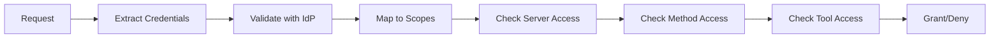

# MCP Gateway & Registry - Frequently Asked Questions (FAQ)

This FAQ addresses common questions from different user personas working with the MCP Gateway & Registry system. Questions are organized by user type and complexity level.

## Table of Contents

- [AI App Developer Questions](#ai-app-developer-questions)
- [Platform Level Questions](#platform-level-questions)
- [General Questions](#general-questions)

---

## AI App Developer Questions

*Questions from developers building AI applications that use the Registry and Gateway to discover and use MCP servers and tools.*

### Q1: How do I discover available MCP tools for my AI agent?

**A:** You can discover tools in several ways:

1. **Dynamic Tool Discovery** (Recommended): Use the [`intelligent_tool_finder`](dynamic-tool-discovery.md) tool with natural language queries:
   ```python
   tools = await intelligent_tool_finder(
       natural_language_query="get current time in different timezones",
       session_cookie="your_session_cookie"
   )
   ```

2. **Web Interface**: Browse available tools at `http://your-gateway-url:7860` after authentication.

3. **Direct MCP Connection**: Connect to the registry MCP server at `/mcpgw/sse` and use standard MCP `tools/list` calls.

### Q2: What's the difference between user identity and agent identity authentication modes?

**A:** There are two authentication patterns:

- **User Identity Mode**: Your agent acts on behalf of a human user
  - Uses OAuth 2.0 PKCE flow with session cookies
  - Agent inherits user's permissions based on Cognito groups
  - Use `--use-session-cookie` flag when running agents
  - Best for: Interactive applications, user-driven tasks

- **Agent Identity Mode**: Your agent has its own identity
  - Uses Machine-to-Machine (M2M) JWT tokens
  - Agent has its own scopes assigned in Cognito
  - Default mode when running agents
  - Best for: Autonomous agents, scheduled tasks, background processing

See [Authentication Documentation](auth.md) for detailed setup instructions.

### Q3: How do I connect my agent to multiple MCP servers through the gateway?

**A:** The gateway provides a single endpoint with path-based routing:

```python
# Connect to different servers via the gateway using SSE client
from mcp import ClientSession
from mcp.client.sse import sse_client

async def connect_to_server(server_url):
    async with sse_client(server_url) as (read, write):
        async with ClientSession(read, write) as session:
            await session.initialize()
            # Use the session for tool calls
            return session

# Example server URLs through the gateway
server_url = f"https://your-gateway.com/currenttime/sse"
time_session = await connect_to_server(server_url)

# Or use the registry's tool discovery
registry_url = f"https://your-gateway.com/mcpgw/sse"
registry_session = await connect_to_server(registry_url)
```

All requests go through the same gateway with authentication handled centrally.

### Q4: What authentication headers do I need to include in my MCP requests?

**A:** For **M2M Authentication** (Agent Identity):
```python
headers = {
    'Authorization': f'Bearer {jwt_token}',
    'X-User-Pool-Id': 'us-east-1_XXXXXXXXX',
    'X-Client-Id': 'your-client-id',
    'X-Region': 'us-east-1'
}
```

For **Session Cookie Authentication** (User Identity):
```python
headers = {
    'Cookie': f'mcp_gateway_session={session_cookie}',
    'X-User-Pool-Id': 'us-east-1_XXXXXXXXX',
    'X-Client-Id': 'your-client-id',
    'X-Region': 'us-east-1'
}
```

### Q5: How do I handle tool discovery when I don't know what tools are available?

**A:** Use the Dynamic Tool Discovery feature:

1. **In your agent code**:
   ```python
   # Let your agent discover tools autonomously
   tools = await intelligent_tool_finder(
       natural_language_query="I need to get stock market data",
       session_cookie=session_cookie,
       top_n_tools=3
   )
   
   # Then invoke the discovered tool
   if tools:
       result = await invoke_mcp_tool(
           server_name=tools[0]["service_path"],
           tool_name=tools[0]["tool_name"],
           arguments={"symbol": "AAPL"},
           # ... auth parameters
       )
   ```

2. **Configure your agent** with tool discovery capabilities as shown in the [Dynamic Tool Discovery guide](dynamic-tool-discovery.md).

### Q6: What's the best way to handle authentication errors in my application?

**A:** Implement proper error handling for common authentication scenarios:

```python
try:
    result = await mcp_client.call_tool(tool_name, arguments)
except AuthenticationError as e:
    if "token expired" in str(e):
        # Refresh JWT token or re-authenticate user
        await refresh_authentication()
        result = await mcp_client.call_tool(tool_name, arguments)
    elif "access denied" in str(e):
        # User lacks required scopes
        logger.error(f"Insufficient permissions for {tool_name}")
        return "Sorry, you don't have permission to use this tool."
    else:
        # Other auth errors
        logger.error(f"Authentication failed: {e}")
        return "Authentication failed. Please check your credentials."
```

### Q7: How do I test my agent's integration with the MCP Gateway locally?

**A:** Follow these steps:

1. **Set up local environment**:
   ```bash
   git clone https://github.com/agentic-community/mcp-gateway-registry.git
   cd mcp-gateway-registry
   cp .env.template .env
   # Configure your .env file
   ./build_and_run.sh
   ```

2. **Test authentication**:
   ```bash
   # For user identity mode
   cd agents/
   python cli_user_auth.py
   python agent.py --use-session-cookie --message "test message"
   
   # For agent identity mode
   python agent.py --message "test message"
   ```

3. **Access the web interface** at `http://localhost:7860` to verify server registration and tool availability.

---

## Platform Level Questions

### Q8: What are the minimum system requirements for deploying the MCP Gateway & Registry?

**A:** **Minimum Requirements**:
- **EC2 Instance**: `t3.large` or larger (2 vCPU, 8GB RAM)
- **Operating System**: Ubuntu 20.04 LTS or newer
- **Storage**: 20GB+ available disk space
- **Network**: Ports 80, 443, 7860, 8080 accessible

**Recommended for Production**:
- **EC2 Instance**: `t3.2xlarge` (8 vCPU, 32GB RAM)
- **Storage**: 50GB+ SSD storage
- **Load Balancer**: Application Load Balancer for high availability
- **SSL Certificate**: Valid SSL certificate for HTTPS

### Q9: How do I set up Amazon Cognito for authentication?

**A:** Follow the step-by-step [Cognito Setup Guide](cognito.md):

1. **Create User Pool** with email/username sign-in
2. **Configure App Client** with proper callback URLs
3. **Set up User Groups** (e.g., `mcp-registry-admin`, `mcp-registry-user`)
4. **Create Resource Server** for M2M authentication with custom scopes
5. **Configure Environment Variables** in your `.env` file

Key environment variables needed:
```bash
COGNITO_USER_POOL_ID=us-east-1_XXXXXXXXX
COGNITO_CLIENT_ID=your-client-id
COGNITO_CLIENT_SECRET=your-client-secret
AWS_REGION=us-east-1
```

### Q10: What ports need to be open in my security group?

**A:** **For HTTP Deployment**:
- Port 80 (HTTP traffic)
- Port 7860 (Registry web interface)
- Port 8080 (Auth server)

**For HTTPS Deployment**:
- Port 443 (HTTPS traffic)
- Port 7860 (Registry web interface, if needed)
- Port 8080 (Auth server, if needed)

**For Development/Testing**:
- All above ports plus any custom MCP server ports (8000-8003 by default)

### Q11: How do I deploy the solution using Docker Compose?

**A:** The deployment is automated with the provided script:

1. **Clone and configure**:
   ```bash
   git clone https://github.com/agentic-community/mcp-gateway-registry.git
   cd mcp-gateway-registry
   cp .env.template .env
   # Edit .env with your configuration
   ```

2. **Create required directories**:
   ```bash
   sudo mkdir -p /opt/mcp-gateway/servers
   sudo cp -r registry/servers /opt/mcp-gateway/
   sudo mkdir -p /opt/mcp-gateway/auth_server
   sudo cp auth_server/scopes.yml /opt/mcp-gateway/auth_server/scopes.yml
   sudo mkdir /var/log/mcp-gateway
   ```

3. **Deploy**:
   ```bash
   ./build_and_run.sh
   ```

The script handles Docker image building, service orchestration, and health checks.

### Q12: How do I configure HTTPS with SSL certificates?

**A:** For production HTTPS deployment:

1. **Prepare SSL certificates**:
   ```bash
   sudo mkdir -p /home/ubuntu/ssl_data/certs
   sudo mkdir -p /home/ubuntu/ssl_data/private
   # Copy your certificate files to these directories
   # Important: Name your files as follows:
   # - Certificate file: fullchain.pem (goes in /home/ubuntu/ssl_data/certs/)
   # - Private key file: privkey.pem (goes in /home/ubuntu/ssl_data/private/)
   ```

2. **Update security group** to allow port 443

3. **Deploy normally** - the Docker Compose configuration automatically detects and uses SSL certificates:
   ```bash
   ./build_and_run.sh
   ```

4. **Access via HTTPS**:
   - Main interface: `https://your-domain.com`
   - MCP servers: `https://your-domain.com/server-name/sse`

### Q13: How do I add new MCP servers to the registry?

**A:** You can add servers through the web interface:

1. **Access the registry** at `http://your-gateway:7860`
2. **Login** with your Cognito credentials or admin credentials
3. **Click "Register Server"** button
4. **Fill in server details**:
   - **Server Name**: Display name
   - **Path**: URL path (e.g., `/my-service`)
   - **Proxy Pass URL**: Internal server URL (e.g., `http://localhost:8001`)
   - **Description**: Optional description
   - **Tags**: Optional categorization tags

The registry will automatically:
- Update the Nginx configuration
- Perform health checks
- Discover available tools
- Update the FAISS index for tool discovery

### Q14: How do I monitor the health of MCP servers?

**A:** The registry provides built-in health monitoring:

1. **Web Interface**: View server status at `http://your-gateway:7860`
   - Green: Healthy servers
   - Red: Servers with issues
   - Gray: Disabled servers

2. **Manual Health Checks**: Click the refresh icon (🔄) on any server card

3. **Logs**: Monitor service logs:
   ```bash
   # View all service logs
   docker-compose logs -f
   
   # View specific service logs
   docker-compose logs -f registry
   docker-compose logs -f auth-server
   ```

4. **API Endpoint**: Programmatic health checks via `/health` endpoints

### Q15: What should I do if authentication is not working?

**A:** Follow this troubleshooting checklist:

1. **Verify Cognito Configuration**:
   - Check User Pool ID format: `us-east-1_XXXXXXXXX`
   - Verify Client ID and Secret are correct
   - Ensure callback URLs match exactly

2. **Check Environment Variables**:
   ```bash
   # Verify .env file has all required variables
   cat .env | grep -E "(COGNITO|AWS_REGION|SECRET_KEY)"
   ```

3. **Test Authentication Flows**:
   ```bash
   # Test user authentication
   cd agents/
   python cli_user_auth.py
   
   # Test M2M authentication
   python -c "from auth_server.cognito_utils import generate_token; print('M2M test passed')"
   ```

4. **Review Logs**:
   ```bash
   docker-compose logs -f auth-server | grep -i error
   ```

5. **Common Issues**:
   - **Callback URL mismatch**: Add all required URLs to Cognito app client
   - **Secret key mismatch**: Ensure same `SECRET_KEY` in registry and agent configs
   - **Scope issues**: Verify group mappings in [`scopes.yml`](../auth_server/scopes.yml)

---

## Advanced Platform Engineer Questions

### Q16: What is the architectural pattern used by the MCP Gateway, and what are its trade-offs?

**A:** The MCP Gateway uses a **Reverse Proxy Pattern** with **Path-Based Routing**:

**Architecture**:
- **Nginx** as the reverse proxy layer
- **Path-based routing** (`/server-name/*` → backend server)
- **Centralized authentication** via dedicated auth server
- **Service discovery** through registry MCP server


### Q17: How does the fine-grained access control system work, and how can it be extended?

**A:** The FGAC system uses a **Scope-Based Authorization Model**:

**Core Components**:
1. **Scope Configuration** ([`scopes.yml`](../auth_server/scopes.yml)): Defines permissions
2. **Group Mappings**: Maps IdP groups to scopes
3. **Validation Engine**: Enforces access decisions

**Authorization Flow**:


**Extension Points**:

1. **Custom Scope Types**:
   ```yaml
   # Add new scope categories
   Custom-Scopes:
     data-scientist-tools:
       - server: analytics
         methods: [tools/call]
         tools: [ml_model, data_analysis]
   ```

2. **Dynamic Scope Resolution**:
   ```python
   # Implement custom scope resolver
   def resolve_dynamic_scopes(user_context, request_context):
       # Custom logic based on time, location, etc.
       return computed_scopes
   ```

3. **Attribute-Based Access Control (ABAC)**:
   ```python
   # Extend validation with attributes
   def validate_with_attributes(user_attrs, resource_attrs, env_attrs):
       # Policy evaluation engine
       return access_decision
   ```

### Q18: What are the performance characteristics and bottlenecks of the current implementation?

**A:** **Performance Profile**:

**Throughput**:
- **Nginx Proxy**: Metrics TBD and would be updated soon
- **Auth Validation**: Metrics TBD and would be updated soon
- **Tool Discovery**: Metrics TBD and would be updated soon

**Latency Breakdown**:
- **Proxy Overhead**: Metrics TBD and would be updated soon
- **Auth Validation**: Metrics TBD and would be updated soon
- **MCP Server Call**: Variable (depends on tool complexity)
- **Tool Discovery**: Metrics TBD and would be updated soon

**Bottlenecks**:

1. **Authentication Server**:
   - **Issue**: IdP validation latency
   - **Mitigation**: JWT token caching, connection pooling
   - **Scaling**: Multiple auth server instances

2. **FAISS Index Operations**:
   - **Issue**: Memory usage and search latency
   - **Mitigation**: Index optimization, model selection
   - **Scaling**: Distributed search, GPU acceleration

3. **Nginx Configuration Updates**:
   - **Issue**: Config reload during server registration
   - **Mitigation**: Graceful reloads, configuration templating
   - **Scaling**: Dynamic upstream configuration

**Optimization Opportunities**:
```python
# 1. Implement connection pooling
async def create_connection_pool():
    return aiohttp.TCPConnector(limit=100, limit_per_host=30)

# 2. Add response caching
@lru_cache(maxsize=1000)
def cache_tool_metadata(server_name: str):
    return expensive_tool_discovery()

# 3. Implement circuit breakers
@circuit_breaker(failure_threshold=5, timeout=30)
async def call_mcp_server(server_url: str):
    return await make_request(server_url)
```

### Q19: How can the system be extended to support federated registries?

**A:** Federated Registry Architecture (Roadmap item #37):

## General Questions

### Q20: What is the Model Context Protocol (MCP) and why do I need a gateway?

**A:** **Model Context Protocol (MCP)** is an open standard that allows AI models to connect with external systems, tools, and data sources.

**Why You Need a Gateway**:
- **Service Discovery**: Find approved MCP servers in your organization
- **Centralized Access Control**: Secure, governed access to tools
- **Dynamic Tool Discovery**: Agents can find new tools autonomously
- **Simplified Client Configuration**: Single endpoint for multiple servers
- **Enterprise Security**: Authentication, authorization, and audit logging

**Without Gateway**: Each agent connects directly to individual MCP servers
**With Gateway**: All agents connect through a single, secure, managed endpoint

### Q21: What's the difference between the Registry and the Gateway?

**A:** They are complementary components:

**Registry**:
- **Purpose**: Service discovery and management
- **Features**: Web UI, server registration, health monitoring, tool catalog
- **Users**: Platform administrators, developers
- **Access**: Web browser at `:7860`

**Gateway**:
- **Purpose**: Secure proxy for MCP protocol traffic
- **Features**: Authentication, authorization, request routing
- **Users**: AI agents, MCP clients
- **Access**: MCP protocol at `/server-name/sse`

**Together**: Registry manages what's available, Gateway controls access to it.

### Q22: Can I use this with non-AWS identity providers?

**A:** Currently, the system is designed for **Amazon Cognito**, but the architecture supports other OAuth2/OIDC providers.

**Supported Patterns**:
- OAuth 2.0 Authorization Code flow (PKCE)
- OAuth 2.0 Client Credentials flow (M2M)
- JWT token validation
- Group-based authorization

**To Add New IdP**:
1. Implement IdP-specific authentication in [`auth_server/`](../auth_server/)
2. Update token validation logic
3. Map IdP groups/roles to MCP scopes
4. Update environment configuration

**Potential IdPs**: Azure AD, Okta, Auth0, Keycloak, Google Identity

### Q23: How do I contribute to the project or report issues?

**A:** **Contributing**:
1. **GitHub Repository**: [agentic-community/mcp-gateway-registry](https://github.com/agentic-community/mcp-gateway-registry)
2. **Issues**: Report bugs or request features via GitHub Issues
3. **Pull Requests**: Submit code contributions following the project guidelines
4. **Documentation**: Help improve documentation and examples

**Getting Help**:
- **GitHub Issues**: For bugs and feature requests
- **Discussions**: For questions and community support
- **Documentation**: Check existing docs first

**Development Setup**:
```bash
git clone https://github.com/agentic-community/mcp-gateway-registry.git
cd mcp-gateway-registry
# Follow development setup in README.md
```

### Q24: What's on the roadmap for future development?

**A:** **Major Features** (from [GitHub Issues](https://github.com/agentic-community/mcp-gateway-registry/issues)):

- **[Multi-Level Registry Support](https://github.com/agentic-community/mcp-gateway-registry/issues/37)**: Federated registries with cross-IdP authentication
- **[Usage Metrics and Analytics](https://github.com/agentic-community/mcp-gateway-registry/issues/38)**: Comprehensive usage tracking and analytics
- **[Tool Popularity Scoring](https://github.com/agentic-community/mcp-gateway-registry/issues/39)**: Rating system for tools and servers

**Authentication & Identity Enhancements**:
- Additional IdP integrations
- Enhanced RBAC capabilities

**See the [full roadmap](README.md#roadmap) in the README for complete details.**

---

## Need More Help?

- **Documentation**: Check the [`docs/`](.) folder for detailed guides
- **Examples**: See [`agents/`](../agents/) for working code examples
- **Issues**: Report problems on [GitHub Issues](https://github.com/agentic-community/mcp-gateway-registry/issues)
- **Community**: Join discussions and get support from the community

---

*This FAQ is maintained by the MCP Agentic community. Last updated: June 16, 2025*