# Integrating Amazon Bedrock AgentCore Gateways

This guide demonstrates how to register and use an Amazon Bedrock AgentCore Gateway as an MCP server through the MCP Gateway Registry.

## Overview

[Amazon Bedrock AgentCore Gateway](https://docs.aws.amazon.com/bedrock-agentcore/latest/devguide/gateway.html) provides an easy and secure way for developers to build, deploy, discover, and connect to tools at scale. AI agents need tools to perform real-world tasks—from querying databases to sending messages to analyzing documents.

This guide uses the [Customer Support Assistant](https://github.com/awslabs/amazon-bedrock-agentcore-samples/tree/main/02-use-cases/customer-support-assistant) example from the `amazon-bedrock-agentcore-samples` repository to demonstrate how to register and use an AgentCore Gateway as an MCP server through the MCP Gateway Registry.

### Architecture Overview

```
┌─────────────────────────────────────────────────────────────────────────────┐
│                          Integration Flow                                   │
└─────────────────────────────────────────────────────────────────────────────┘

                                                   ┌──────────────────────────┐
                                                   │   AWS Cloud              │
                                                   │                          │
  ┌──────────────┐        ┌──────────────────┐     │  ┌────────────────────┐  │
  │              │        │                  │     │  │  Amazon Bedrock    │  │
  │  AI Agent    │───────▶│  MCP Gateway &   │──────▶│  AgentCore Gateway │  │
  │  (Claude)    │        │  Registry        │     │  │                    │  │
  │              │        │  localhost:7860  │     │  │  Customer Support  │  │
  └──────────────┘        └──────────────────┘     │  │  MCP Server        │  │
                                   │               │  │                    │  │
                                   │               │  │  - Warranty Tool   │  │
                                   │               │  │  - Customer Tool   │  │
                                   │               │  │  - Knowledge Base  │  │
                                   │               │  └────────────────────┘  │
                          ┌────────▼────────┐      │            │             │
                          │                 │      │            │             │
                          │  Authentication │      │    ┌───────▼──────────┐  │
                          │  - Cognito Token│◀─────────│    Cognito User  │  │
                          │  - Passthrough  │      │    │  Pool (OAuth)    │  │
                          │                 │      │    └──────────────────┘  │
                          └─────────────────┘      │                          │
                                                   └──────────────────────────┘

Flow:
1. AI Agent sends request to MCP Gateway Registry
2. Gateway routes to registered AgentCore Gateway MCP server
3. AgentCore Gateway authenticates via Cognito (token passthrough)
4. Tools execute (warranty lookup, customer profile, knowledge base query)
5. Response flows back through Gateway to AI Agent
```

## Prerequisites

- AWS Account with Amazon Bedrock AgentCore access
- EC2 instance (recommended) - See [Complete Setup Guide](complete-setup-guide.md) for EC2 configuration details
  - Alternatively, you can run on macOS - See [macOS Setup Guide](macos-setup-guide.md)
  - Optional: For direct desktop access to EC2 instead of port forwarding, see [Remote Desktop Setup](remote-desktop-setup.md)
- Docker and Docker Compose installed
- Python 3.11+ with `uv` package manager
- Git

## Step 1: Set Up the MCP Gateway Registry

### 1.1 Deploy the Registry

Deploy the registry using pre-built containers. See [README - Option A: Pre-built Images](../README.md#option-a-pre-built-images-instant-setup) for detailed instructions.

```bash
# Create workspace directory
mkdir -p ${HOME}/workspace
cd ${HOME}/workspace

# Clone the repository
git clone https://github.com/agentic-community/mcp-gateway-registry.git
cd mcp-gateway-registry

# Copy environment file
cp .env.example .env

# Configure environment (see Complete Setup Guide for details)
export DOCKERHUB_ORG=mcpgateway

# Deploy with pre-built images
./build_and_run.sh --prebuilt
```

Follow the [Complete Setup Guide - Initial Environment Configuration](complete-setup-guide.md#initial-environment-configuration) for detailed configuration steps including Keycloak initialization and agent account creation.

### 1.2 Verify Registry is Running

Open your browser and navigate to:
```
http://localhost:7860
```

You should see the MCP Gateway Registry UI with the list of registered services.

## Step 2: Set Up Your AgentCore Gateway

### 2.1 Deploy the Customer Support Assistant

Clone the Amazon Bedrock AgentCore samples repository and follow the setup instructions:

```bash
# Navigate to workspace directory
cd ${HOME}/workspace

# Clone the AgentCore samples repository
git clone https://github.com/awslabs/amazon-bedrock-agentcore-samples.git
cd amazon-bedrock-agentcore-samples/02-use-cases/customer-support-assistant
```

Follow the instructions in the [Customer Support Assistant README](https://github.com/awslabs/amazon-bedrock-agentcore-samples/tree/main/02-use-cases/customer-support-assistant) to deploy the AgentCore gateway in your AWS account. You can do this in a separate terminal on the same EC2 machine.

This will create:
- Amazon Bedrock AgentCore Gateway
- Cognito User Pool for authentication
- Lambda functions for warranty status and customer profile lookup
- Knowledge base integration

**Important:** During deployment, save the following configuration values that will be printed in the output:

```bash
cd ${HOME}/workspace/

# Create a file to store AgentCore authentication parameters
cat > .agentcore-params << 'EOF'
# AgentCore Gateway Authentication Parameters
COGNITO_TOKEN_URL="<YOUR_COGNITO_TOKEN_URL>"  # Example: https://us-east-1XXXXXXXX.auth.us-east-1.amazoncognito.com/oauth2/token
CLIENT_ID="<YOUR_CLIENT_ID>"                   # Example: 7kqi2l0n47mnfmhfapsf29ch4h
CLIENT_SECRET="<YOUR_CLIENT_SECRET>"           # Get from AWS Cognito Console
SCOPE="<YOUR_SCOPE>"                           # Example: default-m2m-resource-server-XXXXXXXX/read
EOF
```

**To find your Client Secret:**
1. Go to AWS Cognito Console
2. Find the User Pool with prefix `customersupport-`
3. Navigate to App Integration → App clients
4. Click on your app client
5. View and copy the Client Secret

### 2.2 Verify AgentCore Gateway is Working

After deployment, test the gateway directly using the test script:

```bash
cd ${HOME}/workspace/amazon-bedrock-agentcore-samples/02-use-cases/customer-support-assistant
python test/test_gateway.py --prompt "Check warranty with serial number MNO33333333"
```

If successful, you should see output showing the gateway endpoint and warranty lookup results with tool execution details.

## Step 3: Register the AgentCore Gateway with MCP Registry

### 3.1 Create Gateway Configuration File

Create a file named `gateway-config.json` in your AgentCore project directory with the following content:

```json
{
  "server_name": "customer-support-assistant",
  "description": "Amazon Bedrock AgentCore Gateway for customer support operations with warranty lookup and knowledge base",
  "path": "/customer-support-assistant",
  "proxy_pass_url": "https://<YOUR-GATEWAY-ID>.gateway.bedrock-agentcore.us-east-1.amazonaws.com/mcp/",
  "auth_provider": "bedrock-agentcore",
  "auth_type": "oauth",
  "supported_transports": [
    "streamable-http"
  ],
  "tags": [
    "bedrock",
    "agentcore",
    "customer-support",
    "warranty",
    "knowledge-base"
  ],
  "headers": [
    {
      "Authorization": "Bearer $CUSTOMER_SUPPORT_AUTH_TOKEN"
    }
  ],
  "num_tools": 2,
  "num_stars": 0,
  "is_python": false,
  "license": "Apache-2.0",
  "tool_list": [
    {
      "name": "LambdaUsingSDK___check_warranty_status",
      "parsed_description": {
        "main": "Check the warranty status of a product using its serial number and optionally verify via email",
        "args": null,
        "returns": null,
        "raises": null
      },
      "schema": {
        "type": "object",
        "properties": {
          "serial_number": {
            "type": "string",
            "description": "Product serial number to check warranty status"
          },
          "customer_email": {
            "type": "string",
            "description": "Optional customer email for verification"
          }
        },
        "required": [
          "serial_number"
        ]
      }
    },
    {
      "name": "LambdaUsingSDK___get_customer_profile",
      "parsed_description": {
        "main": "Retrieve customer profile using customer ID, email, or phone number",
        "args": null,
        "returns": null,
        "raises": null
      },
      "schema": {
        "type": "object",
        "properties": {
          "customer_id": {
            "type": "string",
            "description": "Unique customer identifier"
          },
          "email": {
            "type": "string",
            "description": "Customer email address"
          },
          "phone": {
            "type": "string",
            "description": "Customer phone number"
          }
        },
        "required": [
          "customer_id"
        ]
      }
    }
  ]
}
```

**Key Configuration Parameters:**

| Parameter | Value | Description |
|-----------|-------|-------------|
| `path` | `/customer-support-assistant` | The URL path where this service will be accessible through the registry. The registry will automatically format this to `/customer-support-assistant/` (with trailing slash) for bedrock-agentcore services. |
| `proxy_pass_url` | `https://<YOUR-GATEWAY-ID>.gateway.bedrock-agentcore.us-east-1.amazonaws.com/mcp/` | The backend AgentCore Gateway URL. The registry will automatically remove the `/mcp/` suffix and ensure it ends with just `/` for bedrock-agentcore services. Replace `<YOUR-GATEWAY-ID>` with your actual Gateway ID from the deployment output. |
| `auth_provider` | `bedrock-agentcore` | **Critical:** This tells the registry to use passthrough authentication - the Cognito token will be passed directly to the AgentCore Gateway without validation by the registry's auth server. |
| `auth_type` | `oauth` | Specifies OAuth authentication flow |
| `server_name` | `customer-support-assistant` | Display name for the service in the registry UI |
| `tags` | `["bedrock", "agentcore", "customer-support", ...]` | Searchable tags used by the `intelligent_tool_finder` for hybrid search (combines semantic search with tag-based filtering). AI agents can discover tools by category using these tags. |
| `tool_list` | Array of tool definitions | Defines the available tools/functions with their schemas, descriptions, and parameters. Each tool includes a name, parsed description, and JSON schema for arguments. This metadata enables the registry to catalog and expose tools for dynamic discovery by AI agents. |

**Important Notes:**
- The `auth_provider: "bedrock-agentcore"` field enables passthrough authentication, which means:
  - The registry does not validate the Cognito access token
  - The token is passed directly to the AgentCore Gateway
  - The AgentCore Gateway validates the token with its own Cognito User Pool
- Replace `<YOUR-GATEWAY-ID>` with your actual AgentCore Gateway ID (shown in deployment output)

### 3.2 Register the Gateway

Navigate to your `mcp-gateway-registry` directory and run:

```bash
cd ${HOME}/workspace/mcp-gateway-registry
source .venv/bin/activate

# Register the AgentCore gateway
./cli/service_mgmt.sh add ${HOME}/workspace/amazon-bedrock-agentcore-samples/02-use-cases/customer-support-assistant/gateway-config.json
```

### 3.3 Verify Registration

#### Via UI

1. Open http://localhost:7860 in your browser
2. You should see "customer-support-assistant" in the services list
3. The health status should show as "healthy"

**Screenshot:**


#### Via Command Line

**Note:** Refresh credentials first since Keycloak access tokens have a 5-minute TTL by default:

```bash
# Refresh authentication credentials
./credentials-provider/generate_creds.sh

# List services and filter for customer-support-assistant
uv run cli/mcp_client.py \
  --url http://localhost/mcpgw/mcp \
  call --tool list_services \
  --args '{}' \
  2>/dev/null | \
tail -n +2 | \
jq '.content[0].text | fromjson | .services[] | select(.server_name == "customer-support-assistant")'
```

Look for the customer-support-assistant entry in the output.

## Step 4: Test the Registered Gateway

### 4.1 Refresh Authentication Credentials

Generate fresh ingress credentials for the registry. **Note:** Keycloak access tokens have a 5-minute TTL by default, so you'll need to refresh credentials before testing:

```bash
./credentials-provider/generate_creds.sh
```

### 4.2 Generate Cognito Access Token for AgentCore Gateway

Before calling the AgentCore gateway, you need to obtain an access token from Cognito. Load the parameters you saved earlier and generate the token:

```bash
cd ${HOME}/workspace/.agentcore-params

# Load AgentCore authentication parameters
source .agentcore-params

# Request access token from Cognito
response=$(curl -s -X POST "$COGNITO_TOKEN_URL" \
  -H "Content-Type: application/x-www-form-urlencoded" \
  -d "grant_type=client_credentials" \
  -d "client_id=$CLIENT_ID" \
  -d "client_secret=$CLIENT_SECRET" \
  -d "scope=$SCOPE")

# Extract and save the access token
echo "$response" | python3 -c "import sys, json; print(json.load(sys.stdin)['access_token'])" > .cognito_access_token

echo "Access token saved to .cognito_access_token"
```

**Note:** Cognito access tokens have a default validity of **1 hour**. You'll need to regenerate the token if it expires.

### 4.3 Call the AgentCore Gateway Through the Registry

Now you can call the AgentCore gateway tools through the MCP Gateway Registry:

```bash
uv run cli/mcp_client.py \
  --url http://localhost/customer-support-assistant/mcp \
  --token-file ${HOME}/workspace/amazon-bedrock-agentcore-samples/02-use-cases/customer-support-assistant/.cognito_access_token \
  call --tool LambdaUsingSDK___check_warranty_status \
  --args '{"serial_number":"MNO33333333"}'
```

**Expected Output:**

```json
✓ Token file authentication successful (${HOME}/workspace/amazon-bedrock-agentcore-samples/02-use-cases/customer-support-assistant/.cognito_access_token)
{
  "isError": false,
  "content": [
    {
      "type": "text",
      "text": "{\"statusCode\":200,\"body\":\"🛡️ Warranty Status Information\\n===============================\\n📱 Product: Gaming Console Pro\\n🔢 Serial Number: MNO33333333\\n👤 Customer: Unknown\\n📅 Purchase Date: 2023-11-25\\n⏰ Warranty End Date: 2024-11-25\\n📋 Warranty Type: Gaming Warranty\\n🔍 Status: ❌ Expired\\n\\n📆 Expired 317 days ago\\n\\n🔧 Coverage Details:\\n   Controller issues, overheating protection, and hard drive replacement covered\\n\\n❌ Your warranty has expired.\\n   Extended warranty options may be available.\\n   Contact support for repair service pricing.\"}"
    }
  ]
}
```

### 4.4 Test Customer Profile Lookup

```bash
uv run cli/mcp_client.py \
  --url http://localhost/customer-support-assistant/ \
  --token-file ${HOME}/workspace/amazon-bedrock-agentcore-samples/02-use-cases/customer-support-assistant/.cognito_access_token \
  call --tool LambdaUsingSDK___get_customer_profile \
  --args '{"customer_id":"CUST001"}'
```

**Expected Output:**

```json
✓ Token file authentication successful (.cognito_access_token)
{
  "isError": false,
  "content": [
    {
      "type": "text",
      "text": "{\"statusCode\":200,\"body\":\"👤 Customer Profile Information: 👤 Customer Profile Information\\n===============================\\n🆔 Customer ID: CUST001\\n👤 Name: John Smith\\n💎 Tier: Premium\\n\\n📞 Contact Information:\\n   📧 Email: john.smith@email.com\\n   📱 Phone: +1-555-0101\\n   🏠 Address: 123 Main Street, New York, NY, 10001, USA\\n\\n📊 Account Details:\\n   📅 Registration Date: 2022-11-20\\n   🎂 Date of Birth: 1985-03-15\\n   ⏱️ Customer Since: 2 years, 10 months\\n\\n💼 Purchase History:\\n   🛒 Total Purchases: 3\\n   💰 Lifetime Value: $2,850.00\\n   🎯 Average Order: $950.00\\n\\n🎧 Support Information:\\n   📞 Support Cases: 2\\n   💬 Communication Preferences: Email, SMS\\n\\n📝 Account Notes:\\n   VIP customer, prefers email communication\\n\\n🌟 Premium Benefits:\\n   • Priority customer support\\n   • Extended warranty coverage\\n   • Free expedited shipping\\n   • Exclusive product access\\n\\n💡 Support Recommendations:\\n   💎 High-value customer - prioritize satisfaction\\n   🎉 Loyal customer - consider loyalty rewards\\n\\n⚡ Quick Actions Available:\\n   • Check warranty status for customer products\\n   • View purchase history and invoices\\n   • Update contact information or preferences\\n   • Create new support case\\n   • Send promotional offers (if opted in)\"}"
    }
  ]
}
```

## How It Works

### Dual Authentication Flow

The integration uses **two separate authentication layers**:

#### Ingress Authentication (Gateway Access Control)
- **Purpose**: Verifies the AI agent has permission to access the MCP Gateway Registry itself
- **Identity Provider**: Keycloak (MCP Gateway's IdP)
- **Token**: Keycloak JWT access token (5-minute TTL by default)
- **Validation**: Performed by the MCP Gateway's Auth Server
- **Scope**: Controls which services and tools the agent can access through the gateway

#### Egress Authentication (AgentCore Access Control)
- **Purpose**: Verifies the request has permission to call the AgentCore Gateway
- **Identity Provider**: Amazon Cognito (AgentCore's IdP)
- **Token**: Cognito JWT access token (1-hour TTL by default)
- **Validation**: Performed by the AgentCore Gateway itself
- **Scope**: Controls access to AgentCore tools and resources

### Authentication Sequence

```mermaid
sequenceDiagram
    participant Agent as AI Agent
    participant Keycloak as Keycloak<br/>(Ingress IdP)
    participant Gateway as MCP Gateway<br/>& Auth Server
    participant AgentCore as AgentCore Gateway<br/>(Customer Support)
    participant Cognito as Amazon Cognito<br/>(Egress IdP)

    Note over Agent,Cognito: Setup Phase

    rect rgb(240, 248, 255)
        Note over Agent,Keycloak: 1. Ingress Authentication
        Agent->>Keycloak: 1a. Request access token<br/>(client credentials)
        Keycloak->>Agent: 1b. Keycloak JWT token<br/>(5-min TTL)
    end

    rect rgb(255, 248, 220)
        Note over Agent,Cognito: 2. Egress Authentication
        Agent->>Cognito: 2a. Request access token<br/>(client credentials)
        Cognito->>Agent: 2b. Cognito JWT token<br/>(1-hour TTL)
        Agent->>Agent: 2c. Save to .cognito_access_token
    end

    Note over Agent,Cognito: Runtime Phase - MCP Protocol Flow

    rect rgb(255, 240, 245)
        Note over Agent,Gateway: 3. Initialize MCP Session
        Agent->>Gateway: 3a. POST /initialize<br/>X-Authorization: Bearer [Keycloak JWT]<br/>Authorization: Bearer [Cognito JWT]

        Gateway->>Keycloak: 3b. Validate ingress token
        Keycloak->>Gateway: 3c. Token valid ✓

        Gateway->>Gateway: 3d. Check auth_provider=bedrock-agentcore<br/>→ Use passthrough mode

        Note right of Gateway: Gateway does NOT<br/>validate Cognito token

        Gateway->>AgentCore: 3e. Forward initialize request<br/>Authorization: Bearer [Cognito JWT]

        AgentCore->>Cognito: 3f. Validate egress token
        Cognito->>AgentCore: 3g. Token valid ✓

        AgentCore->>Gateway: 3h. Return capabilities
        Gateway->>Agent: 3i. Session initialized ✓
    end

    rect rgb(240, 255, 240)
        Note over Agent,AgentCore: 4. Discover Tools
        Agent->>Gateway: 4a. POST /tools/list<br/>X-Authorization: Bearer [Keycloak JWT]<br/>Authorization: Bearer [Cognito JWT]

        Gateway->>AgentCore: 4b. Forward tools/list<br/>Authorization: Bearer [Cognito JWT]

        AgentCore->>Gateway: 4c. Return tool list<br/>[LambdaUsingSDK___check_warranty_status,<br/>LambdaUsingSDK___get_customer_profile]

        Gateway->>Agent: 4d. Available tools returned
    end

    rect rgb(255, 250, 240)
        Note over Agent,AgentCore: 5. Call Tool
        Agent->>Gateway: 5a. POST /tools/call<br/>Tool: LambdaUsingSDK___get_customer_profile<br/>Args: {customer_id: "CUST001"}<br/>X-Authorization: Bearer [Keycloak JWT]<br/>Authorization: Bearer [Cognito JWT]

        Gateway->>AgentCore: 5b. Forward tool call<br/>Authorization: Bearer [Cognito JWT]

        AgentCore->>AgentCore: 5c. Execute Lambda function<br/>get_customer_profile("CUST001")

        AgentCore->>Gateway: 5d. Return customer profile<br/>{name: "John Smith", tier: "Premium", ...}

        Gateway->>Agent: 5e. Tool response returned
    end
```



### Key Points

**Ingress Authentication (Keycloak)**
- Validates AI agent's access to the MCP Gateway Registry
- Checked by the MCP Gateway's Auth Server
- Required for all gateway requests
- Token refresh: `./credentials-provider/generate_creds.sh`

**Egress Authentication (Cognito)**
- Validates access to the AgentCore Gateway
- **Passthrough mode**: Gateway does NOT validate this token
- Validated by the AgentCore Gateway itself
- Token refresh: Re-run the curl command in Section 4.2

**Why Two Tokens?**
- **Security in depth**: Both layers must authenticate successfully
- **Separation of concerns**: Gateway controls access to its services; AgentCore controls access to its tools
- **Flexibility**: Each layer can use its own IdP and policies


## Next Steps

### 1. Configure Fine-Grained Access Control (FGAC)

Set up access controls so the customer-support-assistant service is only accessible to users in specific groups:

```bash
# Create a new group/scope for customer support users
cd ${HOME}/workspace/mcp-gateway-registry

# Add the group and assign users
# See the complete end-to-end example in the Service Management Guide
```

**Learn More:** Follow the [Service Management Guide - Complete Example: LOB1 Services Group](service-management.md#complete-example-lob1-line-of-business-1-services-group) for detailed instructions on:
- Creating groups and scopes
- Assigning users to groups
- Configuring service-level access control
- Testing access permissions

### 2. Additional Integration Options

- **Add more AgentCore gateways** to your registry following this same process
- **Integrate with Claude Desktop** or other MCP clients for AI-powered interactions
- **Browse registered services** through the registry UI at http://localhost:7860
- **Monitor usage and metrics** through Grafana dashboards at http://localhost:3000 - See [Observability Guide](OBSERVABILITY.md)

## Troubleshooting

### 404 Not Found Error

If you get a 404 error, verify:
1. Service is registered: `uv run cli/mcp_client.py --url http://localhost/mcpgw/mcp call --tool list_services --args '{}'`
2. Path matches: Use `/customer-support-assistant/` (with trailing slash)
3. Health status is healthy in the UI

### 401 Authentication Error

If you get a 401 error:
1. Refresh your Cognito access token
2. Verify token file path is correct
3. Check token hasn't expired

### Service Not Showing as Healthy

1. Verify AgentCore gateway is accessible from registry container
2. Check network connectivity
3. Review registry logs: `docker logs mcp-gateway-registry-registry-1`

## Additional Resources

- [Amazon Bedrock AgentCore Samples](https://github.com/awslabs/amazon-bedrock-agentcore-samples)
- [MCP Gateway Registry Documentation](../README.md)
- [Service Management Guide](service-management.md)
