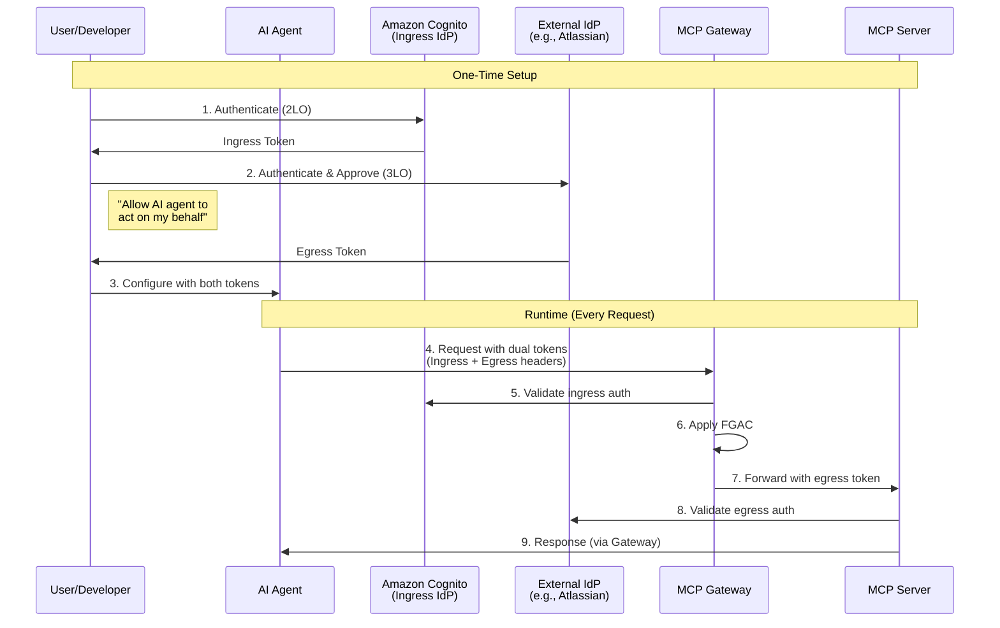
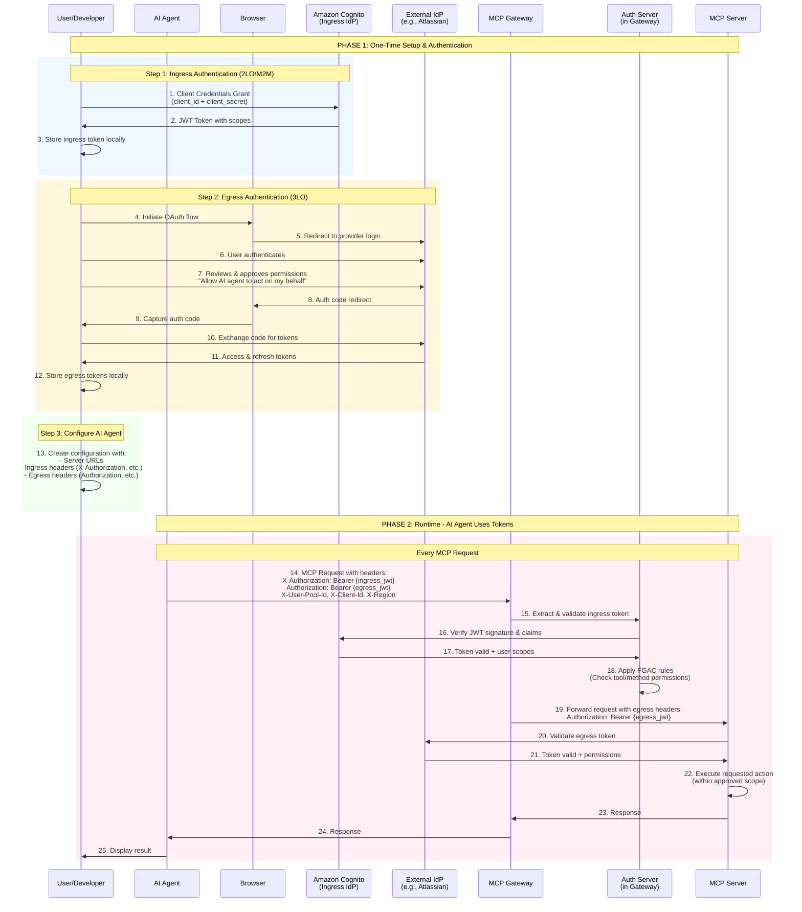

# Authentication and Authorization Guide

The MCP Gateway Registry provides enterprise-ready authentication and authorization using industry-standard OAuth 2.0 flows with fine-grained access control.

## Quick Navigation

**I want to...**
- [Build an AI agent with authentication](#quick-start-for-ai-agents) → Quick Start
- [Understand the authentication architecture](#authentication-architecture) → Architecture 
- [Set up external service integration](#external-service-integration) → Egress Auth
- [Configure fine-grained permissions](#fine-grained-access-control-fgac) → FGAC
- [See all configuration options](#configuration-reference) → Reference

---

## Quick Start for AI Agents

Get your AI agent authenticated and running in 5 minutes.

### Prerequisites
- Amazon Cognito credentials (provided by your administrator)
- Access to external services you want to integrate (optional)

### Step 1: Configure Environment

Create `credentials-provider/oauth/.env` with your credentials:

```bash
# Ingress Authentication (Required)
AWS_REGION=us-east-1
INGRESS_OAUTH_USER_POOL_ID=us-east-1_XXXXXXXXX
INGRESS_OAUTH_CLIENT_ID=your_cognito_client_id
INGRESS_OAUTH_CLIENT_SECRET=your_cognito_client_secret

# Egress Authentication (Optional - for external services)
EGRESS_OAUTH_CLIENT_ID_1=your_external_provider_client_id
EGRESS_OAUTH_CLIENT_SECRET_1=your_external_provider_client_secret
EGRESS_OAUTH_REDIRECT_URI_1=http://localhost:8080/callback
EGRESS_PROVIDER_NAME_1=atlassian
EGRESS_MCP_SERVER_NAME_1=atlassian
```

**Pro Tip:** Use the example files as templates:
```bash
# Copy and customize the example configurations
cp credentials-provider/oauth/.env.example credentials-provider/oauth/.env
cp .env.example .env

# Edit with your actual credentials
```

### Step 2: Run OAuth Setup

```bash
cd credentials-provider
./generate_creds.sh

# Available options:
# ./generate_creds.sh --all              # Run all authentication flows (default)
# ./generate_creds.sh --ingress-only     # Only MCP Gateway authentication
# ./generate_creds.sh --egress-only      # Only external provider authentication
# ./generate_creds.sh --agentcore-only   # Only AgentCore token generation
# ./generate_creds.sh --provider google  # Specify provider for egress auth
# ./generate_creds.sh --verbose          # Enable debug logging

# This will:
# 1. Authenticate with Cognito (M2M/2LO)
# 2. Optionally authenticate with external services (3LO)  
# 3. Generate AgentCore tokens if configured
# 4. Generate MCP client configurations
# 5. Add no-auth services to configurations
```

### Step 3: Use Generated Configuration

The script generates ready-to-use MCP client configurations:

**For VS Code** (`~/.vscode/mcp.json`):
```json
{
  "mcp": {
    "servers": {
      "mcp_gateway": {
        "url": "https://mcpgateway.ddns.net/mcpgw/mcp",
        "headers": {
          "X-Authorization": "Bearer {your_jwt_token}",
          "X-User-Pool-Id": "{user_pool_id}",
          "X-Client-Id": "{client_id}",
          "X-Region": "{region}"
        }
      }
    }
  }
}
```

### Step 4: Test Your Connection

```python
# Example: Using the MCP client with authentication
import json
import os
from pathlib import Path
from langchain_mcp_adapters.client import MultiServerMCPClient

# Method 1: Load configuration from ~/.vscode/mcp.json
def load_mcp_config_from_file():
    """Load MCP configuration from VS Code config file."""
    config_path = Path.home() / ".vscode" / "mcp.json"
    
    if not config_path.exists():
        # Fallback to oauth-tokens directory if VS Code config doesn't exist
        config_path = Path.cwd() / ".oauth-tokens" / "vscode_mcp.json"
    
    if config_path.exists():
        with open(config_path, 'r') as f:
            config = json.load(f)
            # Extract the servers configuration
            return config.get("mcp", {}).get("servers", {})
    else:
        raise FileNotFoundError(f"MCP configuration not found at {config_path}")

# Method 2: Direct configuration (as shown in agent.py)
def create_mcp_client_direct(auth_token, user_pool_id, client_id, region):
    """Create MCP client with direct configuration."""
    auth_headers = {
        'X-Authorization': f'Bearer {auth_token}',
        'X-User-Pool-Id': user_pool_id,
        'X-Client-Id': client_id,
        'X-Region': region
    }
    
    return MultiServerMCPClient({
        "mcp_gateway": {
            "url": "https://mcpgateway.ddns.net/mcpgw/mcp",
            "transport": "sse",
            "headers": auth_headers
        }
    })

# Usage Example - Loading from config file
async def connect_with_config_file():
    # Load configuration from file
    servers_config = load_mcp_config_from_file()
    
    # Initialize MCP client with loaded configuration
    mcp_client = MultiServerMCPClient(servers_config)
    
    # Discover available tools (filtered by your permissions)
    tools = await mcp_client.get_tools()
    return tools

# Usage Example - Direct configuration (useful for agents)
async def connect_with_params(token, pool_id, client_id, region="us-east-1"):
    # Create client with parameters
    mcp_client = create_mcp_client_direct(token, pool_id, client_id, region)
    
    # Discover available tools
    tools = await mcp_client.get_tools()
    return tools
```

**That's it!** Your agent is now authenticated and can access MCP servers based on your assigned permissions.

### Integration with Agent Applications

The `agents/agent.py` file demonstrates how to integrate authentication in a production agent:

```python
# Example from agents/agent.py showing MultiServerMCPClient usage
from langchain_mcp_adapters.client import MultiServerMCPClient

# The agent can read auth parameters from multiple sources:
# 1. Command-line arguments (--client-id, --client-secret, etc.)
# 2. Environment variables (COGNITO_CLIENT_ID, etc.)
# 3. Configuration files (.env.agent, .env.user)
# 4. VS Code MCP config (~/.vscode/mcp.json)

# Current implementation in agent.py:
auth_headers = {
    'X-Authorization': f'Bearer {access_token}',
    'X-User-Pool-Id': args.user_pool_id,
    'X-Client-Id': args.client_id,
    'X-Region': args.region
}

client = MultiServerMCPClient({
    "mcp_registry": {
        "url": server_url,
        "transport": "sse",
        "headers": auth_headers
    }
})

# To enhance agent.py to read from ~/.vscode/mcp.json:
# Add a function to load config from file as a fallback
# when auth parameters are not provided via CLI or env vars
```

For a complete working example, see [`agents/agent.py`](../agents/agent.py) which implements:
- Multiple authentication methods (M2M, session cookies, JWT tokens)
- Dynamic token generation and refresh
- Comprehensive error handling and logging
- Integration with LangChain and Anthropic models

---

## Authentication Architecture

### Overview

The MCP Gateway Registry uses a comprehensive three-layer authentication system:

1. **Ingress Authentication (2LO)**: Gateway access using Amazon Cognito
2. **Egress Authentication (3LO)**: External service integration via OAuth providers  
3. **Fine-Grained Access Control (FGAC)**: Permission management at method and tool level

### Key Concepts

- **Dual Token System**: AI agents carry BOTH ingress and egress tokens
- **Token Storage**: After authentication, tokens are stored locally and used by AI agents
- **Header Passing**: Both token sets are passed as headers from AI agent to gateway
- **Validation Points**: 
  - Ingress tokens validated by gateway with Cognito
  - FGAC enforced at gateway level
  - Egress tokens passed through to MCP servers for their validation

### High-Level Authentication Flow



### Complete End-to-End Flow (Detailed)



### Authentication Types Explained

#### Two-Legged OAuth (2LO) - Ingress
- **Purpose**: Authenticate agents/users TO the MCP Gateway
- **Provider**: Amazon Cognito
- **Use Case**: M2M authentication for AI agents
- **Token Type**: JWT with embedded scopes

#### Three-Legged OAuth (3LO) - Egress  
- **Purpose**: Authenticate FROM the Gateway to external services
- **Providers**: Atlassian, Google, GitHub, others
- **Use Case**: Access external APIs on behalf of users
- **Token Type**: Provider-specific OAuth tokens

---

## Token Header Mapping

### Headers sent from AI Agent to Gateway:
```json
{
  "headers": {
    // Ingress Authentication (for Gateway)
    "X-Authorization": "Bearer {cognito_jwt_token}",
    "X-User-Pool-Id": "{cognito_user_pool_id}",
    "X-Client-Id": "{cognito_client_id}",
    "X-Region": "{aws_region}",
    
    // Egress Authentication (for MCP Server)
    "Authorization": "Bearer {external_provider_token}",
    "X-Provider-Id": "{provider_specific_id}"  // Provider-specific headers
  }
}
```

### Headers forwarded from Gateway to MCP Server:
```json
{
  "headers": {
    // Only egress headers are forwarded
    "Authorization": "Bearer {external_provider_token}",
    "X-Provider-Id": "{provider_specific_id}"
  }
}
```

## Key Security Layers

### Layer 1: Ingress Authentication (2LO)
- **Purpose**: Controls who can access the MCP Gateway
- **Validation**: Gateway validates with Cognito
- **Headers**: X-Authorization, X-User-Pool-Id, X-Client-Id, X-Region
- **Methods**: Machine-to-Machine (M2M), User Authentication to Registry UI

### Layer 2: Fine-Grained Access Control (FGAC)
- **Purpose**: Controls which tools/methods within MCP servers can be accessed
- **Validation**: Applied at Gateway level after ingress auth
- **Based on**: User/agent scopes and permissions

### Layer 3: Egress Authentication (3LO)
- **Purpose**: Allows MCP servers to act on user's behalf with external services
- **Validation**: MCP server validates with its IdP (e.g., Atlassian)
- **Headers**: Authorization, provider-specific headers

## External Service Integration

### Supported Providers

- **Atlassian Cloud**: Jira, Confluence integration
- **Google**: Workspace, Gmail, Drive access
- **GitHub**: Repository and organization access
- **Others**: See [`agents/oauth/oauth_providers.yaml`](../agents/oauth/oauth_providers.yaml) for complete list

### Setting Up External Provider (Atlassian Example)

1. **Create Developer App**
   - Visit [developer.atlassian.com](https://developer.atlassian.com)
   - Create OAuth 2.0 (3LO) app
   - Set redirect URI: `http://localhost:8080/callback`

2. **Configure Credentials**
   ```bash
   # In credentials-provider/oauth/.env
   EGRESS_OAUTH_CLIENT_ID_1=your_atlassian_client_id
   EGRESS_OAUTH_CLIENT_SECRET_1=your_atlassian_client_secret
   EGRESS_OAUTH_REDIRECT_URI_1=http://localhost:8080/callback
   EGRESS_PROVIDER_NAME_1=atlassian
   EGRESS_MCP_SERVER_NAME_1=atlassian
   ```

3. **Run Authentication**
   ```bash
   cd credentials-provider
   ./generate_creds.sh  # This will handle both ingress and egress auth
   ```

---

## Fine-Grained Access Control (FGAC)

The FGAC system provides granular permissions for MCP servers, methods, and individual tools.

### Key Concepts

#### Scope Types

- **UI Scopes**: Registry management permissions
  - `mcp-registry-admin`: Full administrative access
  - `mcp-registry-user`: Limited user access
  
- **Server Scopes**: MCP server access
  - `mcp-servers-unrestricted/read`: Read all servers
  - `mcp-servers-unrestricted/execute`: Execute all tools
  - `mcp-servers-restricted/read`: Limited read access
  - `mcp-servers-restricted/execute`: Limited execute access

#### Methods vs Tools

The system distinguishes between:

- **MCP Methods**: Protocol operations (`initialize`, `tools/list`, `tools/call`)
- **Individual Tools**: Specific functions within servers

### Access Control Example

```yaml
# User can list tools but only execute specific ones
mcp-servers-restricted/execute:
  - server: fininfo
    methods:
      - tools/list        # Can list all tools
      - tools/call        # Can call tools
    tools:
      - get_stock_aggregates   # But only these specific tools
      - print_stock_data       # Not other tools in the server
```

### Common Scenarios

| Scenario | Can List Tools? | Can Execute? | Which Tools? |
|----------|----------------|--------------|--------------|
| Read-only user | ✅ Yes | ❌ No | N/A |
| Restricted execute | ✅ Yes | ✅ Yes | Only specified tools |
| Unrestricted admin | ✅ Yes | ✅ Yes | All tools |

For complete FGAC documentation, see [Fine-Grained Access Control](scopes.md).

---

## Implementation Guide

### Running OAuth Authentication

#### Complete Setup (Ingress + Egress)
```bash
cd agents/oauth
./oauth_creds.sh                    # Interactive mode
./oauth_creds.sh --provider atlassian --force  # Specific provider
```

#### Ingress Only (Gateway Access)
```bash
./oauth_creds.sh --ingress-only
# Or directly:
python ingress_oauth.py --verbose
```

#### Egress Only (External Services)
```bash
./oauth_creds.sh --egress-only --provider atlassian
# Or directly:
python egress_oauth.py --provider atlassian
```

### Authentication Headers Reference

Headers are automatically managed by the OAuth scripts, but here's what gets sent:

#### For MCP Gateway (Ingress)
| Header | Purpose | Example |
|--------|---------|---------|
| `X-Authorization` | JWT token for gateway | `Bearer eyJhbG...` |
| `X-User-Pool-Id` | Cognito pool identifier | `us-east-1_XXXXXXXXX` |
| `X-Client-Id` | Cognito client ID | `your_client_id` |
| `X-Region` | AWS region | `us-east-1` |

#### For External Services (Egress)
| Header | Purpose | Example |
|--------|---------|---------|
| `Authorization` | External service token | `Bearer ya29.a0...` |
| `X-Atlassian-Cloud-Id` | Atlassian instance | `1234-5678-9abc` |

---

## Configuration Reference

📋 **For complete configuration documentation, see [Configuration Reference](configuration.md)**

The Configuration Reference provides comprehensive documentation for all configuration files including:

- **Environment Variables**: `.env` files with complete parameter documentation
- **YAML Configurations**: All `.yml` and `.yaml` files with field descriptions  
- **Example Files**: `.env.example` and `config.yaml.example` templates
- **Security Best Practices**: Credential management and file permissions
- **Troubleshooting**: Common configuration issues and solutions

### Quick Reference

| Configuration | Location | Purpose |
|---------------|----------|---------|
| **Main Environment** | `.env` | Core project settings and registry URLs |
| **OAuth Credentials** | `credentials-provider/oauth/.env` | Ingress/egress OAuth provider credentials |
| **AgentCore Config** | `credentials-provider/agentcore-auth/` | Amazon Bedrock AgentCore authentication |
| **OAuth Providers** | `auth_server/oauth2_providers.yml` | Web-based OAuth provider definitions |

### Key Configuration Files

#### OAuth Provider Configuration

Providers are configured in [`credentials-provider/oauth/oauth_providers.yaml`](../credentials-provider/oauth/oauth_providers.yaml):

```yaml
providers:
  atlassian:
    display_name: "Atlassian Cloud"
    auth_url: "https://auth.atlassian.com/authorize"
    token_url: "https://auth.atlassian.com/oauth/token"
    scopes:
      - "read:jira-work"
      - "write:jira-work"
    requires_cloud_id: true
```

### Scope Configuration

Access control is defined in [`auth_server/scopes.yml`](../auth_server/scopes.yml):

```yaml
group_mappings:
  mcp-registry-admin:
    - mcp-registry-admin
    - mcp-servers-unrestricted/read
    - mcp-servers-unrestricted/execute

mcp-servers-restricted/read:
  - server: currenttime
    methods:
      - tools/list
    tools:
      - current_time_by_timezone
```

### Generated Output Files

The OAuth scripts generate:

- **VS Code Config**: `~/.vscode/mcp.json` - Primary configuration for VS Code integration
- **Local VS Code Config**: `.oauth-tokens/vscode_mcp.json` - Local copy of VS Code config
- **Roocode Config**: `~/.roocode/mcp_servers.json` - Configuration for Roocode
- **Local Roocode Config**: `.oauth-tokens/mcp.json` - Local copy of Roocode config
- **Token Storage**: `.oauth-tokens/ingress.json`, `.oauth-tokens/egress.json` - Raw token data

#### Using Configuration Files in Your Code

The generated configuration files can be used directly with `MultiServerMCPClient`:

```python
# Option 1: Load from VS Code config location
config_path = Path.home() / ".vscode" / "mcp.json"

# Option 2: Load from local oauth-tokens directory
config_path = Path.cwd() / ".oauth-tokens" / "vscode_mcp.json"

# Parse and use the configuration
with open(config_path) as f:
    config = json.load(f)
    servers = config.get("mcp", {}).get("servers", {})
    client = MultiServerMCPClient(servers)
```

---

## Security Considerations

### Best Practices

1. **Token Storage**: Tokens stored with `600` permissions in `.oauth-tokens/`
2. **Environment Security**: Never commit `.env` files
3. **Scope Management**: Follow principle of least privilege
4. **Network Security**: HTTPS-only, PKCE where supported

### Token Lifecycle

- **Ingress tokens**: 1-hour expiry, auto-refresh via client credentials
- **Egress tokens**: Provider-specific, refresh tokens where available
- **Session management**: Handled automatically by OAuth scripts
- **Automated refresh service**: Background service monitors and refreshes all tokens

#### Token Refresh Service

The MCP Gateway includes an [Automated Token Refresh Service](token-refresh-service.md) that provides:

- **Continuous monitoring** of all OAuth tokens for expiration
- **Proactive refresh** before tokens expire (configurable 1-hour buffer)
- **Automatic MCP config generation** for coding assistants
- **Service discovery** for both OAuth and no-auth services
- **Background operation** with comprehensive logging

Start the token refresh service:
```bash
./start_token_refresher.sh
```

The service automatically generates MCP configurations for:
- **VS Code extensions** (`.oauth-tokens/vscode_mcp.json`)
- **Claude Code/Roocode** (`.oauth-tokens/mcp.json`)
- **Custom MCP clients** (standard configuration format)

---

## Troubleshooting

### Common Issues

**Cannot authenticate with Cognito**
- Verify credentials in `.env`
- Check user pool ID format
- Ensure client has proper Cognito configuration

**External provider authentication fails**
- Verify redirect URI matches provider configuration
- Check client ID/secret are correct
- Ensure required scopes are configured

**Permission denied for specific tools**
- Check your Cognito group memberships
- Verify scope mappings in `scopes.yml`
- Ensure tool names match exactly

---

## Testing and Validation

### MCP Gateway Testing Tools

Use the comprehensive testing script to validate your authentication setup:

```bash
# Test basic connectivity
./tests/mcp_cmds.sh basic

# Test MCP connectivity with authentication
./tests/mcp_cmds.sh ping

# List available tools (filtered by your permissions)
./tests/mcp_cmds.sh list

# Call specific tools
./tests/mcp_cmds.sh call debug_auth_context '{}'
./tests/mcp_cmds.sh call intelligent_tool_finder '{"natural_language_query": "quantum"}'

# Test against different gateway URLs
GATEWAY_URL=https://your-domain.com/mcp ./tests/mcp_cmds.sh ping
./tests/mcp_cmds.sh --url https://your-domain.com/mcp list
```

The testing script automatically:
- Detects localhost vs external URLs
- Loads appropriate authentication credentials from `.oauth-tokens/ingress.json`
- Handles MCP session establishment and authentication headers
- Provides clear error messages for debugging

### Credential Validation

```bash
# Validate all OAuth configurations
cd credentials-provider
./generate_creds.sh --verbose

# Test specific authentication flows
./generate_creds.sh --ingress-only --verbose    # Test MCP Gateway auth
./generate_creds.sh --egress-only --verbose     # Test external provider auth
./generate_creds.sh --agentcore-only --verbose  # Test AgentCore auth
```

### Authentication Flow Testing

1. **Ingress Authentication** (MCP Gateway access):
   ```bash
   python credentials-provider/oauth/ingress_oauth.py --verbose
   ```

2. **Egress Authentication** (External services):
   ```bash
   python credentials-provider/oauth/egress_oauth.py --provider atlassian --verbose
   ```

3. **AgentCore Token Generation**:
   ```bash
   python credentials-provider/agentcore-auth/generate_access_token.py --debug
   ```

---

## Additional Resources

- [Complete Configuration Reference](configuration.md)
- [Amazon Cognito Setup Guide](cognito.md)
- [Complete Fine-Grained Access Control Documentation](scopes.md)
- [OAuth Provider Configurations](../credentials-provider/oauth/oauth_providers.yaml)
- [MCP Testing Tools](../tests/mcp_cmds.sh)
- [Source: Auth Server Implementation](../auth_server/server.py)