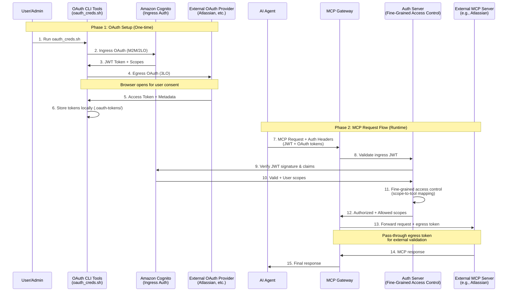
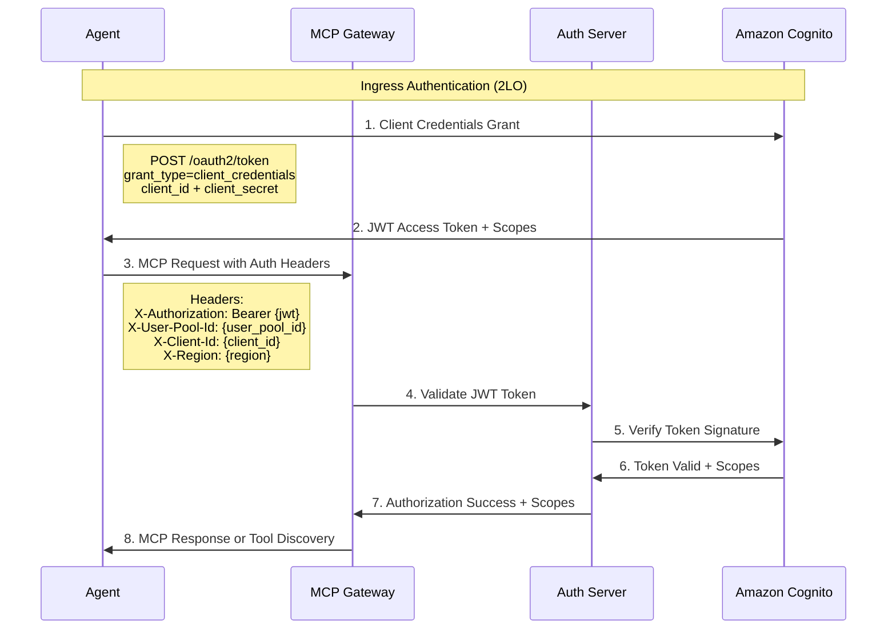

# Authentication and Authorization for MCP Gateway Registry

The MCP Gateway Registry implements a comprehensive OAuth 2.0 authentication and authorization architecture that combines Two-Legged OAuth (2LO) for gateway access, Three-Legged OAuth (3LO) for external service integration, and Fine-Grained Access Control (FGAC) for granular permission management.

## Architecture Overview

The authentication and authorization system consists of three key components:

1. **Ingress Authentication**: Authenticating TO the MCP Gateway and Registry (2LO)
   - Amazon Cognito-based authentication for agents and users
   - JWT token validation and scope extraction
   - [Fine-Grained Access Control (FGAC)](#fine-grained-access-control) for method and tool-level permissions

2. **Egress Authentication**: Authenticating FROM the MCP Gateway to external services (3LO)
   - OAuth integration with external providers (Atlassian, Google, GitHub, etc.)
   - Pass-through token mechanism for external service authorization

3. **Fine-Grained Access Control**: Granular permission system integrated with ingress authentication
   - Scope-based authorization for MCP servers, methods, and individual tools
   - Group mappings from Amazon Cognito to permission scopes
   - Hierarchical validation with principle of least privilege

This architecture separates concerns between gateway access control, external service authorization, and granular permission management, providing flexibility and security for enterprise deployments.



## Ingress Authentication (Two-Legged OAuth - 2LO)

Ingress authentication controls access TO the MCP Gateway and Registry using Amazon Cognito as the primary Identity Provider (IdP). This layer implements standard OAuth 2.0 Two-Legged flows.

### Supported Authentication Methods

#### 1. Machine-to-Machine (M2M) Authentication
- **Flow**: OAuth 2.0 Client Credentials Grant
- **Use Case**: AI agents and automated systems
- **Token Type**: JWT access tokens
- **Scopes**: Defined in Cognito client configuration

#### 2. User Authentication to Registry UI
- **Flow**: OAuth 2.0 Authorization Code + PKCE
- **Use Case**: Human administrators accessing the Registry web interface
- **Process**: User visits Registry landing page → redirected to Cognito for authentication → granted access to Registry UI
- **Token Type**: Web session management

#### 3. User Authentication (DEPRECATED)
- **Flow**: OAuth 2.0 Authorization Code + PKCE
- **Use Case**: Human administrators (legacy CLI tools)
- **Token Type**: Session cookies
- **Status**: ⚠️ **DEPRECATED** - Cookie-based authentication is deprecated in favor of standard OAuth flows

### Amazon Cognito Configuration

The MCP Gateway Registry uses Amazon Cognito for ingress authentication. Configuration is managed through environment variables:

```bash
# Amazon Cognito Configuration
AWS_REGION=us-east-1
INGRESS_OAUTH_USER_POOL_ID=us-east-1_XXXXXXXXX
INGRESS_OAUTH_CLIENT_ID=your_cognito_client_id
INGRESS_OAUTH_CLIENT_SECRET=your_cognito_client_secret
```

For detailed Cognito setup instructions, see [`docs/cognito.md`](cognito.md).

### Ingress Authentication Flow



## Egress Authentication (Three-Legged OAuth - 3LO)

Egress authentication enables the MCP Gateway to authenticate to external services on behalf of users using standard OAuth 2.0 Three-Legged flows.

### Supported OAuth Providers

The system supports multiple external OAuth providers through a comprehensive configuration system. See [`agents/oauth/oauth_providers.yaml`](../agents/oauth/oauth_providers.yaml) for the complete list:

- **Atlassian Cloud**: Jira, Confluence access
- **Google**: Google Workspace, Gmail, Drive
- **GitHub**: Repository and organization access
- **Others**: *Coming soon*

### OAuth Provider Configuration

External OAuth providers are configured in [`agents/oauth/oauth_providers.yaml`](../agents/oauth/oauth_providers.yaml):

```yaml
providers:
  atlassian:
    display_name: "Atlassian Cloud"
    auth_url: "https://auth.atlassian.com/authorize"
    token_url: "https://auth.atlassian.com/oauth/token"
    user_info_url: "https://api.atlassian.com/oauth/token/accessible-resources"
    scopes:
      - "read:jira-work"
      - "write:jira-work"
      - "read:confluence-space.summary"
      - "offline_access"
    response_type: "code"
    grant_type: "authorization_code"
    audience: "api.atlassian.com"
    requires_pkce: false
    requires_cloud_id: true
```

### Setting Up External Provider Authentication

#### Example: Atlassian Developer Setup

1. **Create Atlassian Developer Account**
   - Sign up at [developer.atlassian.com](https://developer.atlassian.com)
   - Navigate to "Your apps" section

2. **Create OAuth 2.0 App**
   - Click "Create new app"
   - Choose "OAuth 2.0 (3LO)" app type
   - Configure app settings:
     - App name: "MCP Gateway Integration"
     - Redirect URI: `http://localhost:8080/callback`
     - Scopes: Select required Jira/Confluence permissions

3. **Get Credentials**
   - Copy the **Client ID** from the app settings
   - Copy the **Client Secret** from the app settings
   - Note the **Cloud ID** from your Atlassian instance

4. **Configure Environment Variables**
   
   Add the credentials to [`agents/oauth/.env`](../agents/oauth/.env):

   ```bash
   # Egress OAuth Configuration
   EGRESS_OAUTH_CLIENT_ID=your_atlassian_client_id
   EGRESS_OAUTH_CLIENT_SECRET=your_atlassian_client_secret
   EGRESS_OAUTH_REDIRECT_URI=http://localhost:8080/callback
   ```

### Egress Authentication Flow


## Authentication Headers

The MCP Gateway uses specific HTTP headers to pass authentication information through the system. Based on the implementation in [`agents/agent.py`](../agents/agent.py), the following headers are used:

### Headers for MCP Gateway and Registry

| Header Name | Purpose | Example Value | Usage |
|-------------|---------|---------------|--------|
| `X-Authorization` | Ingress JWT token for gateway access | `Bearer eyJhbG...` | Amazon Cognito M2M authentication |
| `X-User-Pool-Id` | Amazon Cognito User Pool identifier | `us-east-1_XXXXXXXXX` | Token validation context |
| `X-Client-Id` | Amazon Cognito App Client ID | `your_cognito_client_id` | Client identification |
| `X-Region` | AWS region for Amazon Cognito | `us-east-1` | Regional context |
| `Cookie` | Session cookie (deprecated) | `mcp_gateway_session={session_cookie}` | ⚠️ Legacy user authentication |

### Headers for External MCP Servers

> **Note**: These headers are passed through to external MCP servers when making egress calls to services like Atlassian.

| Header Name | Purpose | Example Value | Usage |
|-------------|---------|---------------|--------|
| `Authorization` | Egress token for external services | `Bearer ya29.a0...` | External OAuth provider tokens |
| `X-Atlassian-Cloud-Id` | Atlassian instance identifier | `1234-5678-9abc-def0` | Atlassian-specific routing |

## Implementation Examples

### Running OAuth Authentication

The MCP Gateway Registry provides automated OAuth orchestration through shell scripts and Python modules:

#### 1. Complete OAuth Flow (Ingress + Egress)

```bash
# Run both ingress and egress authentication
cd agents/oauth
./oauth_creds.sh

# With specific provider
./oauth_creds.sh --provider atlassian

# Force new token generation
./oauth_creds.sh --force --verbose
```

#### 2. Ingress-Only Authentication

```bash
# M2M authentication to MCP Gateway
cd agents/oauth
./oauth_creds.sh --ingress-only

# Or run directly
python ingress_oauth.py --verbose
```

#### 3. Egress-Only Authentication

```bash
# External provider authentication
cd agents/oauth
./oauth_creds.sh --egress-only --provider atlassian

# Or run directly
python egress_oauth.py --provider atlassian --verbose
```

#### 4. Generic OAuth Flow

For custom or advanced OAuth flows:

```bash
# Interactive OAuth flow
python generic_oauth_flow.py --provider atlassian

# Command line mode
python generic_oauth_flow.py \
  --provider atlassian \
  --client-id YOUR_CLIENT_ID \
  --client-secret YOUR_CLIENT_SECRET
```

### Environment File Structure

The OAuth system uses environment files in [`agents/oauth/.env`](../agents/oauth/.env):

```bash
# =============================================================================
# AMAZON COGNITO OAUTH2 CONFIGURATION (Ingress)
# =============================================================================
AWS_REGION=us-east-1
INGRESS_OAUTH_USER_POOL_ID=us-east-1_XXXXXXXXX
INGRESS_OAUTH_CLIENT_ID=your_cognito_client_id
INGRESS_OAUTH_CLIENT_SECRET=your_cognito_client_secret

# =============================================================================
# EGRESS OAUTH CONFIGURATION (External Services)
# =============================================================================
EGRESS_OAUTH_CLIENT_ID=your_external_provider_client_id
EGRESS_OAUTH_CLIENT_SECRET=your_external_provider_client_secret
EGRESS_OAUTH_REDIRECT_URI=http://localhost:8080/callback
# EGRESS_OAUTH_SCOPE is optional - uses provider defaults
```

### Generated Configuration Files

After successful authentication, the system generates MCP client configuration files:

#### VS Code MCP Configuration
```json
{
  "mcp": {
    "servers": {
      "mcp_gateway": {
        "url": "https://mcpgateway.ddns.net/sse",
        "headers": {
          "X-Authorization": "Bearer {ingress_token}",
          "X-User-Pool-Id": "{user_pool_id}",
          "X-Client-Id": "{client_id}",
          "X-Region": "{region}"
        }
      },
      "atlassian": {
        "url": "https://mcpgateway.ddns.net/atlassian/mcp",
        "headers": {
          "Authorization": "Bearer {egress_token}",
          "X-Atlassian-Cloud-Id": "{cloud_id}"
        }
      }
    }
  }
}
```

#### Roocode MCP Configuration
```json
{
  "mcpServers": {
    "mcp_gateway": {
      "type": "streamable-http",
      "url": "https://mcpgateway.ddns.net/sse",
      "headers": {
        "X-Authorization": "Bearer {ingress_token}",
        "X-User-Pool-Id": "{user_pool_id}",
        "X-Client-Id": "{client_id}",
        "X-Region": "{region}"
      },
      "disabled": false,
      "alwaysAllow": []
    }
  }
}
```

## Fine-Grained Access Control

As part of the ingress authentication process, the Auth Server within the MCP Gateway and Registry implements a sophisticated fine-grained access control system that provides granular permissions for accessing MCP servers, methods, and tools. This system validates not only the user's identity but also their specific permissions to access individual MCP tools and operations.

### Access Control Architecture

The access control system is built around a scope-based authorization model that:

- Maps Amazon Cognito user groups to MCP server scopes
- Controls access to specific MCP servers, methods, and individual tools
- Supports both user identity mode (OAuth2 PKCE) and agent identity mode (Machine-to-Machine)
- Uses hierarchical scope validation for precise permission control
- Follows the principle of least privilege by default

The access control system is defined in [`auth_server/scopes.yml`](../auth_server/scopes.yml) and enforced by the validation logic in [`auth_server/server.py`](../auth_server/server.py).

### Scope Types and Structure

The system defines several types of scopes, each serving different purposes:

#### UI Scopes
Control access to registry management functions through the web interface:

- **`mcp-registry-admin`**: Full administrative access to all registry functions
- **`mcp-registry-user`**: Limited user access to specific servers and operations
- **`mcp-registry-developer`**: Developer access for service registration and management
- **`mcp-registry-operator`**: Operational access for service control without registration rights

#### Server Scopes
Control access to MCP servers with read and execute permissions:

- **`mcp-servers-unrestricted/read`**: Read access to all MCP servers and tools
- **`mcp-servers-unrestricted/execute`**: Execute access to all MCP servers and tools
- **`mcp-servers-restricted/read`**: Limited read access to specific servers and tools
- **`mcp-servers-restricted/execute`**: Limited execute access to specific servers and tools

#### Permission Levels
- **Read Permission**: Allows listing tools and reading server information
- **Execute Permission**: Allows calling tools and executing server methods

### Group Mappings

Group mappings connect Amazon Cognito groups to both UI and server scopes:

```yaml
group_mappings:
  mcp-registry-admin:
    - mcp-registry-admin                    # UI permissions
    - mcp-servers-unrestricted/read         # Server read access
    - mcp-servers-unrestricted/execute      # Server execute access
  mcp-registry-user:
    - mcp-registry-user                     # Limited UI permissions
    - mcp-servers-restricted/read           # Limited server access
```

> **Important**: All group names (such as `mcp-registry-admin`, `mcp-registry-user`) and scope names (such as `mcp-servers-unrestricted/read`, `mcp-servers-restricted/execute`) are completely customizable by the platform administrator deploying this solution. These names are examples and can be changed to match your organization's naming conventions and security requirements.

### Methods vs Tools Access Control

One of the key features of the access control system is its ability to differentiate between MCP protocol methods and specific tools, providing granular control over what operations users can perform.

#### MCP Protocol Methods
Methods are standard MCP protocol operations that all servers support:

- **`initialize`**: Initialize connection with the server
- **`notifications/initialized`**: Handle initialization notifications
- **`ping`**: Health check operation
- **`tools/list`**: List available tools on the server
- **`tools/call`**: Call a specific tool (requires additional tool-level validation)

#### Tool-Specific Access Control
Tools are server-specific functions that can be called via the `tools/call` method. The system provides two levels of validation:

1. **Method-Level Validation**: Check if the user can call `tools/call`
2. **Tool-Level Validation**: Check if the user can call the specific tool

Example configuration for restricted tool access:

```yaml
mcp-servers-restricted/execute:
  - server: fininfo
    methods:
      - initialize
      - notifications/initialized
      - ping
      - tools/list
      - tools/call                    # Can call tools/call method
    tools:
      - get_stock_aggregates          # Can call this specific tool
      - print_stock_data              # Can call this specific tool
      # Note: Cannot call other tools like advanced analytics tools
```

### Validation Logic

The scope validation follows a systematic approach implemented in the `validate_server_tool_access()` function:

1. **Input Validation**: Validate server name, method, tool name, and user scopes
2. **Scope Iteration**: Check each user scope for matching permissions
3. **Server Matching**: Find server configurations that match the requested server
4. **Method Validation**: Check if the requested method is allowed
5. **Tool Validation**: For `tools/call`, validate specific tool permissions
6. **Access Decision**: Grant access if any scope allows the operation

### Access Control Scenarios

#### Scenario 1: Method Access Only
User has permission for `tools/list` but not `tools/call`:
- ✅ Can list available tools
- ❌ Cannot execute any tools

#### Scenario 2: Method + Specific Tool Access
User has permission for `tools/call` and specific tools:
- ✅ Can call `get_stock_aggregates`
- ✅ Can call `print_stock_data`
- ❌ Cannot call `advanced_analytics_tool` (not in allowed tools list)

#### Scenario 3: Unrestricted Access
User has unrestricted execute permissions:
- ✅ Can call any method
- ✅ Can call any tool listed in the scope configuration

### Authentication Mode Integration

The scope system integrates seamlessly with both authentication modes:

- **User Identity Mode**: Users authenticate via OAuth2 PKCE, and their Cognito groups are mapped to scopes
- **Agent Identity Mode**: Agents authenticate via M2M JWT tokens with custom scopes directly assigned

### Security Considerations

The access control system is designed around the principle of least privilege:

- **Default Deny**: All access is denied by default unless explicitly granted
- **Explicit Permissions**: Each permission must be explicitly configured
- **Granular Control**: Permissions can be granted at the method and tool level
- **Scope Separation**: UI and server permissions are managed separately

### Configuration Example

Here's a complete example showing different access levels:

```yaml
# Basic user with read-only access
group_mappings:
  mcp-registry-basic-user:
    - mcp-registry-user
    - mcp-servers-restricted/read

mcp-servers-restricted/read:
  - server: currenttime
    methods:
      - initialize
      - notifications/initialized
      - ping
      - tools/list
    tools:
      - current_time_by_timezone

# Developer with service management
group_mappings:
  mcp-registry-developer:
    - mcp-registry-developer
    - mcp-servers-restricted/read
    - mcp-servers-restricted/execute

UI-Scopes:
  mcp-registry-developer:
    list_service: [all]
    register_service: [all]
    health_check_service: [all]
```

For comprehensive documentation including troubleshooting, security best practices, and advanced configuration examples, see the [complete Fine-Grained Access Control documentation](scopes.md).

## Security Considerations

### Token Storage and Protection
- OAuth tokens are stored in `.oauth-tokens/` directory with `600` permissions
- Sensitive header values are redacted in logs
- Tokens include expiration timestamps and refresh capabilities

### Scope Management
- Fine-grained access control through OAuth scopes
- Cognito groups map to MCP tool access permissions
- Provider-specific scopes control external service access

### Network Security
- HTTPS-only communication for OAuth flows
- Secure redirect URI validation
- PKCE (Proof Key for Code Exchange) where supported

For comprehensive setup instructions and advanced configuration, see:
- [Amazon Cognito Setup Guide](cognito.md)
- [Fine-Grained Access Control](scopes.md)
- [OAuth Provider Configurations](../agents/oauth/oauth_providers.yaml)