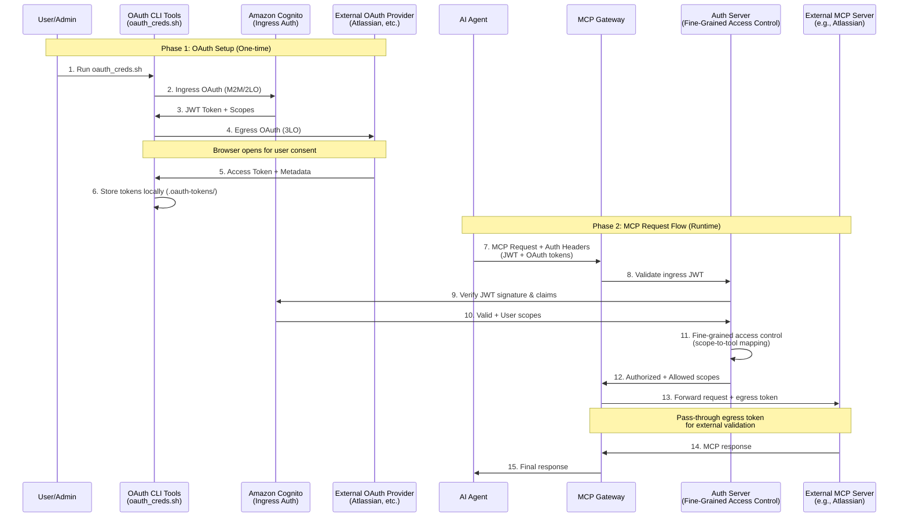
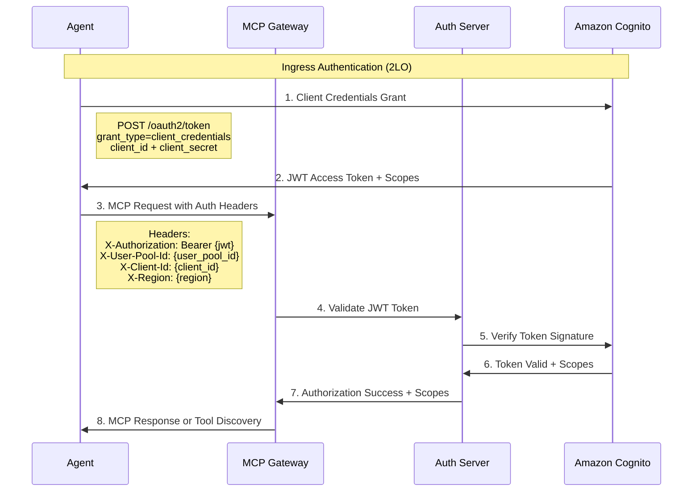

# Authentication and Authorization for MCP Gateway Registry

The MCP Gateway Registry implements a comprehensive two-layer OAuth 2.0 authentication architecture that supports both standard Two-Legged OAuth (2LO) and Three-Legged OAuth (3LO) flows for enterprise-ready access control.

## Architecture Overview

The authentication system consists of two distinct layers:

1. **Ingress Authentication**: Authenticating TO the MCP Gateway and Registry (2LO)
2. **Egress Authentication**: Authenticating FROM the MCP Gateway to external services (3LO)

This dual-layer approach separates concerns between gateway access control and external service authorization, providing flexibility and security for enterprise deployments.



## Ingress Authentication (Two-Legged OAuth - 2LO)

Ingress authentication controls access TO the MCP Gateway and Registry using Amazon Cognito as the primary Identity Provider (IdP). This layer implements standard OAuth 2.0 Two-Legged flows.

### Supported Authentication Methods

#### 1. Machine-to-Machine (M2M) Authentication
- **Flow**: OAuth 2.0 Client Credentials Grant
- **Use Case**: AI agents and automated systems
- **Token Type**: JWT access tokens
- **Scopes**: Defined in Cognito client configuration

#### 2. User Authentication to Registry UI
- **Flow**: OAuth 2.0 Authorization Code + PKCE
- **Use Case**: Human administrators accessing the Registry web interface
- **Process**: User visits Registry landing page → redirected to Cognito for authentication → granted access to Registry UI
- **Token Type**: Web session management

#### 3. User Authentication (DEPRECATED)
- **Flow**: OAuth 2.0 Authorization Code + PKCE
- **Use Case**: Human administrators (legacy CLI tools)
- **Token Type**: Session cookies
- **Status**: ⚠️ **DEPRECATED** - Cookie-based authentication is deprecated in favor of standard OAuth flows

### Amazon Cognito Configuration

The MCP Gateway Registry uses Amazon Cognito for ingress authentication. Configuration is managed through environment variables:

```bash
# Amazon Cognito Configuration
AWS_REGION=us-east-1
INGRESS_OAUTH_USER_POOL_ID=us-east-1_XXXXXXXXX
INGRESS_OAUTH_CLIENT_ID=your_cognito_client_id
INGRESS_OAUTH_CLIENT_SECRET=your_cognito_client_secret
```

For detailed Cognito setup instructions, see [`docs/cognito.md`](cognito.md).

### Ingress Authentication Flow



## Egress Authentication (Three-Legged OAuth - 3LO)

Egress authentication enables the MCP Gateway to authenticate to external services on behalf of users using standard OAuth 2.0 Three-Legged flows.

### Supported OAuth Providers

The system supports multiple external OAuth providers through a comprehensive configuration system. See [`agents/oauth/oauth_providers.yaml`](../agents/oauth/oauth_providers.yaml) for the complete list:

- **Atlassian Cloud**: Jira, Confluence access
- **Google**: Google Workspace, Gmail, Drive
- **GitHub**: Repository and organization access
- **Others**: *Coming soon*

### OAuth Provider Configuration

External OAuth providers are configured in [`agents/oauth/oauth_providers.yaml`](../agents/oauth/oauth_providers.yaml):

```yaml
providers:
  atlassian:
    display_name: "Atlassian Cloud"
    auth_url: "https://auth.atlassian.com/authorize"
    token_url: "https://auth.atlassian.com/oauth/token"
    user_info_url: "https://api.atlassian.com/oauth/token/accessible-resources"
    scopes:
      - "read:jira-work"
      - "write:jira-work"
      - "read:confluence-space.summary"
      - "offline_access"
    response_type: "code"
    grant_type: "authorization_code"
    audience: "api.atlassian.com"
    requires_pkce: false
    requires_cloud_id: true
```

### Setting Up External Provider Authentication

#### Example: Atlassian Developer Setup

1. **Create Atlassian Developer Account**
   - Sign up at [developer.atlassian.com](https://developer.atlassian.com)
   - Navigate to "Your apps" section

2. **Create OAuth 2.0 App**
   - Click "Create new app"
   - Choose "OAuth 2.0 (3LO)" app type
   - Configure app settings:
     - App name: "MCP Gateway Integration"
     - Redirect URI: `http://localhost:8080/callback`
     - Scopes: Select required Jira/Confluence permissions

3. **Get Credentials**
   - Copy the **Client ID** from the app settings
   - Copy the **Client Secret** from the app settings
   - Note the **Cloud ID** from your Atlassian instance

4. **Configure Environment Variables**
   
   Add the credentials to [`agents/oauth/.env`](../agents/oauth/.env):

   ```bash
   # Egress OAuth Configuration
   EGRESS_OAUTH_CLIENT_ID=your_atlassian_client_id
   EGRESS_OAUTH_CLIENT_SECRET=your_atlassian_client_secret
   EGRESS_OAUTH_REDIRECT_URI=http://localhost:8080/callback
   ```

### Egress Authentication Flow

```mermaid
sequenceDiagram
    participant User
    participant Gateway as MCP Gateway
    participant Browser
    participant Provider as External OAuth Provider<br/>(e.g., Atlassian)
    
    Note over User,Provider: Egress Authentication (3LO)
    
    User->>Gateway: 1. Run egress_oauth.py
    Gateway->>Browser: 2. Open Authorization URL
    Note right of Gateway: https://auth.atlassian.com/authorize<br/>?client_id={id}<br/>&redirect_uri={callback}<br/>&scope={scopes}<br/>&response_type=code
    
    Browser->>Provider: 3. User Authorization
    
    rect rgb(255, 248, 220)
        Note over User,Provider: 🔑 THREE-LEGGED OAUTH (3LO) STEP
        User->>Provider: 4. Grant Permissions (User clicks "Accept")
        Note over User,Provider: This is where the user explicitly<br/>authorizes the application access
    end
    
    Provider->>Browser: 5. Redirect with Auth Code
    Browser->>Gateway: 6. Authorization Code
    
    Gateway->>Provider: 7. Exchange Code for Token
    Note right of Gateway: POST /oauth/token<br/>grant_type=authorization_code<br/>code={auth_code}<br/>client_id + client_secret
    
    Provider->>Gateway: 8. Access Token + Metadata
    Note left of Provider: Response includes:<br/>- access_token<br/>- refresh_token<br/>- cloud_id (Atlassian)<br/>- scopes
    
    Gateway->>Gateway: 9. Store Egress Tokens
    Note right of Gateway: Saved to .oauth-tokens/egress.json
```



## Authentication Headers

The MCP Gateway uses specific HTTP headers to pass authentication information through the system. Based on the implementation in [`agents/agent.py`](../agents/agent.py), the following headers are used:

### Headers for MCP Gateway and Registry

| Header Name | Purpose | Example Value | Usage |
|-------------|---------|---------------|--------|
| `X-Authorization` | Ingress JWT token for gateway access | `Bearer eyJhbG...` | Amazon Cognito M2M authentication |
| `X-User-Pool-Id` | Amazon Cognito User Pool identifier | `us-east-1_XXXXXXXXX` | Token validation context |
| `X-Client-Id` | Amazon Cognito App Client ID | `your_cognito_client_id` | Client identification |
| `X-Region` | AWS region for Amazon Cognito | `us-east-1` | Regional context |
| `Cookie` | Session cookie (deprecated) | `mcp_gateway_session={session_cookie}` | ⚠️ Legacy user authentication |

### Headers for External MCP Servers

> **Note**: These headers are passed through to external MCP servers when making egress calls to services like Atlassian.

| Header Name | Purpose | Example Value | Usage |
|-------------|---------|---------------|--------|
| `Authorization` | Egress token for external services | `Bearer ya29.a0...` | External OAuth provider tokens |
| `X-Atlassian-Cloud-Id` | Atlassian instance identifier | `1234-5678-9abc-def0` | Atlassian-specific routing |

## Implementation Examples

### Running OAuth Authentication

The MCP Gateway Registry provides automated OAuth orchestration through shell scripts and Python modules:

#### 1. Complete OAuth Flow (Ingress + Egress)

```bash
# Run both ingress and egress authentication
cd agents/oauth
./oauth_creds.sh

# With specific provider
./oauth_creds.sh --provider atlassian

# Force new token generation
./oauth_creds.sh --force --verbose
```

#### 2. Ingress-Only Authentication

```bash
# M2M authentication to MCP Gateway
cd agents/oauth
./oauth_creds.sh --ingress-only

# Or run directly
python ingress_oauth.py --verbose
```

#### 3. Egress-Only Authentication

```bash
# External provider authentication
cd agents/oauth
./oauth_creds.sh --egress-only --provider atlassian

# Or run directly
python egress_oauth.py --provider atlassian --verbose
```

#### 4. Generic OAuth Flow

For custom or advanced OAuth flows:

```bash
# Interactive OAuth flow
python generic_oauth_flow.py --provider atlassian

# Command line mode
python generic_oauth_flow.py \
  --provider atlassian \
  --client-id YOUR_CLIENT_ID \
  --client-secret YOUR_CLIENT_SECRET
```

### Environment File Structure

The OAuth system uses environment files in [`agents/oauth/.env`](../agents/oauth/.env):

```bash
# =============================================================================
# AMAZON COGNITO OAUTH2 CONFIGURATION (Ingress)
# =============================================================================
AWS_REGION=us-east-1
INGRESS_OAUTH_USER_POOL_ID=us-east-1_XXXXXXXXX
INGRESS_OAUTH_CLIENT_ID=your_cognito_client_id
INGRESS_OAUTH_CLIENT_SECRET=your_cognito_client_secret

# =============================================================================
# EGRESS OAUTH CONFIGURATION (External Services)
# =============================================================================
EGRESS_OAUTH_CLIENT_ID=your_external_provider_client_id
EGRESS_OAUTH_CLIENT_SECRET=your_external_provider_client_secret
EGRESS_OAUTH_REDIRECT_URI=http://localhost:8080/callback
# EGRESS_OAUTH_SCOPE is optional - uses provider defaults
```

### Generated Configuration Files

After successful authentication, the system generates MCP client configuration files:

#### VS Code MCP Configuration
```json
{
  "mcp": {
    "servers": {
      "mcp_gateway": {
        "url": "https://mcpgateway.ddns.net/sse",
        "headers": {
          "X-Authorization": "Bearer {ingress_token}",
          "X-User-Pool-Id": "{user_pool_id}",
          "X-Client-Id": "{client_id}",
          "X-Region": "{region}"
        }
      },
      "atlassian": {
        "url": "https://mcpgateway.ddns.net/atlassian/mcp",
        "headers": {
          "Authorization": "Bearer {egress_token}",
          "X-Atlassian-Cloud-Id": "{cloud_id}"
        }
      }
    }
  }
}
```

#### Roocode MCP Configuration
```json
{
  "mcpServers": {
    "mcp_gateway": {
      "type": "streamable-http",
      "url": "https://mcpgateway.ddns.net/sse",
      "headers": {
        "X-Authorization": "Bearer {ingress_token}",
        "X-User-Pool-Id": "{user_pool_id}",
        "X-Client-Id": "{client_id}",
        "X-Region": "{region}"
      },
      "disabled": false,
      "alwaysAllow": []
    }
  }
}
```

## Fine-Grained Access Control

As part of the ingress authentication process, the Auth Server within the MCP Gateway and Registry implements fine-grained access control for MCP server methods and tools. This system validates not only the user's identity but also their specific permissions to access individual MCP tools and operations.

### Access Control Flow

1. **Token Validation**: The Auth Server validates the incoming JWT token with Amazon Cognito
2. **Scope Extraction**: User scopes and group memberships are extracted from the validated token
3. **Permission Mapping**: Scopes are mapped to specific MCP server methods and tool access permissions
4. **Authorization Decision**: Each MCP request is evaluated against the user's permitted scopes

### Scope-Based Authorization

The system uses OAuth scopes to control access to:
- Specific MCP servers (e.g., `atlassian:read`, `atlassian:write`)
- Individual tools within servers (e.g., `jira:issues:read`, `confluence:pages:write`)
- Administrative functions (e.g., `registry:admin`, `server:manage`)

For detailed information about configuring scopes, group mappings, and permission management, see the [Fine-Grained Access Control documentation](scopes.md).

## Security Considerations

### Token Storage and Protection
- OAuth tokens are stored in `.oauth-tokens/` directory with `600` permissions
- Sensitive header values are redacted in logs
- Tokens include expiration timestamps and refresh capabilities

### Scope Management
- Fine-grained access control through OAuth scopes
- Cognito groups map to MCP tool access permissions
- Provider-specific scopes control external service access

### Network Security
- HTTPS-only communication for OAuth flows
- Secure redirect URI validation
- PKCE (Proof Key for Code Exchange) where supported

For comprehensive setup instructions and advanced configuration, see:
- [Amazon Cognito Setup Guide](cognito.md)
- [Fine-Grained Access Control](scopes.md)
- [OAuth Provider Configurations](../agents/oauth/oauth_providers.yaml)