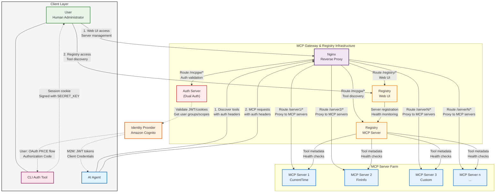

# Authentication and Authorization Enhancements for MCP

Authorization in context of MCP usually refers to two distinct flows or grant types:

- Agent acting on-behalf of a user: in this case the Agent takes the identity of the end-user (human). For example, an Agent invoked by an application as a result of a user asking a question in a chatbot will use the user's identity for authentication and authorization.

- Agent acting on its own behalf: in this case the Agent gets invoked automatically in response to an event and thus the Agent has its own identity. For example a network remediation agent that gets invoked when a network anomaly is detected will have an identity of its own as it is not being invoked by a user.

The latest MCP authorization spec available [here](https://modelcontextprotocol.io/specification/2025-03-26/basic/authorization) discusses this in context of OAuth Grant types.

## The challenge with MCP auth in an enterprise scenario

The current MCP spec puts the onus of authentication on the MCP server i.e. the server is responsible for providing access credentials to the MCP client as well as validating those credentials (see [OAuth for model context protocol](https://aaronparecki.com/2025/04/03/15/oauth-for-model-context-protocol) for an illustrative explanation). This implies that developers now have to add Auth capabilities in their MCP servers and in an enterprise scenario with hundreds of MCP servers and thousands of tools this is a huge challenge. The problem is compounded by the fact that enterprises would want to offer fine-grained access controls to tools (an Agent can access the server but only a subset of the tools provided by the server) for both the types of Agent flows described above.

## A Solution with an MCP Gateway and Registry

The MCP gateway and Registry provides an enterprise ready solution that integrates with an IdP and provides a separate auth server which handles all authorization and authentication by talking to an IdP and this frees up the MCP servers from having to handle any authentication.

Here is an architecture diagram of the system.

### Architecture Components Explained

The updated architecture diagram above shows the clear separation of components that work together to provide secure, enterprise-ready MCP access:

#### Client Layer
- **User (Human Administrator)**: Manages the registry through the web UI, registers new MCP servers, and monitors system health
- **CLI Auth Tool**: Handles OAuth authentication flows for users, creating session cookies for web UI access
- **AI Agent**: Programmatic clients that discover and invoke MCP tools with proper authentication

#### MCP Gateway & Registry Infrastructure
- **Nginx Reverse Proxy**: Single entry point that routes all requests and handles SSL termination
- **Auth Server**: Validates JWT tokens and session cookies against Amazon Cognito, enforces fine-grained access control
- **Registry Web UI**: Administrative interface for managing MCP servers and viewing system status
- **Registry MCP Server**: Provides tool discovery capabilities to agents, returns filtered results based on permissions

#### External Components
- **Amazon Cognito**: Identity Provider (IdP) that handles user authentication and group management
- **MCP Server Farm**: Collection of individual MCP servers providing various tools and capabilities

> **For detailed setup instructions**, see the comprehensive guide in [`docs/cognito.md`](cognito.md) which covers both user identity and agent identity authentication modes.

At a high-level the flow works as follows:

1. An Agent gets auth credentials from an enterprise IdP either by itself (agent identity) or is provided these credentials (on-behalf of user's identity) that have been retrieved by the (human) user through a separate program (such as signing-in via a web browser or a CLI command).

1. The Agent embeds these credentials and other metadata needed to verify these credentials in HTTP headers for the MCP protocol messages exchanged with the MCP servers.

1. The MCP servers are only accessible through the Gateway (reverse proxy), upon receiving the messages the Gateway hands them off to an auth server which validates the credentials embedded in the these messages with the enterprise IdP. This validation includes both authentication as well as authorization. The auth server retrieves the access scope for the Agent from the IdP auth validation response and then compares it with the MCP method (`initialize`, `tools/call` etc.) and tool being requested. The auth server responds with a 200 OK if the access should be allowed based on the credentials provided and the scope requested or a an HTTP 403 access denied otherwise. The auth server also includes the list of allowed scopes in its 200 OK response.

1. The Gateway then proceeds to pass on the request to the MCP server to which the request was addressed to in case the access was allowed (200 OK from the auth server) or sends the 403 access denied to the Agent. 

1. An Agent uses the same mechanism to talk to the Registry's MCP server for tool discovery. The Agent may request access to a special tool discovery tool available via the Registry's MCP server. The tool discovery tool now has access to the Agent's scope (through the auth server including the scope in the response headers for the 200 OK) and applies the scopes while searching for potential tools that the Agent can have access to, thus it only lists the tools that the Agent has access to in its response via the tool discovery tool. Here is a example scenario, a general purpose AI assistant may be able to discover through the tool finder tool that there is a tool to get the current time at a given location but based on its access it may not have access to a tool to determine stock information and hence the Registry never list the stock information tool as an available tool to the Agent (if the Agent knows about this tool through some out of band mechanism and tries to invoke the tool it would get an access denied as explained in the previous steps).

The above implementation provides an OAuth compliant way to MCP security without the MCP servers being involved in enforcing this security greatly simplifying the MCP server implementation (as compared to every MCP server having to implement authentication and authorization).

## Amazon Cognito based reference implementation

For comprehensive setup instructions and detailed configuration of Amazon Cognito as the Identity Provider, see the detailed documentation in [`docs/cognito.md`](cognito.md) which covers both user identity and agent identity authentication modes with step-by-step configuration guides.

For information about Fine-Grained Access Control (FGAC) including scope configuration, group mappings, and permission management, see [`docs/scopes.md`](scopes.md).

By implementing these enhancements, we can significantly improve the security, scalability, and flexibility of our MCP authentication and authorization system.