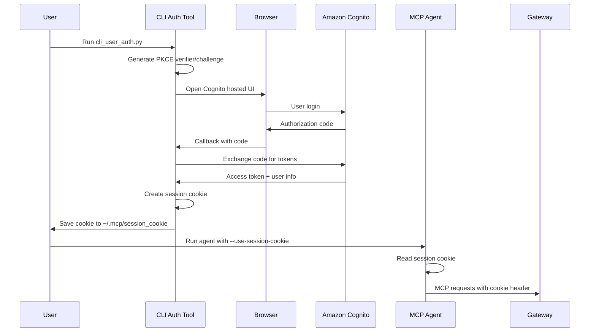
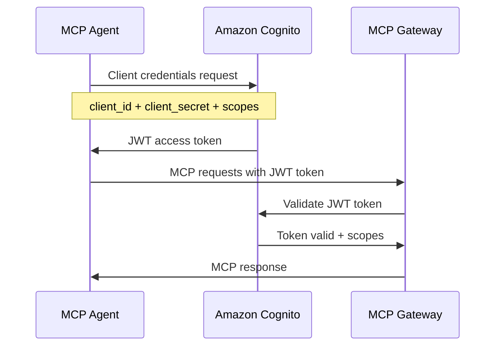

# Amazon Cognito Setup Guide for MCP Gateway Registry

This comprehensive guide covers setting up Amazon Cognito for both user identity and agent identity authentication modes with the MCP Gateway Registry system.

## Table of Contents

1. [Overview](#overview)
2. [Amazon Cognito Setup](#amazon-cognito-setup)
3. [Agent Uses User Identity Mode](#agent-uses-user-identity-mode)
4. [Agent Uses Its Own Identity Mode](#agent-uses-its-own-identity-mode)
5. [Environment Configuration Examples](#environment-configuration-examples)
6. [Testing and Troubleshooting](#testing-and-troubleshooting)

## Overview

The MCP Gateway Registry supports two distinct authentication modes:

- **Agent Uses User Identity Mode**: Agents act on behalf of users using OAuth 2.0 PKCE flow with session cookies
- **Agent Uses Its Own Identity Mode**: Agents have their own identity using Machine-to-Machine (M2M) authentication with JWT tokens

Both modes integrate with Amazon Cognito as the Identity Provider (IdP) and use the same scope-based authorization system defined in [`auth_server/scopes.yml`](../auth_server/scopes.yml).

## Amazon Cognito Setup

### Step 1: Create Cognito User Pool

1. **Navigate to Amazon Cognito Console**
   - Go to [AWS Cognito Console](https://console.aws.amazon.com/cognito/)
   - Select your desired AWS region (e.g., `us-east-1`)
   - Click "Create user pool"

2. **Configure Sign-in Experience**
   - **Authentication providers**: Choose "Cognito user pool"
   - **Cognito user pool sign-in options**: Select "Email" and optionally "Username"
   - Click "Next"

3. **Configure Security Requirements**
   - **Password policy**: Choose "Cognito defaults" or customize as needed
   - **Multi-factor authentication**: Choose "Optional" or "Required" based on your security requirements
   - **User account recovery**: Enable "Email only"
   - Click "Next"

4. **Configure Sign-up Experience**
   - **Self-service sign-up**: Enable if you want users to self-register
   - **Required attributes**: Select "email" at minimum
   - **Custom attributes**: Add any custom attributes if needed
   - Click "Next"

5. **Configure Message Delivery**
   - **Email provider**: Choose "Send email with Cognito" for development or configure SES for production
   - Click "Next"

6. **Integrate Your App**
   - **User pool name**: Enter a descriptive name (e.g., `mcp-gateway-users`)
   - **Hosted authentication pages**: Check "Use the Cognito Hosted UI"
   - **Domain**: Choose "Use a Cognito domain" and enter a unique domain prefix
   - Click "Next"

7. **Review and Create**
   - Review all settings
   - Click "Create user pool"

### Step 2: Configure App Clients

You'll need to create two app clients: one for user authentication (PKCE flow) and one for M2M authentication.

#### App Client for User Authentication (PKCE Flow)

1. **Navigate to App Integration**
   - In your user pool, go to "App integration" tab
   - Click "Create app client"

2. **Configure App Client**
   - **App type**: Select "Public client"
   - **App client name**: Enter `mcp-gateway-user-client`
   - **Client secret**: Select "Don't generate a client secret"
   - **Authentication flows**: Enable "ALLOW_USER_SRP_AUTH" and "ALLOW_REFRESH_TOKEN_AUTH"

3. **Configure Hosted UI Settings**
   - **Allowed callback URLs**: Add:
     - `http://localhost:8080/callback` (for local development)
     - `https://your-domain.com/oauth2/callback/cognito` (for production)
   - **Allowed sign-out URLs**: Add:
     - `http://localhost:7860` (for local development)
     - `https://your-domain.com` (for production)
   - **Identity providers**: Select "Cognito user pool"
   - **OAuth 2.0 grant types**: Enable "Authorization code grant"
   - **OpenID Connect scopes**: Enable "openid", "email", "profile"

#### App Client for M2M Authentication

1. **Create Second App Client**
   - Click "Create app client" again
   - **App type**: Select "Confidential client"
   - **App client name**: Enter `mcp-gateway-m2m-client`
   - **Client secret**: Select "Generate a client secret"
   - **Authentication flows**: Enable "ALLOW_USER_SRP_AUTH" and "ALLOW_REFRESH_TOKEN_AUTH"

2. **Configure M2M Settings**
   - **OAuth 2.0 grant types**: Enable "Client credentials"
   - **Custom scopes**: Add custom scopes for your MCP servers (see [Scope Configuration](#scope-configuration))

### Step 3: Create User Groups

Groups are used to map users to specific scopes and permissions.

1. **Navigate to Groups**
   - In your user pool, go to "Groups" tab
   - Click "Create group"

2. **Create Required Groups**
   Create the following groups based on your [`scopes.yml`](../auth_server/scopes.yml) configuration:

   - **mcp-registry-admin**
     - Description: "Full administrative access to MCP registry and all servers"
     - Precedence: 1

   - **mcp-registry-developer**
     - Description: "Developer access with ability to register services"
     - Precedence: 2

   - **mcp-registry-operator**
     - Description: "Operator access with ability to control services"
     - Precedence: 3

   - **mcp-registry-user**
     - Description: "Basic user access to limited MCP servers"
     - Precedence: 4

### Step 4: Configure Custom Scopes (for M2M)

1. **Navigate to Resource Servers**
   - In your user pool, go to "App integration" → "Resource servers"
   - Click "Create resource server"

2. **Create Resource Server**
   - **Name**: `mcp-gateway-api`
   - **Identifier**: `mcp-gateway`
   - **Scopes**: Add the following custom scopes based on your [`scopes.yml`](../auth_server/scopes.yml):
     - `mcp-servers-unrestricted/read`: "Read access to all MCP servers"
     - `mcp-servers-unrestricted/execute`: "Execute access to all MCP servers"
     - `mcp-servers-restricted/read`: "Read access to restricted MCP servers"
     - `mcp-servers-restricted/execute`: "Execute access to restricted MCP servers"

3. **Update M2M App Client**
   - Go back to your M2M app client
   - In "Hosted UI settings", add the custom scopes you just created

## Agent Uses User Identity Mode

This mode enables agents to act on behalf of users, using their Cognito identity and group memberships for authorization.

### Configuration Steps

#### 1. Cognito User Pool Configuration

Ensure your Cognito User Pool is configured with:
- **PKCE-enabled app client** (public client without secret)
- **Hosted UI enabled** with appropriate callback URLs
- **User groups** mapped to MCP scopes via [`scopes.yml`](../auth_server/scopes.yml)

#### 2. OAuth 2.0 PKCE Flow Setup

The PKCE (Proof Key for Code Exchange) flow is implemented in [`agents/cli_user_auth.py`](../agents/cli_user_auth.py):



#### 3. Session Cookie Authentication

The session cookie contains:
- **Username**: Cognito username
- **Groups**: User's Cognito group memberships
- **Expiration**: 8-hour validity (configurable)
- **Signature**: Signed with `SECRET_KEY` for security

#### 4. Required Environment Variables

Create `.env.user` file in the `agents/` directory:

```bash
# Cognito Configuration
COGNITO_USER_POOL_ID=us-east-1_XXXXXXXXX
COGNITO_CLIENT_ID=your-public-client-id
SECRET_KEY=your-secret-key-matching-registry

# Optional: Custom domain
COGNITO_DOMAIN=your-custom-domain

# AWS Region
AWS_REGION=us-east-1

# Registry URL (for callback configuration)
REGISTRY_URL=http://localhost:7860
```

#### 5. CLI Authentication Tool Usage

Run the CLI authentication tool to obtain a session cookie:

```bash
# Navigate to agents directory
cd agents/

# Run CLI authentication
python cli_user_auth.py

# This will:
# 1. Open your browser to Cognito hosted UI
# 2. After login, capture the authorization code
# 3. Exchange code for user information
# 4. Create and save session cookie to ~/.mcp/session_cookie
```

#### 6. Agent Usage with Session Cookie

```bash
# Use agent with session cookie authentication
python agent.py \
  --use-session-cookie \
  --message "What time is it in Tokyo?" \
  --mcp-registry-url http://localhost/mcpgw/sse
```

## Agent Uses Its Own Identity Mode

This mode enables agents to have their own identity using Machine-to-Machine (M2M) authentication.

### Configuration Steps

#### 1. Machine-to-Machine Authentication Setup

M2M authentication uses the OAuth 2.0 Client Credentials flow:



#### 2. Client Credentials Flow Configuration

The M2M flow is implemented in [`auth_server/cognito_utils.py`](../auth_server/cognito_utils.py):

1. **Token Request**: Agent requests token using client credentials
2. **JWT Token**: Cognito issues JWT token with embedded scopes
3. **Token Validation**: Auth server validates JWT signature and claims
4. **Scope Enforcement**: Access granted based on token scopes

#### 3. JWT Token Handling

JWT tokens contain:
- **Issuer**: Cognito User Pool issuer URL
- **Client ID**: M2M app client identifier
- **Scopes**: Granted scopes for MCP server access
- **Expiration**: Token validity period (typically 1 hour)

#### 4. Required Environment Variables

Create `.env.agent` file in the `agents/` directory:

```bash
# Cognito M2M Configuration
COGNITO_CLIENT_ID=your-confidential-client-id
COGNITO_CLIENT_SECRET=your-client-secret
COGNITO_USER_POOL_ID=us-east-1_XXXXXXXXX

# AWS Region
AWS_REGION=us-east-1

# MCP Registry URL
MCP_REGISTRY_URL=http://localhost/mcpgw/sse
```

#### 5. Scope and Permission Configuration

M2M clients must be granted specific scopes in Cognito:

1. **Navigate to App Client**
   - Go to your M2M app client in Cognito console
   - Edit "Hosted UI settings"

2. **Assign Custom Scopes**
   - Select appropriate scopes from your resource server:
     - `mcp-gateway/mcp-servers-unrestricted/read`
     - `mcp-gateway/mcp-servers-unrestricted/execute`
     - `mcp-gateway/mcp-servers-restricted/read`
     - `mcp-gateway/mcp-servers-restricted/execute`

#### 6. Agent Usage with M2M Authentication

```bash
# Use agent with M2M authentication (default mode)
python agent.py \
  --message "What time is it in Tokyo?" \
  --mcp-registry-url http://localhost/mcpgw/sse
```

## Environment Configuration Examples

### Complete `.env.user` Example

```bash
# =============================================================================
# USER IDENTITY MODE CONFIGURATION
# =============================================================================
# This configuration is used when agents act on behalf of users

# Cognito User Pool Configuration
COGNITO_USER_POOL_ID=us-east-1_ABC123DEF
COGNITO_CLIENT_ID=1a2b3c4d5e6f7g8h9i0j
# Note: No client secret for public PKCE client

# Secret key for session cookie signing (must match registry SECRET_KEY)
SECRET_KEY=your-64-character-hex-secret-key-here

# Optional: Custom Cognito domain (if configured)
# COGNITO_DOMAIN=mcp-gateway

# AWS Region
AWS_REGION=us-east-1

# Registry URL for callback configuration
REGISTRY_URL=http://localhost:7860

# Callback configuration
USE_DIRECT_CALLBACK=true

# =============================================================================
# USAGE INSTRUCTIONS
# =============================================================================
# 1. Run: python cli_user_auth.py
# 2. Complete browser authentication
# 3. Run: python agent.py --use-session-cookie --message "your question"
```

### Complete `.env.agent` Example

```bash
# =============================================================================
# AGENT IDENTITY MODE CONFIGURATION (M2M)
# =============================================================================
# This configuration is used when agents have their own identity

# Cognito M2M App Client Configuration
COGNITO_CLIENT_ID=2b3c4d5e6f7g8h9i0j1k
COGNITO_CLIENT_SECRET=your-confidential-client-secret-here
COGNITO_USER_POOL_ID=us-east-1_ABC123DEF

# AWS Region
AWS_REGION=us-east-1

# MCP Registry URL
MCP_REGISTRY_URL=http://localhost/mcpgw/sse

# Optional: Bedrock model configuration
BEDROCK_MODEL_ID=anthropic.claude-3-haiku-20240307-v1:0

# =============================================================================
# USAGE INSTRUCTIONS
# =============================================================================
# 1. Ensure M2M client has appropriate scopes in Cognito
# 2. Run: python agent.py --message "your question"
```

### Common Configuration Pitfalls and Solutions

#### 1. Callback URL Mismatch

**Problem**: `redirect_uri_mismatch` error during OAuth flow

**Solution**: Ensure callback URLs in Cognito match your configuration:
- Local development: `http://localhost:8080/callback`
- Docker environment: `http://localhost:7860/oauth2/callback/cognito`
- Production: `https://your-domain.com/oauth2/callback/cognito`

#### 2. Secret Key Mismatch

**Problem**: Session cookie validation fails

**Solution**: Ensure `SECRET_KEY` in `.env.user` matches the registry's `SECRET_KEY`:
```bash
# Generate a new secret key
python -c 'import secrets; print(secrets.token_hex(32))'

# Use the same key in both .env and registry configuration
```

#### 3. Scope Configuration Issues

**Problem**: Access denied errors despite valid authentication

**Solution**: Verify scope mappings in [`scopes.yml`](../auth_server/scopes.yml):
- Check group mappings match Cognito groups
- Ensure server/tool permissions are correctly defined
- Verify M2M client has required custom scopes

#### 4. JWT Token Validation Errors

**Problem**: M2M authentication fails with token validation errors

**Solution**: Check the following:
- Client ID and secret are correct
- User Pool ID format is correct (e.g., `us-east-1_ABC123DEF`)
- AWS region matches User Pool region
- Custom scopes are properly configured in resource server

## Testing and Troubleshooting

### How to Verify Cognito Configuration

#### 1. Test User Authentication Flow

```bash
# Test CLI authentication
cd agents/
python cli_user_auth.py

# Expected output:
# - Browser opens to Cognito hosted UI
# - After login, callback succeeds
# - Session cookie saved to ~/.mcp/session_cookie
```

#### 2. Test M2M Authentication Flow

```bash
# Test M2M token generation
cd auth_server/
python -c "
from cognito_utils import generate_token
import os
from dotenv import load_dotenv

load_dotenv('../agents/.env.agent')
token = generate_token(
    os.environ['COGNITO_CLIENT_ID'],
    os.environ['COGNITO_CLIENT_SECRET'],
    os.environ['COGNITO_USER_POOL_ID'],
    os.environ['AWS_REGION']
)
print('Token generated successfully:', token[:50] + '...')
"
```

#### 3. Test Agent Authentication

```bash
# Test user identity mode
python agent.py --use-session-cookie --message "test message"

# Test agent identity mode
python agent.py --message "test message"
```

### Common Authentication Errors and Solutions

#### Error: `Invalid redirect URI`

**Cause**: Callback URL not registered in Cognito app client

**Solution**:
1. Go to Cognito console → App integration → App clients
2. Edit your app client
3. Add the correct callback URL to "Allowed callback URLs"

#### Error: `Session cookie has expired`

**Cause**: Session cookie is older than 8 hours

**Solution**:
```bash
# Re-authenticate to get fresh session cookie
python cli_user_auth.py
```

#### Error: `Access denied for server/tool`

**Cause**: User/agent lacks required scopes for the requested resource

**Solution**:
1. Check user's group membership in Cognito
2. Verify group mappings in [`scopes.yml`](../auth_server/scopes.yml)
3. For M2M, check client's assigned scopes in Cognito

#### Error: `JWT token validation failed`

**Cause**: Token signature validation or claims validation failed

**Solution**:
1. Verify client credentials are correct
2. Check User Pool ID format and region
3. Ensure token hasn't expired
4. Verify JWKS endpoint is accessible

### Testing Both Authentication Modes

#### User Identity Mode Test

```bash
# 1. Authenticate user
python cli_user_auth.py

# 2. Test with session cookie
python agent.py \
  --use-session-cookie \
  --message "What MCP servers are available?" \
  --mcp-registry-url http://localhost/mcpgw/sse

# Expected: Agent uses user's permissions based on Cognito groups
```

#### Agent Identity Mode Test

```bash
# Test with M2M authentication
python agent.py \
  --message "What MCP servers are available?" \
  --mcp-registry-url http://localhost/mcpgw/sse

# Expected: Agent uses its own permissions based on assigned scopes
```

### Debugging Authentication Flows

#### Enable Debug Logging

```bash
# Set environment variable for detailed logging
export PYTHONPATH="${PYTHONPATH}:$(pwd)/auth_server"
export LOG_LEVEL=DEBUG

# Run agent with debug logging
python agent.py --message "test" --mcp-registry-url http://localhost/mcpgw/sse
```

#### Check Auth Server Logs

```bash
# View auth server logs for validation details
docker logs mcp-gateway-registry-auth-server-1

# Look for:
# - Token validation attempts
# - Scope mapping results
# - Access control decisions
```

#### Verify Scope Mappings

```bash
# Test scope mapping logic
cd auth_server/
python -c "
import yaml
from server import map_cognito_groups_to_scopes

# Load scopes config
with open('scopes.yml', 'r') as f:
    config = yaml.safe_load(f)

# Test group mapping
groups = ['mcp-registry-user']
scopes = map_cognito_groups_to_scopes(groups)
print(f'Groups {groups} mapped to scopes: {scopes}')
"
```

## Related Documentation

- [Main Authentication Guide](auth.md) - Overview of the authentication architecture
- [Scopes Configuration](../auth_server/scopes.yml) - Detailed scope and permission definitions
- [Environment Template](../.env.template) - Complete environment configuration template
- [Agent Implementation](../agents/agent.py) - Reference agent implementation
- [CLI Authentication Tool](../agents/cli_user_auth.py) - User authentication utility

## Support and Troubleshooting

For additional support:

1. **Check Logs**: Review auth server and agent logs for detailed error messages
2. **Verify Configuration**: Ensure all environment variables are correctly set
3. **Test Components**: Use the testing procedures above to isolate issues
4. **Review Scopes**: Verify scope mappings match your intended access control

This guide provides comprehensive coverage of Amazon Cognito setup for both authentication modes. Follow the step-by-step instructions and use the troubleshooting section to resolve common issues.