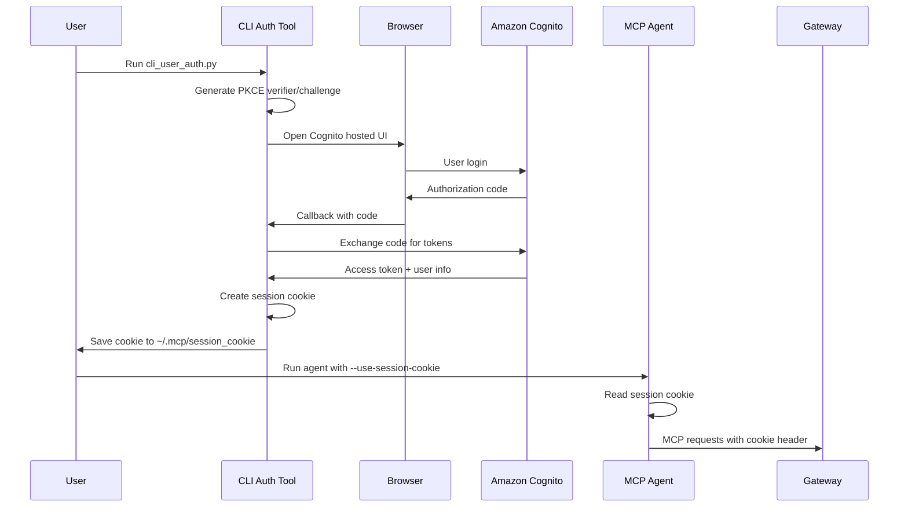
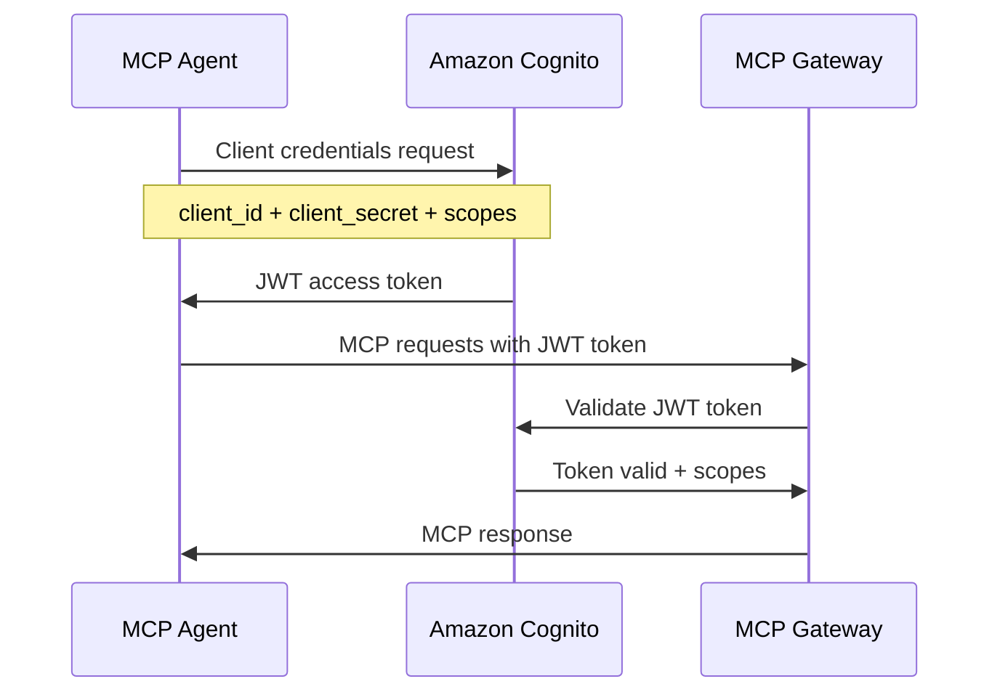

# Amazon Cognito Setup Guide for MCP Gateway Registry

This comprehensive guide covers setting up Amazon Cognito for both user identity and agent identity authentication modes with the MCP Gateway Registry system.

## Table of Contents

1. [Overview](#overview)
2. [Amazon Cognito Setup](#amazon-cognito-setup)
3. [Agent Uses User Identity Mode](#agent-uses-user-identity-mode)
4. [Agent Uses Its Own Identity Mode](#agent-uses-its-own-identity-mode)
5. [Environment Configuration Examples](#environment-configuration-examples)
6. [Testing and Troubleshooting](#testing-and-troubleshooting)

## Overview

The MCP Gateway Registry supports two distinct authentication modes:

- **Agent Uses User Identity Mode**: Agents act on behalf of users using OAuth 2.0 PKCE flow with session cookies
- **Agent Uses Its Own Identity Mode**: Agents have their own identity using Machine-to-Machine (M2M) authentication with JWT tokens

Both modes integrate with Amazon Cognito as the Identity Provider (IdP) and use the same scope-based authorization system defined in [`auth_server/scopes.yml`](../auth_server/scopes.yml).

## Amazon Cognito Setup

This section covers setting up Amazon Cognito for two distinct authentication modes used by the MCP Gateway Registry system.

### User Group Setup (For Users and Agents Using User Identity)

This setup is for users who will authenticate through the web interface and for agents that act on behalf of users using their identity and permissions.

#### Step 1: Create User Pool

1. **Navigate to Amazon Cognito Console**
   - Go to [AWS Cognito Console](https://console.aws.amazon.com/cognito/)
   - Select your desired AWS region (e.g., `us-east-1`)
   - Click the **"Create User pool"** button

2. **Configure Application Type**
   - Select **"Traditional Web App"** for application type
   - Name your application **"MCP Gateway"**

3. **Configure Sign-in Options**
   - Under "Options for sign-in identifiers", select:
     - **Email**
     - **Username**
     - **Phone number**

4. **Set Required Attributes**
   - Under "Required attributes for sign-up", select:
     - **Email** (required)

5. **Create User Directory**
   - Click on **"Create User Directory"**
   - Once created, click on **"Go to overview"** (typically on the bottom right corner of the page)

#### Step 2: Configure App Client for Users

1. **Access App Clients**
   - Click on **"App Clients"** in the left navigation
   - Click on **"MCP Gateway"** from the App Client list

2. **Copy Client Credentials**
   - Copy and paste the **Client ID** and **Client Secret**
   - Note them separately - you'll need them later for `.env` files for the MCP Gateway and agent. 

3. **Configure Login Pages**
   - Click on **"Login Pages"** and then **"Edit"**

4. **Set Callback URLs**
   - For the allowed callback URLs, add the following 3 URLs:
     - `http://localhost:8080/callback`
     - `http://localhost:8080/oauth2/callback/cognito`
     - `https://your_mcp_gateway_domain_name/oauth2/callback/cognito`

5. **Configure OpenID Connect Scopes**
   - From OpenID Connect Scopes section:
     - **Email**, **openid**, **phone** would already be there
     - **Remove** phone
     - **Add** profile
     - **Add** aws.cognito.signin.user.admin

#### Step 3: Create Users and Groups

1. **Create a User**
   - Click on **"Users"** in the main menu
   - Create a new user with the following settings:
     - Select **email** as identifier
     - **Don't send invitation**
     - Provide **username** and **email address**
     - Mark **email address as verified** (check the checkbox)
     - Choose a desired **username** and set a **password**

2. **Create Admin Group**
   - Create a group called **"mcp-registry-admin"**
   - Leave everything as default

3. **Add User to Group**
   - Once the group is created, click on the **group name**
   - Click on **"Add user to group"**
   - Add the user you created in the previous step to this group

### Machine-to-Machine (M2M) Setup (For Agents Using Their Own Identity)

This setup is for agents that have their own identity and authenticate using client credentials flow without user interaction.

#### Step 1: Create M2M App Client

1. **Create Machine-to-Machine App Client**
   - In your user pool, go to "App integration" tab
   - Click **"Create app client"**
   - **App type**: Select "Machine to Machine"
   - **App client name**: Enter `Agent` (or `My AI Assistant` or any name that reflects what the agent will do)
   - **Client secret**: Select "Generate a client secret"
   - **Copy and save** the **Client ID** and **Client Secret** - you'll need these for the [`agents/.env.agent`](../agents/.env.agent) file

#### Step 2: Create Resource Server and Custom Scopes

1. **Navigate to Domain Settings**
   - In the sidebar, click on **"Branding"**
   - Under Branding, click on **"Domain"**

2. **Create Resource Server**
   - Click **"Create resource server"**
   - **Name**: `mcp-servers-unrestricted`
   - **Identifier**: `mcp-servers-unrestricted` (use the same name as identifier)

3. **Add Custom Scopes**
   - Add two custom scopes:
     - `read`: "Read access to all MCP servers"
     - `execute`: "Execute access to all MCP servers"
   - This group gives your agent access to all MCP servers and tools accessible via the MCP Gateway
   - See [`auth_server/scopes.yml`](../auth_server/scopes.yml) file for more details on scope configuration

#### Step 3: Assign Scopes to Agent App Client

1. **Configure Agent Client Scopes**
   - Go back to **"App Clients"**
   - Select your **Agent** app client
   - Click on **"Login Pages"** → **"Edit"**

2. **Select Custom Scopes**
   - Under "Custom scopes" section, select:
     - `mcp-servers-unrestricted/read`
     - `mcp-servers-unrestricted/execute`
   - Click **"Save changes"**


## Agent Uses User Identity Mode

This mode enables agents to act on behalf of users, using their Cognito identity and group memberships for authorization.

### Configuration Steps

#### 1. Cognito User Pool Configuration

Ensure your Cognito User Pool is configured with:
- **PKCE-enabled app client** (public client without secret)
- **Hosted UI enabled** with appropriate callback URLs
- **User groups** mapped to MCP scopes via [`scopes.yml`](../auth_server/scopes.yml)

#### 2. OAuth 2.0 PKCE Flow Setup

The PKCE (Proof Key for Code Exchange) flow is implemented in [`agents/cli_user_auth.py`](../agents/cli_user_auth.py):



#### 3. Session Cookie Authentication

The session cookie contains:
- **Username**: Cognito username
- **Groups**: User's Cognito group memberships
- **Expiration**: 8-hour validity (configurable)
- **Signature**: Signed with `SECRET_KEY` for security

#### 4. Required Environment Variables

Create `.env.user` file in the `agents/` directory:

```bash
# Cognito Configuration
COGNITO_USER_POOL_ID=us-east-1_XXXXXXXXX
COGNITO_CLIENT_ID=your-public-client-id
SECRET_KEY=your-secret-key-matching-registry

# Optional: Custom domain
COGNITO_DOMAIN=your-custom-domain

# AWS Region
AWS_REGION=us-east-1

# Registry URL (for callback configuration)
REGISTRY_URL=http://localhost:7860
```

#### 5. CLI Authentication Tool Usage

Run the CLI authentication tool to obtain a session cookie:

```bash
# Navigate to agents directory
cd agents/

# Run CLI authentication
python cli_user_auth.py

# This will:
# 1. Open your browser to Cognito hosted UI
# 2. After login, capture the authorization code
# 3. Exchange code for user information
# 4. Create and save session cookie to ~/.mcp/session_cookie
```

#### 6. Agent Usage with Session Cookie

```bash
# Use agent with session cookie authentication
python agent.py \
  --use-session-cookie \
  --message "What time is it in Tokyo?" \
  --mcp-registry-url http://localhost/mcpgw/sse
```

## Agent Uses Its Own Identity Mode

This mode enables agents to have their own identity using Machine-to-Machine (M2M) authentication.

### Configuration Steps

#### 1. Machine-to-Machine Authentication Setup

M2M authentication uses the OAuth 2.0 Client Credentials flow:



#### 2. Client Credentials Flow Configuration

The M2M flow is implemented in [`auth_server/cognito_utils.py`](../auth_server/cognito_utils.py):

1. **Token Request**: Agent requests token using client credentials
2. **JWT Token**: Cognito issues JWT token with embedded scopes
3. **Token Validation**: Auth server validates JWT signature and claims
4. **Scope Enforcement**: Access granted based on token scopes

#### 3. JWT Token Handling

JWT tokens contain:
- **Issuer**: Cognito User Pool issuer URL
- **Client ID**: M2M app client identifier
- **Scopes**: Granted scopes for MCP server access
- **Expiration**: Token validity period (typically 1 hour)

#### 4. Required Environment Variables

Create `.env.agent` file in the `agents/` directory:

```bash
# Cognito M2M Configuration
COGNITO_CLIENT_ID=your-confidential-client-id
COGNITO_CLIENT_SECRET=your-client-secret
COGNITO_USER_POOL_ID=us-east-1_XXXXXXXXX

# AWS Region
AWS_REGION=us-east-1

# MCP Registry URL
MCP_REGISTRY_URL=http://localhost/mcpgw/sse
```

#### 5. Agent Usage with M2M Authentication

```bash
# Use agent with M2M authentication (default mode)
python agent.py \
  --message "What time is it in Tokyo?" \
  --mcp-registry-url http://localhost/mcpgw/sse
```

### Common Configuration Pitfalls and Solutions

#### 1. Callback URL Mismatch

**Problem**: `redirect_uri_mismatch` error during OAuth flow

**Solution**: Ensure all 3 callback URLs are present in your Cognito configuration:
- `http://localhost:8080/callback`
- `http://localhost:8080/oauth2/callback/cognito`
- `https://your-domain.com/oauth2/callback/cognito`

#### 2. Secret Key Mismatch

**Problem**: Session cookie validation fails

**Solution**: Ensure `SECRET_KEY` in `.env.user` matches the registry's `SECRET_KEY` in `.env` in the project root directory:
```bash
# Generate a new secret key
python -c 'import secrets; print(secrets.token_hex(32))'

# Use the same key in both .env and registry configuration
```

#### 3. Scope Configuration Issues

**Problem**: Access denied errors despite valid authentication

**Solution**: Verify scope mappings in [`scopes.yml`](../auth_server/scopes.yml):
- Check group mappings match Cognito groups
- Ensure server/tool permissions are correctly defined
- Verify M2M client has required custom scopes

#### 4. JWT Token Validation Errors

**Problem**: M2M authentication fails with token validation errors

**Solution**: Check the following:
- Client ID and secret are correct
- User Pool ID format is correct (e.g., `us-east-1_ABC123DEF`)
- AWS region matches User Pool region
- Custom scopes are properly configured in resource server

## Testing and Troubleshooting

### How to Verify Cognito Configuration

#### 1. Test User Authentication Flow

```bash
# Test CLI authentication
cd agents/
python cli_user_auth.py

# Expected output:
# - Browser opens to Cognito hosted UI
# - After login, callback succeeds
# - Session cookie saved to ~/.mcp/session_cookie
```

#### 2. Test M2M Authentication Flow

```bash
# Test M2M token generation
cd auth_server/
python -c "
from cognito_utils import generate_token
import os
from dotenv import load_dotenv

load_dotenv('../agents/.env.agent')
token = generate_token(
    os.environ['COGNITO_CLIENT_ID'],
    os.environ['COGNITO_CLIENT_SECRET'],
    os.environ['COGNITO_USER_POOL_ID'],
    os.environ['AWS_REGION']
)
print('Token generated successfully:', token[:50] + '...')
"
```

#### 3. Test Agent Authentication

```bash
# Test user identity mode
python agent.py --use-session-cookie --message "test message"

# Test agent identity mode
python agent.py --message "test message"
```

### Common Authentication Errors and Solutions

#### Error: `Invalid redirect URI`

**Cause**: Callback URL not registered in Cognito app client

**Solution**:
1. Go to Cognito console → App integration → App clients
2. Edit your app client
3. Add the correct callback URL to "Allowed callback URLs"

#### Error: `Session cookie has expired`

**Cause**: Session cookie is older than 8 hours

**Solution**:
```bash
# Re-authenticate to get fresh session cookie
python cli_user_auth.py
```

#### Error: `Access denied for server/tool`

**Cause**: User/agent lacks required scopes for the requested resource

**Solution**:
1. Check user's group membership in Cognito
2. Verify group mappings in [`scopes.yml`](../auth_server/scopes.yml)
3. For M2M, check client's assigned scopes in Cognito

#### Error: `JWT token validation failed`

**Cause**: Token signature validation or claims validation failed

**Solution**:
1. Verify client credentials are correct
2. Check User Pool ID format and region
3. Ensure token hasn't expired
4. Verify JWKS endpoint is accessible

### Testing Both Authentication Modes

#### User Identity Mode Test

```bash
# 1. Authenticate user
python cli_user_auth.py

# 2. Test with session cookie
python agent.py \
  --use-session-cookie \
  --message "What MCP servers are available?" \
  --mcp-registry-url http://localhost/mcpgw/sse

# Expected: Agent uses user's permissions based on Cognito groups
```

#### Agent Identity Mode Test

```bash
# Test with M2M authentication
cd agents
python agent.py \
  --message "What MCP tools are available?" \
  --mcp-registry-url http://localhost/mcpgw/sse

# Expected: Agent uses its own permissions based on assigned scopes
```

### Debugging Authentication Flows

#### Enable Debug Logging

```bash
# Run agent with debug logging
python agent.py --message "test" --mcp-registry-url http://localhost/mcpgw/sse
```

#### Check Auth Server Logs

```bash
# View auth server logs for validation details
docker-compose logs -f auth-server

# Look for:
# - Token validation attempts
# - Scope mapping results
# - Access control decisions
```

#### Verify Scope Mappings

```bash
# Test scope mapping logic
cd auth_server/
python -c "
import yaml
from server import map_cognito_groups_to_scopes

# Load scopes config
with open('scopes.yml', 'r') as f:
    config = yaml.safe_load(f)

# Test group mapping
groups = ['mcp-registry-user']
scopes = map_cognito_groups_to_scopes(groups)
print(f'Groups {groups} mapped to scopes: {scopes}')
"
```

## Related Documentation

- [Main Authentication Guide](auth.md) - Overview of the authentication architecture
- [Scopes Configuration](../auth_server/scopes.yml) - Detailed scope and permission definitions
- [Environment Template](../.env.template) - Complete environment configuration template
- [Agent Implementation](../agents/agent.py) - Reference agent implementation
- [CLI Authentication Tool](../agents/cli_user_auth.py) - User authentication utility

## Support and Troubleshooting

For additional support:

1. **Check Logs**: Review auth server and agent logs for detailed error messages
2. **Verify Configuration**: Ensure all environment variables are correctly set
3. **Test Components**: Use the testing procedures above to isolate issues
4. **Review Scopes**: Verify scope mappings match your intended access control

This guide provides comprehensive coverage of Amazon Cognito setup for both authentication modes. Follow the step-by-step instructions and use the troubleshooting section to resolve common issues.

## Saving Client Credentials to Agent Environment Files

After completing the Cognito setup and obtaining your client ID and secret, you need to configure the agent environment files to use these credentials.

### Step 1: Copy Template to Environment File

Navigate to the `agents/` directory and copy the template file:

```bash
cd agents/
cp .env.template .env.user
```

### Step 2: Configure Client Credentials

Edit the [`agents/.env.user`](../agents/.env.user) file with your Cognito credentials obtained from the [User Group Setup](#user-group-setup-for-users-and-agents-using-user-identity) section:

```bash
# Cognito Authentication Configuration
# Copy this file to .env and fill in your actual values

# Cognito App Client ID (from Step 2 of User Group Setup)
COGNITO_CLIENT_ID=your_actual_cognito_client_id_here

# Cognito App Client Secret (from Step 2 of User Group Setup)
COGNITO_CLIENT_SECRET=your_actual_cognito_client_secret_here

# Cognito User Pool ID (from Step 1 of User Group Setup)
COGNITO_USER_POOL_ID=your_actual_cognito_user_pool_id_here

# AWS Region for Cognito
AWS_REGION=us-east-1

# Cognito Domain (without https:// prefix, just the domain name)
# Example: mcp-gateway or your-custom-domain
# COGNITO_DOMAIN=

# Secret key for session cookie signing (must match registry SECRET_KEY), string of hex characters
# To generate: python -c 'import secrets; print(secrets.token_hex(32))'
SECRET_KEY=your-secret-key-here

# Either http://localhost:8000 or the HTTPS URL of your deployed MCP Gateway
REGISTRY_URL=your_registry_url_here
```

### Step 3: Replace Placeholder Values

Replace the following placeholder values with your actual Cognito configuration:

1. **COGNITO_CLIENT_ID**: The Client ID copied from Step 2 of the [User Group Setup](#step-2-configure-app-client-for-users)
2. **COGNITO_CLIENT_SECRET**: The Client Secret copied from Step 2 of the [User Group Setup](#step-2-configure-app-client-for-users)
3. **COGNITO_USER_POOL_ID**: Your User Pool ID from Step 1 of the [User Group Setup](#step-1-create-user-pool)
4. **AWS_REGION**: The AWS region where your Cognito User Pool is located (e.g., `us-east-1`)
5. **SECRET_KEY**: Generate a secure secret key using: `python -c 'import secrets; print(secrets.token_hex(32))'`
6. **REGISTRY_URL**: Your MCP Gateway URL (e.g., `http://localhost:7860` for local development)

### Step 4: Verify Configuration

After saving the file, verify your configuration by testing the authentication flow:

```bash
# Test user authentication
python cli_user_auth.py

# Test agent with session cookie
python agent.py --use-session-cookie --message "test authentication"
```

### Important Notes

- **Security**: Keep your `.env.user` file secure and never commit it to version control
- **Secret Key Matching**: Ensure the `SECRET_KEY` in `agents/.env.user` matches the `SECRET_KEY` in your main registry `.env` file
- **Multiple Agents**: If you have multiple agent instances, each can use the same `.env.user` file or have separate configuration files
- **Environment Separation**: Use different `.env.user` files for different environments (development, staging, production)

This completes the client credential configuration for your MCP Gateway agents using Amazon Cognito authentication.