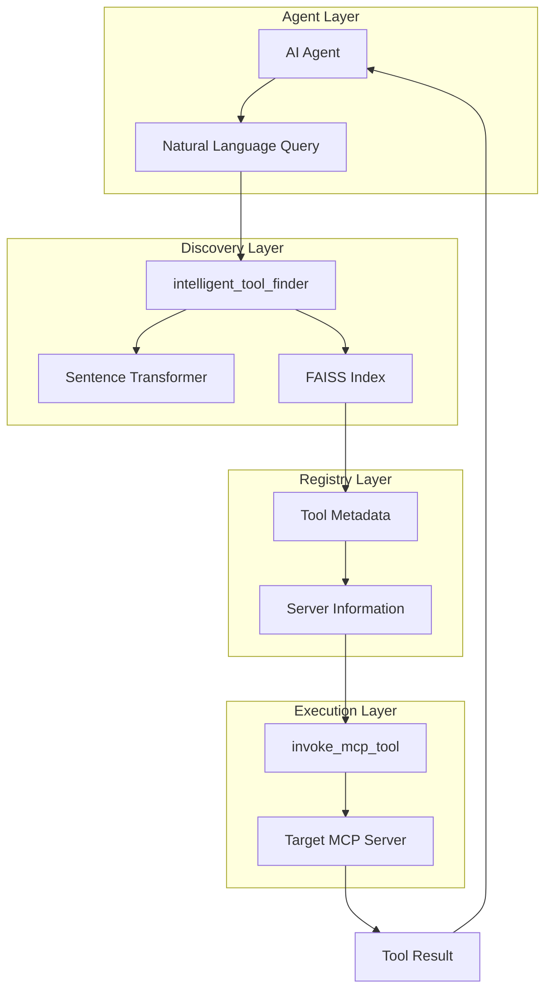

# Dynamic Tool Discovery and Invocation

The MCP Gateway & Registry provides a powerful **Dynamic Tool Discovery and Invocation** feature that enables AI agents to autonomously discover and execute tools beyond their initial capabilities. This feature uses advanced semantic search with FAISS indexing and sentence transformers to intelligently match natural language queries to the most relevant MCP tools across all registered servers.

## Table of Contents

- [Overview](#overview)
- [How It Works](#how-it-works)
- [Architecture](#architecture)
- [Usage Examples](#usage-examples)
- [Agent Integration](#agent-integration)
- [API Reference](#api-reference)
- [Technical Implementation](#technical-implementation)
- [Demo](#demo)

## Overview

Traditional AI agents are limited to the tools they were initially configured with. The Dynamic Tool Discovery feature breaks this limitation by allowing agents to:

1. **Discover new tools** through natural language queries
2. **Automatically find** the most relevant tools from hundreds of available MCP servers
3. **Dynamically invoke** discovered tools without prior configuration
4. **Expand capabilities** on-demand based on user requests

This enables agents to handle tasks they weren't originally designed for, making them truly adaptive and extensible.

## How It Works

The dynamic tool discovery process follows these steps:

1. **Natural Language Query**: Agent receives a user request requiring specialized capabilities
2. **Semantic Search**: The `intelligent_tool_finder` tool processes the query using sentence transformers
3. **FAISS Index Search**: Searches through embeddings of all registered MCP tools
4. **Relevance Ranking**: Returns tools ranked by semantic similarity to the query
5. **Tool Invocation**: Agent uses the discovered tool information to invoke the appropriate MCP tool


## Architecture

### Components



### Key Technologies

- **FAISS (Facebook AI Similarity Search)**: High-performance vector similarity search
- **Sentence Transformers**: Neural network models for semantic text understanding
- **Cosine Similarity**: Mathematical measure of semantic similarity between queries and tools
- **MCP Protocol**: Standardized communication with tool servers

## Usage Examples

### Basic Tool Discovery

```python
# Agent discovers time-related tools
result = intelligent_tool_finder("current time in different timezone")

# Returns information about relevant tools:
# {
#   "tool_name": "current_time_by_timezone",
#   "service_path": "/currenttime",
#   "service_name": "Current Time Server",
#   "tool_schema": {...},
#   "overall_similarity_score": 0.89
# }
```

### Complete Workflow Example

```python
# 1. Discover tools for weather information
weather_tools = intelligent_tool_finder("weather forecast for tomorrow")

# 2. Use the discovered tool
if weather_tools:
    tool_info = weather_tools[0]  # Get the best match
    
    result = invoke_mcp_tool(
        mcp_registry_url="https://your-registry.com/mcpgw/sse",
        server_name=tool_info["service_path"],  # e.g., "/weather"
        tool_name=tool_info["tool_name"],       # e.g., "get_forecast"
        arguments={"location": "New York", "days": 1},
        auth_token=auth_token,
        user_pool_id=user_pool_id,
        client_id=client_id,
        region=region,
        auth_method="m2m"
    )
```

## Agent Integration

### System Prompt Configuration

Agents are configured with instructions on how to use dynamic tool discovery:

```text
<tool_discovery>
When a user requests something that requires a specialized tool you don't have direct access to, use the intelligent_tool_finder tool.

How to use intelligent_tool_finder:
1. When you identify that a task requires a specialized tool (e.g., weather forecast, time information, etc.)
2. Call the tool with a description of what you need: `intelligent_tool_finder("description of needed capability")`.
3. The tool will return the most appropriate specialized tool along with usage instructions
4. You can then use the invoke_mcp_tool to invoke this discovered tool by providing the MCP Registry URL, server name, tool name, and required arguments

Example workflow:
1. Discover a tool: result = intelligent_tool_finder("current time timezone")
2. The result provides details about a time tool on the "currenttime" MCP server.
3. Always use the "service_path" path field for the server name while creating the arguments for the invoke_mcp_tool in the next step.
4. Use invoke_mcp_tool to call it with ALL required auth parameters
</tool_discovery>
```

### Agent Implementation

The agent implementation in [`agents/agent.py`](../agents/agent.py) shows how to:

1. **Load MCP tools** from the registry
2. **Combine built-in and discovered tools**
3. **Handle authentication** for both session cookie and M2M methods
4. **Process tool discovery results**

Key code snippet:

```python
# Get available tools from MCP and display them
mcp_tools = await client.get_tools()
logger.info(f"Available MCP tools: {[tool.name for tool in mcp_tools]}")

# Add the calculator and invoke_mcp_tool to the tools array
# The invoke_mcp_tool function already supports authentication parameters
all_tools = [calculator, invoke_mcp_tool] + mcp_tools
logger.info(f"All available tools: {[tool.name if hasattr(tool, 'name') else tool.__name__ for tool in all_tools]}")

# Create the agent with the model and all tools
agent = create_react_agent(model, all_tools)
```

## API Reference

### intelligent_tool_finder

Finds the most relevant MCP tool(s) across all registered and enabled services based on a natural language query.

#### Parameters

| Parameter | Type | Required | Description |
|-----------|------|----------|-------------|
| `natural_language_query` | `str` | Yes | Your query in natural language describing the task you want to perform |
| `username` | `str` | No* | Username for mcpgw server authentication |
| `password` | `str` | No* | Password for mcpgw server authentication |
| `session_cookie` | `str` | No* | Session cookie for registry authentication |
| `top_k_services` | `int` | No | Number of top services to consider from initial FAISS search (default: 3) |
| `top_n_tools` | `int` | No | Number of best matching tools to return (default: 1) |

*Either `session_cookie` OR (`username` AND `password`) must be provided for authentication.

#### Returns

```python
List[Dict[str, Any]]
```

A list of dictionaries, each describing a recommended tool:

```python
[
    {
        "tool_name": "current_time_by_timezone",
        "tool_parsed_description": {
            "main": "Get current time for a specific timezone",
            "parameters": {...}
        },
        "tool_schema": {
            "type": "object",
            "properties": {...}
        },
        "service_path": "/currenttime",
        "service_name": "Current Time Server",
        "overall_similarity_score": 0.89
    }
]
```

#### Example Usage

```python
# Basic usage with session cookie
tools = await intelligent_tool_finder(
    natural_language_query="what time is it in Tokyo",
    session_cookie="your_session_cookie_here"
)

# Advanced usage with multiple results
tools = await intelligent_tool_finder(
    natural_language_query="stock market information and financial data",
    username="admin",
    password="your_password",
    top_k_services=5,
    top_n_tools=3
)
```

## Technical Implementation

### FAISS Index Creation

The registry automatically creates and maintains a FAISS index of all registered MCP tools:

1. **Tool Metadata Collection**: Gathers tool descriptions, schemas, and server information
2. **Text Embedding**: Uses sentence transformers to create vector embeddings
3. **Index Building**: Constructs FAISS index for fast similarity search
4. **Automatic Updates**: Refreshes index when servers are added/modified

### Semantic Search Process

```python
# 1. Embed the natural language query
query_embedding = await asyncio.to_thread(_embedding_model_mcpgw.encode, [natural_language_query])
query_embedding_np = np.array(query_embedding, dtype=np.float32)

# 2. Search FAISS for top_k_services
distances, faiss_ids = await asyncio.to_thread(_faiss_index_mcpgw.search, query_embedding_np, top_k_services)

# 3. Collect tools from top services
candidate_tools = []
for service in top_services:
    for tool in service.tools:
        tool_text = f"Service: {service.name}. Tool: {tool.name}. Description: {tool.description}"
        candidate_tools.append({
            "text_for_embedding": tool_text,
            "tool_name": tool.name,
            "service_path": service.path,
            # ... other metadata
        })

# 4. Embed all candidate tool descriptions
tool_embeddings = await asyncio.to_thread(_embedding_model_mcpgw.encode, tool_texts)

# 5. Calculate cosine similarity and rank
similarities = cosine_similarity(query_embedding_np, tool_embeddings_np)[0]
ranked_tools = sorted(tools_with_scores, key=lambda x: x["similarity_score"], reverse=True)
```

### Performance Optimizations

- **Lazy Loading**: FAISS index and models are loaded on-demand
- **Caching**: Embeddings and metadata are cached and reloaded only when files change
- **Async Processing**: All embedding operations run in separate threads
- **Memory Efficiency**: Uses float32 precision for embeddings to reduce memory usage

### Model Configuration

The system uses configurable sentence transformer models:

```python
# Default model (lightweight, fast)
EMBEDDINGS_MODEL_NAME = 'all-MiniLM-L6-v2'  # 384 dimensions

# Model loading with caching
model_cache_path = _registry_server_data_path.parent / ".cache"
_embedding_model_mcpgw = SentenceTransformer(EMBEDDINGS_MODEL_NAME, cache_folder=model_cache_path)
```

## Demo

### Example Interaction

**User Query**: "What's the current time in Tokyo?"

**Agent Process**:
1. Agent recognizes need for time information
2. Calls `intelligent_tool_finder("current time in Tokyo")`
3. Discovers `current_time_by_timezone` tool from `/currenttime` server
4. Invokes tool with `{"tz_name": "Asia/Tokyo"}`
5. Returns formatted time result

**Result**: "The current time in Tokyo is 2024-01-15 14:30:45 JST"

### Performance Metrics

- **Search Speed**: < 100ms for typical queries
- **Accuracy**: 85-95% relevance for well-described tools
- **Scalability**: Handles 1000+ registered tools efficiently
- **Memory Usage**: ~200MB for model and index data

## Best Practices

### For Tool Developers

1. **Descriptive Names**: Use clear, descriptive tool names
2. **Rich Descriptions**: Provide detailed tool descriptions with use cases
3. **Proper Schemas**: Include comprehensive parameter schemas
4. **Consistent Naming**: Follow naming conventions for better discoverability

### For Agent Developers

1. **Specific Queries**: Use specific, descriptive queries for better matches
2. **Fallback Handling**: Implement fallbacks when no suitable tools are found
3. **Authentication**: Always include proper authentication parameters
4. **Error Handling**: Handle tool discovery and invocation errors gracefully

### For System Administrators

1. **Index Maintenance**: Monitor FAISS index updates and performance
2. **Model Updates**: Consider updating sentence transformer models periodically
3. **Server Health**: Ensure registered servers are healthy and responsive
4. **Access Control**: Configure proper authentication and authorization