<div align="center">


**Enterprise-Ready Gateway for AI Development Tools**

</div>

## Enterprise-Grade MCP Server & Registry

A comprehensive solution for managing, securing, and accessing Model Context Protocol (MCP) servers at scale. Built for enterprises, development teams, and autonomous AI agents.

### Demo Videos

| Feature | Demo |
|---------|------|
| **Full End-to-End Functionality** | [Watch Full Demo](https://github.com/user-attachments/assets/5ffd8e81-8885-4412-a4d4-3339bbdba4fb) |
| **OAuth 3-Legged Authentication** | [Watch 3LO Demo](https://github.com/user-attachments/assets/3c3a570b-29e6-4dd3-b213-4175884396cc) |
| **Dynamic Tool Discovery & Invocation** | [Watch Tool Discovery](https://github.com/user-attachments/assets/cee25b31-61e4-4089-918c-c3757f84518c) |

### MCP Tools in Action

<div align="center">

</div>

*Experience dynamic tool discovery and intelligent MCP server integration in real-time*

---

## Key Features

### Enterprise-Ready Architecture
- **Reverse Proxy**: Centralized access point for all MCP servers
- **Service Discovery**: Automatic registration and health monitoring
- **Load Balancing**: Intelligent request distribution across server instances
- **High Availability**: Production-ready deployment patterns

### Advanced Security & Authentication
- **OAuth 2.0 Integration**: Amazon Cognito, Google, GitHub, and custom providers
- **Fine-Grained Access Control**: Role-based permissions with scope management
- **JWT Token Vending**: Secure token generation and validation
- **Audit Logging**: Comprehensive security event tracking

### AI Agent Optimization
- **Dynamic Tool Discovery**: Runtime MCP server and tool enumeration
- **Intelligent Tool Finder**: AI-powered tool recommendation and selection
- **Autonomous Access Control**: Context-aware permission management
- **Multi-Agent Coordination**: Shared resource access with conflict resolution

### Developer Experience
- **React Web Interface**: Intuitive server management and monitoring
- **REST API**: Programmatic registry management and integration
- **AI Coding Assistant Integration**: VS Code, Cursor, Claude Code support
- **Real-Time Monitoring**: Live server health and performance metrics

---

## Quick Start

!!! tip "Prerequisites"
    Before proceeding, ensure you have satisfied all [prerequisites](installation.md#prerequisites) including Docker, AWS account setup, and Amazon Cognito configuration.

Get up and running in 5 minutes with Docker Compose:

```bash
# 1. Clone and setup
git clone https://github.com/agentic-community/mcp-gateway-registry.git
cd mcp-gateway-registry

# 2. Configure environment
cp .env.example .env
# Edit .env with your AWS Cognito credentials

# 3. Generate authentication credentials  
./credentials-provider/generate_creds.sh

# 4. Deploy with Docker Compose
docker-compose up -d

# 5. Access the registry
open http://localhost:7860
```

The registry will be available at `http://localhost:7860` with example MCP servers pre-configured.

---

## Architecture Overview

```mermaid
flowchart TB
    subgraph Human_Users["Human Users"]
        User1["Human User 1"]
        User2["Human User 2"]
        UserN["Human User N"]
    end

    subgraph AI_Agents["AI Agents"]
        Agent1["AI Agent 1"]
        Agent2["AI Agent 2"]
        Agent3["AI Agent 3"]
        AgentN["AI Agent N"]
    end

    subgraph EC2_Gateway["<b>MCP Gateway & Registry</b> (Amazon EC2 Instance)"]
        subgraph NGINX["NGINX Reverse Proxy"]
            RP["Reverse Proxy Router"]
        end
        
        subgraph AuthRegistry["Authentication & Registry Services"]
            AuthServer["Auth Server<br/>(Dual Auth)"]
            Registry["Registry<br/>Web UI"]
            RegistryMCP["Registry<br/>MCP Server"]
        end
        
        subgraph LocalMCPServers["Local MCP Servers"]
            MCP_Local1["MCP Server 1"]
            MCP_Local2["MCP Server 2"]
        end
    end
    
    %% Identity Provider
    IdP[Identity Provider<br/>Amazon Cognito]
    
    subgraph EKS_Cluster["Amazon EKS/EC2 Cluster"]
        MCP_EKS1["MCP Server 3"]
        MCP_EKS2["MCP Server 4"]
    end
    
    subgraph APIGW_Lambda["Amazon API Gateway + AWS Lambda"]
        API_GW["Amazon API Gateway"]
        Lambda1["AWS Lambda Function 1"]
        Lambda2["AWS Lambda Function 2"]
    end
    
    subgraph External_Systems["External Data Sources & APIs"]
        DB1[(Database 1)]
        DB2[(Database 2)]
        API1["External API 1"]
        API2["External API 2"]
        API3["External API 3"]
    end
    
    %% Connections from Human Users
    User1 -->|Web Browser<br>Authentication| IdP
    User2 -->|Web Browser<br>Authentication| IdP
    UserN -->|Web Browser<br>Authentication| IdP
    User1 -->|Web Browser<br>HTTPS| Registry
    User2 -->|Web Browser<br>HTTPS| Registry
    UserN -->|Web Browser<br>HTTPS| Registry
    
    %% Connections from Agents to Gateway
    Agent1 -->|MCP Protocol<br>SSE with Auth| RP
    Agent2 -->|MCP Protocol<br>SSE with Auth| RP
    Agent3 -->|MCP Protocol<br>Streamable HTTP with Auth| RP
    AgentN -->|MCP Protocol<br>Streamable HTTP with Auth| RP
    
    %% Auth flow connections
    RP -->|Auth validation| AuthServer
    AuthServer -.->|Validate credentials| IdP
    Registry -.->|User authentication| IdP
    RP -->|Tool discovery| RegistryMCP
    RP -->|Web UI access| Registry
    
    %% Connections from Gateway to MCP Servers
    RP -->|SSE| MCP_Local1
    RP -->|SSE| MCP_Local2
    RP -->|SSE| MCP_EKS1
    RP -->|SSE| MCP_EKS2
    RP -->|Streamable HTTP| API_GW
    
    %% Connections within API GW + Lambda
    API_GW --> Lambda1
    API_GW --> Lambda2
    
    %% Connections to External Systems
    MCP_Local1 -->|Tool Connection| DB1
    MCP_Local2 -->|Tool Connection| DB2
    MCP_EKS1 -->|Tool Connection| API1
    MCP_EKS2 -->|Tool Connection| API2
    Lambda1 -->|Tool Connection| API3

    %% Style definitions
    classDef user fill:#fff9c4,stroke:#f57f17,stroke-width:2px
    classDef agent fill:#e1f5fe,stroke:#29b6f6,stroke-width:2px
    classDef gateway fill:#e8f5e9,stroke:#66bb6a,stroke-width:2px
    classDef nginx fill:#f3e5f5,stroke:#ab47bc,stroke-width:2px
    classDef mcpServer fill:#fff3e0,stroke:#ffa726,stroke-width:2px
    classDef eks fill:#ede7f6,stroke:#7e57c2,stroke-width:2px
    classDef apiGw fill:#fce4ec,stroke:#ec407a,stroke-width:2px
    classDef lambda fill:#ffebee,stroke:#ef5350,stroke-width:2px
    classDef dataSource fill:#e3f2fd,stroke:#2196f3,stroke-width:2px
    
    %% Apply styles
    class User1,User2,UserN user
    class Agent1,Agent2,Agent3,AgentN agent
    class EC2_Gateway,NGINX gateway
    class RP nginx
    class AuthServer,Registry,RegistryMCP gateway
    class IdP apiGw
    class MCP_Local1,MCP_Local2 mcpServer
    class EKS_Cluster,MCP_EKS1,MCP_EKS2 eks
    class API_GW apiGw
    class Lambda1,Lambda2 lambda
    class DB1,DB2,API1,API2,API3 dataSource
```



The MCP Gateway & Registry acts as a centralized hub that:

1. **Authenticates** users and AI agents through OAuth providers
2. **Authorizes** access based on fine-grained scopes and permissions
3. **Routes** requests to appropriate MCP servers
4. **Monitors** server health and performance
5. **Discovers** available tools and capabilities dynamically

---

## Use Cases

### Enterprise Integration
Transform how both autonomous AI agents and development teams access enterprise systems:

- **Unified Access Point**: Single endpoint for all MCP servers across your organization
- **Enterprise SSO**: Integration with existing identity providers (Cognito, SAML, OIDC)
- **Compliance & Governance**: Comprehensive audit trails and access control policies
- **Scalable Architecture**: Support for hundreds of MCP servers and thousands of concurrent users

### AI Agent Workflows
Enable sophisticated AI agent interactions with enterprise systems:

- **Dynamic Tool Discovery**: Agents discover and utilize tools based on current context
- **Intelligent Tool Selection**: AI-powered recommendations for optimal tool usage
- **Multi-Agent Coordination**: Shared access to enterprise resources with conflict resolution
- **Context-Aware Permissions**: Dynamic access control based on agent capabilities and current task

### Development Team Productivity
Accelerate development workflows with integrated tooling:

- **IDE Integration**: Native support for VS Code, Cursor, and Claude Code
- **Real-Time Collaboration**: Shared access to development tools and services
- **Environment Management**: Consistent tool access across development, staging, and production
- **API-First Design**: Programmatic access for custom integrations and automation

---

## Documentation

| Getting Started | Authentication & Security | Architecture & Development |
|-----------------|---------------------------|----------------------------|
| [Installation Guide](installation.md)<br/>Complete setup instructions for EC2 and EKS | [Authentication Guide](auth.md)<br/>OAuth and identity provider integration | [AI Coding Assistants Setup](ai-coding-assistants-setup.md)<br/>VS Code, Cursor, Claude Code integration |
| [Quick Start Tutorial](quick-start.md)<br/>Get running in 5 minutes | [Amazon Cognito Setup](cognito.md)<br/>Step-by-step IdP configuration | [API Reference](registry_api.md)<br/>Programmatic registry management |
| [Configuration Reference](configuration.md)<br/>Environment variables and settings | [Fine-Grained Access Control](scopes.md)<br/>Permission management and security | [Dynamic Tool Discovery](dynamic-tool-discovery.md)<br/>Autonomous agent capabilities |
| | | [Production Deployment](installation.md)<br/>Complete setup for production environments |
| | | [Troubleshooting Guide](FAQ.md)<br/>Common issues and solutions |

---

## Community & Support

**Getting Help**
- [FAQ & Troubleshooting](FAQ.md) - Common questions and solutions
- [GitHub Issues](https://github.com/agentic-community/mcp-gateway-registry/issues) - Bug reports and feature requests
- [GitHub Discussions](https://github.com/agentic-community/mcp-gateway-registry/discussions) - Community support and ideas

**Resources**
- [Demo Videos](https://github.com/agentic-community/mcp-gateway-registry#demo-videos) - See the platform in action

**Contributing**
- [Contributing Guide](CONTRIBUTING.md) - How to contribute code and documentation
- [Code of Conduct](CODE_OF_CONDUCT.md) - Community guidelines and expectations

---

## License

This project is licensed under the MIT License - see the [LICENSE](LICENSE) file for details.

---

*Part of the [Agentic Community](https://github.com/agentic-community) ecosystem - building the future of AI-driven development.*