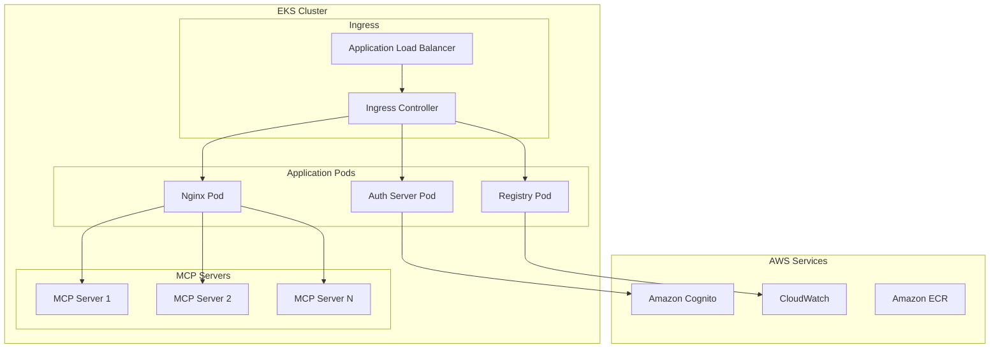

# Installation Guide

Complete installation instructions for the MCP Gateway & Registry on various platforms.

## Prerequisites

- **Node.js 16+**: Required for building the React frontend
- **Docker & Docker Compose**: Container runtime and orchestration
- **Amazon Cognito**: Identity provider for authentication (see [Cognito Setup Guide](cognito.md))
- **SSL Certificate**: Optional for HTTPS deployment in production

## Quick Start (5 Minutes)

```bash
# 1. Clone and setup
git clone https://github.com/agentic-community/mcp-gateway-registry.git
cd mcp-gateway-registry

# 2. Configure environment
cp .env.example .env
# Edit .env with your credentials

# 3. Generate authentication credentials
./credentials-provider/generate_creds.sh

# 4. Install prerequisites
curl -LsSf https://astral.sh/uv/install.sh | sh
sudo apt-get update && sudo apt-get install -y docker.io docker-compose

# 5. Deploy
./build_and_run.sh

# 6. Access registry
open http://localhost:7860
```

## Installation on Amazon EC2

### System Requirements

**Minimum (Development)**:
- EC2 Instance: `t3.large` (2 vCPU, 8GB RAM)
- Storage: 20GB SSD
- Network: Ports 80, 443, 7860, 8080 accessible

**Recommended (Production)**:
- EC2 Instance: `t3.2xlarge` (8 vCPU, 32GB RAM)  
- Storage: 50GB+ SSD
- Network: Multi-AZ with load balancer

### Detailed Setup Steps

1. **Create Local Directories**
   ```bash
   mkdir -p ${HOME}/mcp-gateway/{servers,auth_server,secrets,logs}
   cp -r registry/servers ${HOME}/mcp-gateway/
   cp auth_server/scopes.yml ${HOME}/mcp-gateway/auth_server/
   ```

2. **Configure Environment Variables**
   ```bash
   cp .env.example .env
   nano .env  # Configure required values
   ```

   **Required Configuration:**
   - `ADMIN_PASSWORD`: Secure admin password
   - `COGNITO_USER_POOL_ID`: Amazon Cognito User Pool ID
   - `COGNITO_CLIENT_ID`: Cognito App Client ID
   - `COGNITO_CLIENT_SECRET`: Cognito App Client Secret
   - `AWS_REGION`: AWS region for Cognito

3. **Generate Authentication Credentials**
   ```bash
   # Configure OAuth credentials
   cp credentials-provider/oauth/.env.example credentials-provider/oauth/.env
   nano credentials-provider/oauth/.env
   
   # Generate tokens and client configurations
   ./credentials-provider/generate_creds.sh
   ```

4. **Install Dependencies**
   ```bash
   # Install uv (Python package manager)
   curl -LsSf https://astral.sh/uv/install.sh | sh
   source $HOME/.local/bin/env
   uv venv --python 3.12 && source .venv/bin/activate
   
   # Install Docker
   sudo apt-get update
   sudo apt-get install --reinstall docker.io -y
   sudo apt-get install -y docker-compose
   sudo usermod -a -G docker $USER
   newgrp docker
   ```

5. **Deploy Services**
   ```bash
   ./build_and_run.sh
   ```

### HTTPS Configuration

By default, MCP Gateway runs on HTTP (port 80). To enable HTTPS for production deployments:

#### 1. Obtain SSL Certificates

**Option A: Let's Encrypt (Recommended)**
```bash
# Install certbot
sudo apt-get update
sudo apt-get install -y certbot

# Get certificate (requires domain and port 80 accessible)
sudo certbot certonly --standalone -d your-domain.com
```

**Option B: Commercial CA**
Purchase SSL certificate from a trusted Certificate Authority.

#### 2. Copy Certificates to Expected Location

MCP Gateway expects SSL certificates at `${HOME}/mcp-gateway/ssl/`. The `build_and_run.sh` script will automatically set up the proper directory structure.

```bash
# Create the ssl directory structure
mkdir -p ${HOME}/mcp-gateway/ssl/certs
mkdir -p ${HOME}/mcp-gateway/ssl/private

# Copy your certificates to the expected location
# Replace paths below with your actual certificate locations
cp /etc/letsencrypt/live/your-domain/fullchain.pem ${HOME}/mcp-gateway/ssl/certs/fullchain.pem
cp /etc/letsencrypt/live/your-domain/privkey.pem ${HOME}/mcp-gateway/ssl/private/privkey.pem

# Set proper permissions
chmod 644 ${HOME}/mcp-gateway/ssl/certs/fullchain.pem
chmod 600 ${HOME}/mcp-gateway/ssl/private/privkey.pem
```

**Note**: If SSL certificates are not present at `${HOME}/mcp-gateway/ssl/certs/fullchain.pem` and `${HOME}/mcp-gateway/ssl/private/privkey.pem`, the MCP Gateway will automatically run in HTTP-only mode.

#### 3. Configure Security Group

- Enable TCP port 443 for HTTPS access
- Restrict access to authorized IP ranges
- Keep port 80 open for HTTP and Let's Encrypt renewals

#### 4. Deploy and Verify

```bash
# Start/restart the services
./build_and_run.sh

# Check logs for SSL certificate detection
docker compose logs registry | grep -i ssl

# Expected output:
# "SSL certificates found - HTTPS enabled"
# "HTTPS server will be available on port 443"

# Test HTTPS access
curl https://your-domain.com
```

#### Certificate Renewal (Let's Encrypt)

Let's Encrypt certificates expire after 90 days. Set up automatic renewal:

```bash
# Add to crontab
sudo crontab -e

# Add this line (checks twice daily, renews if needed)
0 0,12 * * * certbot renew --quiet && cp /etc/letsencrypt/live/your-domain/fullchain.pem ${HOME}/mcp-gateway/ssl/certs/fullchain.pem && cp /etc/letsencrypt/live/your-domain/privkey.pem ${HOME}/mcp-gateway/ssl/private/privkey.pem && docker compose restart registry
```

#### Troubleshooting

**HTTPS not working?**
- Check certificate files exist: `ls -la ${HOME}/mcp-gateway/ssl/certs/ ${HOME}/mcp-gateway/ssl/private/`
- Verify certificates are present: `${HOME}/mcp-gateway/ssl/certs/fullchain.pem` and `${HOME}/mcp-gateway/ssl/private/privkey.pem`
- Check container logs: `docker compose logs registry | grep -i ssl`
- Verify port 443 is accessible: `sudo netstat -tlnp | grep 443`
- Ensure certificates are from a trusted CA

## Installation on Amazon EKS

For production Kubernetes deployments, see the [EKS deployment guide](https://github.com/aws-samples/amazon-eks-machine-learning-with-terraform-and-kubeflow/tree/master/examples/agentic/mcp-gateway-microservices).

### Architecture Overview



### Key Benefits of EKS Deployment

- **High Availability**: Multi-AZ pod distribution
- **Auto Scaling**: Horizontal pod autoscaling based on metrics
- **Service Mesh**: Istio integration for advanced traffic management
- **Observability**: Native integration with CloudWatch and Prometheus
- **Security**: Pod security policies and network policies

## Post-Installation

### Verify Installation

1. **Check Service Status**
   ```bash
   docker-compose ps
   docker-compose logs -f
   ```

2. **Test Web Interface**
   - Navigate to `http://localhost:7860`
   - Login with admin credentials
   - Verify MCP server health status

3. **Test Authentication**
   ```bash
   cd tests
   ./mcp_cmds.sh ping
   ```

### Configure AI Coding Assistants

1. **Generate Client Configurations**
   ```bash
   ./credentials-provider/generate_creds.sh
   ls .oauth-tokens/  # View generated configurations
   ```

2. **Setup VS Code**
   ```bash
   cp .oauth-tokens/vscode-mcp.json ~/.vscode/settings.json
   ```

3. **Setup Roo Code**
   ```bash
   cp .oauth-tokens/mcp.json ~/.vscode/mcp-settings.json
   ```

For detailed AI assistant setup, see [AI Coding Assistants Setup Guide](ai-coding-assistants-setup.md).

## Troubleshooting

### Common Issues

**Services won't start:**
```bash
# Check Docker daemon
sudo systemctl status docker

# Check environment variables
cat .env | grep -v SECRET

# View detailed logs
docker-compose logs --tail=50
```

**Authentication failures:**
```bash
# Verify Cognito configuration
aws cognito-idp describe-user-pool --user-pool-id YOUR_POOL_ID

# Test credential generation
cd credentials-provider && ./generate_creds.sh --verbose
```

**Network connectivity issues:**
```bash
# Check port availability
sudo netstat -tlnp | grep -E ':(80|443|7860|8080)'

# Test internal services
curl -v http://localhost:7860/health
```

For more troubleshooting help, see [Troubleshooting Guide](troubleshooting.md).

## Next Steps

- [Authentication Setup](auth.md) - Configure identity providers
- [AI Assistant Integration](ai-coding-assistants-setup.md) - Setup development tools
- [Production Deployment](production-deployment.md) - High availability configuration
- [API Reference](registry_api.md) - Programmatic management