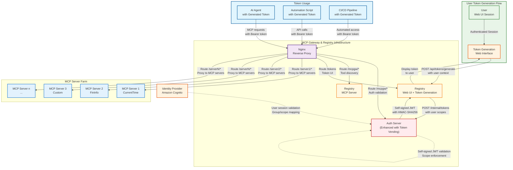
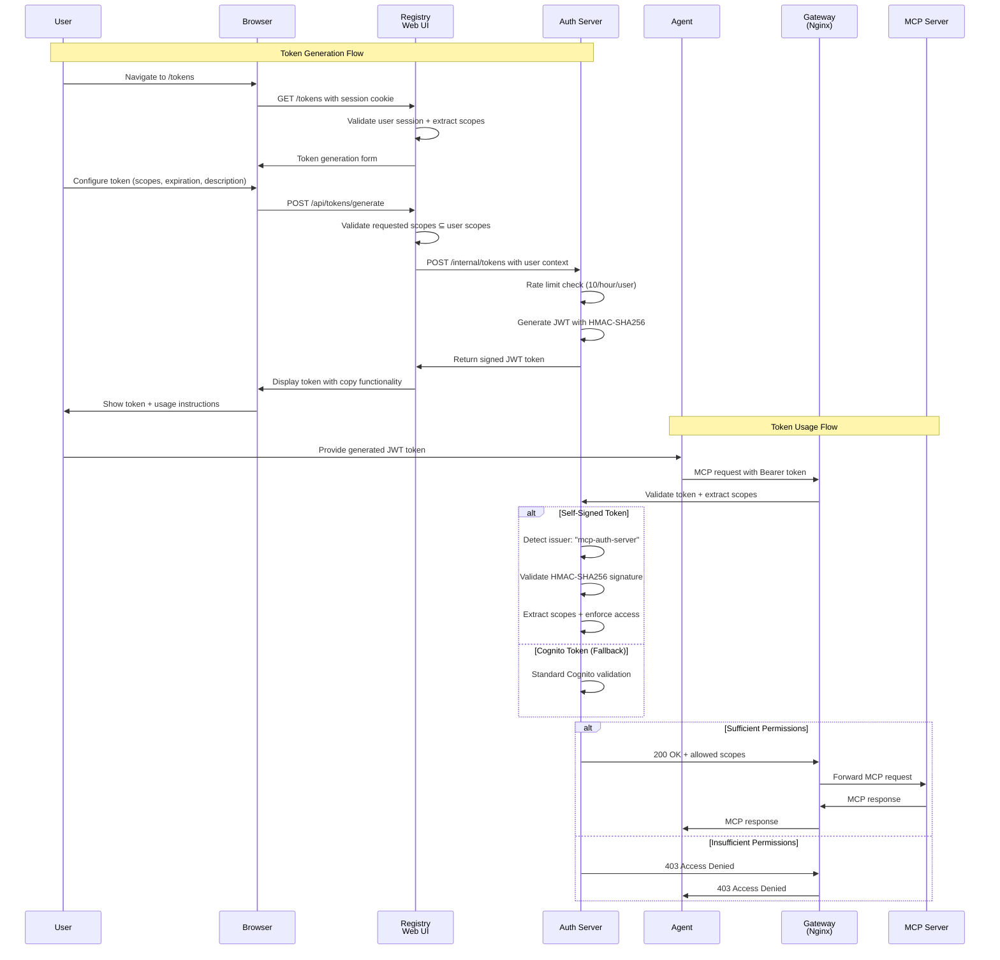

# JWT Token Vending Service for MCP Gateway

The JWT Token Vending Service provides a user-friendly mechanism for generating personal access tokens _without the use of an external IdP_ that can be used for programmatic access to MCP servers. This service bridges the gap between human authentication (web UI sessions) and machine authentication (JWT tokens), enabling users to create tokens with scoped permissions for automation, scripting, and agent access.

## The Challenge with Token Management in Enterprise MCP Deployments

In enterprise scenarios, users often need to provide programmatic access to MCP servers for various automation tasks, CI/CD pipelines, and AI agents. Traditional approaches present several challenges:

- **Manual Token Management**: Requiring users to manually generate M2M credentials through AWS Cognito or other IdPs creates friction and security risks
- **Scope Complexity**: Users need to understand complex scope configurations and may accidentally grant excessive permissions
- **Token Lifecycle**: No centralized way to manage token expiration, renewal, or revocation
- **Audit Trail**: Difficulty tracking which tokens were generated by whom and for what purpose

## A Solution with Integrated Token Vending

The JWT Token Vending Service provides an enterprise-ready solution that integrates directly with the existing MCP Gateway authentication infrastructure, allowing users to generate scoped JWT tokens through a familiar web interface.

Here is an architecture diagram showing how the token vending service integrates with the existing system:



### Architecture Components for Token Vending

The JWT Token Vending Service extends the existing MCP Gateway infrastructure with new capabilities:

#### Enhanced Registry Web UI
- **Token Generation Interface**: User-friendly form for creating JWT tokens with custom scopes and expiration
- **Scope Validation**: Real-time validation ensuring requested scopes are subset of user's current permissions
- **Token Display**: Secure, one-time display of generated tokens with copy functionality and usage instructions

#### Enhanced Auth Server
- **Internal Token Endpoint**: New `/internal/tokens` endpoint for generating self-signed JWT tokens
- **Scope Validation Logic**: Ensures generated tokens cannot exceed user's current permissions
- **Rate Limiting**: Prevents token generation abuse with configurable limits per user
- **Self-Signed JWT Support**: Validates both Cognito tokens and internally generated tokens

#### Token Security Features
- **HMAC-SHA256 Signing**: Uses shared secret key for token signing and validation
- **Scope Inheritance**: Generated tokens can have same or fewer permissions than user's current scopes
- **Configurable Expiration**: Token lifetime from 1-24 hours with 8-hour default
- **Unique Token IDs**: Each token has a unique identifier for potential tracking and revocation

At a high-level the token generation and usage flow works as follows:



1. A **User** authenticates to the Registry web UI using their existing session (derived from Cognito OAuth or M2M flow) which contains their current scopes and permissions.

2. The **User** navigates to the token generation interface at `/tokens` and configures their desired token parameters including optional custom scopes (must be subset of current scopes), expiration time (1-24 hours), and description.

3. The **Registry** validates the user's session, ensures requested scopes are a subset of the user's current permissions, and calls the Auth Server's internal token generation endpoint with the user context and token parameters.

4. The **Auth Server** performs security checks (rate limiting, scope validation, expiration limits) and generates a self-signed JWT token using HMAC-SHA256 with the shared secret key. The token contains standard JWT claims plus MCP-specific metadata.

5. The **Registry** displays the generated token to the user with copy functionality, usage instructions, and security warnings. The token is shown only once for security.

6. The **User** saves the token securely and provides it to their **Agent** or automation script for programmatic access to MCP servers.

7. When the **Agent** makes MCP requests, it includes the generated JWT token in the Authorization header. The **Gateway** forwards the request to the **Auth Server** for validation.

8. The **Auth Server** detects self-signed tokens by the issuer claim, validates the HMAC-SHA256 signature using the shared secret, and enforces scope-based access control using the same logic as Cognito tokens.

9. If the token is valid and the requested operation is within the token's scope, the **Gateway** forwards the request to the appropriate **MCP Server**. Otherwise, it returns a 403 Access Denied response.

The above implementation provides a seamless way for users to generate programmatic access tokens without requiring direct interaction with the Identity Provider, while maintaining the same security guarantees and scope enforcement as the existing authentication system.

## Agent Integration

The JWT Token Vending Service integrates seamlessly with existing agent authentication patterns through enhanced command-line support:

### Enhanced Agent Command Line Interface

The agent now supports direct JWT token usage through a new `--jwt-token` parameter:

```bash
# Method 1: Direct token usage
python agent.py \
  --jwt-token "eyJhbGciOiJIUzI1NiIsInR5cCI6IkpXVCJ9..." \
  --message "What is the current time in New York?"

# Method 2: Environment variable
export JWT_TOKEN="eyJhbGciOiJIUzI1NiIsInR5cCI6IkpXVCJ9..."
python agent.py --jwt-token "$JWT_TOKEN" --message "List available servers"

# Method 3: Token from file
echo "eyJhbGciOiJIUzI1NiIsInR5cCI6IkpXVCJ9..." > ~/.mcp/jwt_token
python agent.py --jwt-token "$(cat ~/.mcp/jwt_token)" --message "Help me analyze data"
```

### Token Storage Best Practices

#### Secure Storage Options
```bash
# Option 1: Encrypted environment file
echo "JWT_TOKEN=your_token_here" | gpg --encrypt > ~/.mcp/token.gpg

# Option 2: System keyring (macOS)
security add-generic-password -a "$USER" -s "mcp-jwt-token" -w "your_token_here"

# Option 3: Secure file with restricted permissions
echo "your_token_here" > ~/.mcp/jwt_token
chmod 600 ~/.mcp/jwt_token
```

#### CI/CD Integration
```yaml
# GitHub Actions example
name: MCP Agent Workflow
on: [push]
jobs:
  run-agent:
    runs-on: ubuntu-latest
    steps:
      - uses: actions/checkout@v2
      - name: Run MCP Agent
        env:
          JWT_TOKEN: ${{ secrets.MCP_JWT_TOKEN }}
        run: |
          python agent.py --jwt-token "$JWT_TOKEN" --message "Deploy analysis"
```

## Security Features and Considerations

### Token Security Implementation

#### Rate Limiting
- **Per-User Limits**: Maximum 10 tokens per user per hour
- **Sliding Window**: Uses hourly time slots for rate calculation
- **Memory-Based**: Simple in-memory counter with automatic cleanup
- **Configurable**: Limits adjustable via environment variables

#### Scope Inheritance and Validation
- **Subset Validation**: Generated tokens cannot exceed user's current permissions
- **Real-Time Validation**: Scope checks performed at generation time
- **Default Behavior**: Empty scope request defaults to user's full scope set
- **JSON Validation**: Custom scope uploads validated for proper JSON format

#### Token Lifecycle Management
- **Configurable Expiration**: 1-24 hour range with 8-hour default
- **No Refresh**: Tokens cannot be refreshed, must be regenerated
- **Unique Identifiers**: Each token has a unique `jti` claim for tracking
- **Self-Contained**: All authorization data embedded in token

### Cryptographic Implementation

#### HMAC-SHA256 Signing
```python
# Token generation process
payload = {
    "iss": "mcp-auth-server",
    "aud": "mcp-registry", 
    "sub": username,
    "scope": " ".join(requested_scopes),
    "exp": current_time + (expires_in_hours * 3600),
    "iat": current_time,
    "jti": str(uuid.uuid4()),
    "token_use": "access",
    "client_id": "user-generated",
    "token_type": "user_generated"
}

# Sign with shared secret
access_token = jwt.encode(payload, SECRET_KEY, algorithm='HS256')
```

#### Token Validation Process
```python
# Validation with issuer detection
try:
    # Quick check for self-signed tokens
    unverified_claims = jwt.decode(token, options={"verify_signature": False})
    if unverified_claims.get('iss') == 'mcp-auth-server':
        # Validate self-signed token
        claims = jwt.decode(token, SECRET_KEY, algorithms=['HS256'], 
                          issuer='mcp-auth-server', audience='mcp-registry')
        scopes = claims.get('scope', '').split()
        return {'valid': True, 'scopes': scopes, 'method': 'self_signed'}
    else:
        # Fall back to Cognito validation
        return validate_cognito_token(token)
except jwt.InvalidTokenError:
    return {'valid': False, 'error': 'Invalid token'}
```

### Security Best Practices

#### For Users
1. **Minimal Scopes**: Generate tokens with only required permissions
2. **Short Expiration**: Use shortest practical token lifetime
3. **Secure Storage**: Store tokens in encrypted or protected locations
4. **Regular Rotation**: Regenerate tokens periodically
5. **Monitor Usage**: Track token usage in application logs

#### For Administrators
1. **Audit Logging**: Monitor token generation patterns and frequency
2. **Scope Configuration**: Regularly review and update scope definitions
3. **Rate Limit Tuning**: Adjust rate limits based on usage patterns
4. **Key Management**: Protect the shared SECRET_KEY used for signing
5. **Access Reviews**: Periodically review user permissions and group memberships

### Threat Model and Mitigations

#### Token Theft
- **Risk**: Stolen tokens provide unauthorized access
- **Mitigation**: Short expiration times, scope limitations, audit logging

#### Scope Escalation
- **Risk**: Users attempt to generate tokens with excessive permissions
- **Mitigation**: Strict subset validation, real-time scope checking

#### Rate Limit Bypass
- **Risk**: Automated token generation for abuse
- **Mitigation**: Per-user rate limiting, monitoring, account lockout policies

#### Replay Attacks
- **Risk**: Intercepted tokens used maliciously
- **Mitigation**: HTTPS enforcement, short token lifetimes, unique token IDs

## Implementation Configuration

### Environment Variables
```bash
# Token generation settings
MAX_TOKEN_LIFETIME_HOURS=24          # Maximum token lifetime
DEFAULT_TOKEN_LIFETIME_HOURS=8       # Default token lifetime
MAX_TOKENS_PER_USER_PER_HOUR=10     # Rate limiting

# JWT settings
JWT_ISSUER="mcp-auth-server"         # Token issuer
JWT_AUDIENCE="mcp-registry"          # Token audience
SECRET_KEY="your-shared-secret"      # HMAC signing key (must be shared)
```

### Scope Configuration
Generated tokens inherit scope validation from the existing `scopes.yml` configuration:

```yaml
# Example scope allowing read access to time servers
mcp-servers-time/read:
  - server: "currenttime"
    methods: ["initialize", "tools/list", "tools/call"]
    tools: ["current_time_by_timezone", "current_time_utc"]

# Example scope for financial data access  
mcp-servers-finance/read:
  - server: "fininfo"
    methods: ["initialize", "tools/list", "tools/call"]
    tools: ["get_stock_price", "get_market_data"]

# Admin scope with full access
mcp-registry-admin:
  - server: "*"
    methods: ["*"]
    tools: ["*"]
```

### User Interface Configuration

The token generation interface provides:

#### Token Configuration Options
- **Description**: Optional human-readable token description
- **Expiration**: Dropdown with 1, 8, and 24-hour options
- **Scope Method**: Radio buttons for "Use current scopes" or "Custom JSON"
- **Custom Scopes**: JSON textarea for advanced users

#### User Experience Features
- **Current Permissions Display**: Shows user's active scopes as badges
- **Real-time Validation**: Client-side validation of JSON scope format
- **Copy Functionality**: Multiple copy methods with fallbacks for different browsers
- **Usage Instructions**: Clear examples of how to use the generated token
- **Security Warnings**: Prominent warnings about token storage and sharing

By implementing the JWT Token Vending Service, organizations can provide their users with a secure, user-friendly way to generate programmatic access tokens while maintaining enterprise-grade security controls and comprehensive audit capabilities. The service seamlessly integrates with existing MCP Gateway infrastructure and provides a foundation for advanced token management features.

## Integration with Token Refresh Service

The JWT Token Vending Service works seamlessly with the [Automated Token Refresh Service](token-refresh-service.md) to provide comprehensive token lifecycle management:

### Automatic Token Monitoring

Once tokens are generated through the vending service, the token refresh service automatically:

- **Monitors expiration times** for all generated tokens
- **Proactively refreshes** tokens before they expire (configurable buffer time)
- **Updates MCP client configurations** with fresh tokens
- **Maintains continuous authentication** without user intervention

### MCP Client Configuration

The token refresh service automatically generates MCP client configurations that include tokens from the vending service:

- **VS Code Extensions** - Automatically configured with refreshed tokens
- **Claude Code/Roocode** - Real-time token updates for coding assistants
- **Custom MCP Clients** - Standard configuration format for any MCP client

### Enhanced Security Model

The combination of both services provides:

- **Short-lived primary tokens** from the vending service (1-24 hours)
- **Automatic refresh capability** using secure refresh tokens
- **Zero-downtime token rotation** for continuous service availability
- **Centralized token lifecycle management** with comprehensive audit trails

### Usage Pattern

1. **Generate Initial Token** - Use the JWT Token Vending Service web interface
2. **Automatic Refresh** - Token refresh service monitors and refreshes tokens
3. **Client Integration** - MCP clients automatically use refreshed tokens
4. **Continuous Operation** - No manual intervention required for token management

For detailed setup and configuration of the token refresh service, see the [Token Refresh Service Documentation](token-refresh-service.md). 