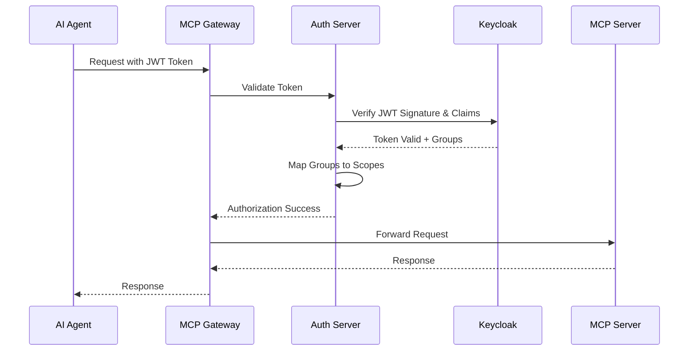

# Keycloak Integration Documentation

## Overview

This document provides comprehensive guidance for implementing Keycloak authentication in the MCP Gateway, including design aspects, operational procedures, configuration parameters, and management scripts.

## Table of Contents

1. [Architecture & Design](#architecture--design)
2. [Environment Configuration](#environment-configuration)
3. [Setup & Installation](#setup--installation)
4. [Operational Procedures](#operational-procedures)
5. [Agent Management](#agent-management)
6. [Monitoring & Troubleshooting](#monitoring--troubleshooting)
7. [Security Considerations](#security-considerations)
8. [Cleanup Procedures](#cleanup-procedures)

## Architecture & Design

### Authentication Flow



### Service Account Architecture

#### Production Architecture (Recommended)
```
AI Agent A → Service Account A (agent-{agent-id}-m2m) → Group: mcp-servers-restricted/unrestricted
AI Agent B → Service Account B (agent-{agent-id}-m2m) → Group: mcp-servers-restricted/unrestricted  
AI Agent C → Service Account C (agent-{agent-id}-m2m) → Group: mcp-servers-restricted/unrestricted
                                      ↓
                              Individual JWT Tokens per Agent
                                      ↓
                              Group-based Authorization + Individual Tracking
```

**Benefits:**
- ✅ Individual audit trails per AI agent
- ✅ Security isolation between agents
- ✅ Granular access control
- ✅ Compliance ready (SOC2, ISO27001)
- ✅ Per-agent metrics and monitoring


### Keycloak Components

#### Realm Configuration
- **Realm Name**: `mcp-gateway`
- **Purpose**: Isolated authentication domain for MCP Gateway
- **Settings**: JWT tokens, group mappings, client configurations

#### Client Configuration
- **Client ID**: `mcp-gateway-m2m`
- **Client Type**: Confidential (with secret)
- **Grant Types**: `client_credentials` (Machine-to-Machine)
- **Service Accounts**: Enabled
- **Standard/Implicit Flow**: Disabled (security best practice)

#### Group Structure
```
mcp-gateway (realm)
├── mcp-servers-unrestricted (group)
│   ├── Scopes: mcp-servers-unrestricted/read, mcp-servers-unrestricted/execute
│   └── Access: Full access to all MCP servers
└── mcp-servers-restricted (group)
    ├── Scopes: mcp-servers-restricted/read, mcp-servers-restricted/execute
    └── Access: Limited access to approved MCP servers
```

## Environment Configuration

### Required Environment Variables

#### 1. Docker Compose (.env)
```bash
# Keycloak Database Configuration
KEYCLOAK_DB_VENDOR=postgres
KEYCLOAK_DB_ADDR=postgres
KEYCLOAK_DB_DATABASE=keycloak
KEYCLOAK_DB_USER=keycloak
KEYCLOAK_DB_PASSWORD=<YOUR_SECURE_DB_PASSWORD>

# Keycloak Admin Configuration
KEYCLOAK_ADMIN=admin
KEYCLOAK_ADMIN_PASSWORD=<YOUR_SECURE_ADMIN_PASSWORD>

# Keycloak Runtime Configuration
KEYCLOAK_HOSTNAME=mcpgateway.ddns.net
KEYCLOAK_HOSTNAME_STRICT=false
KEYCLOAK_HOSTNAME_STRICT_HTTPS=false
KC_PROXY=edge
KC_HTTP_ENABLED=true

# PostgreSQL Database Configuration
POSTGRES_DB=keycloak
POSTGRES_USER=keycloak
POSTGRES_PASSWORD=<YOUR_SECURE_DB_PASSWORD>
```

#### 2. Auth Server Configuration (.env or docker-compose)
```bash
# Authentication Provider Selection
AUTH_PROVIDER=keycloak

# Keycloak Connection Details
KEYCLOAK_URL=https://mcpgateway.ddns.net
KEYCLOAK_REALM=mcp-gateway
KEYCLOAK_CLIENT_ID=mcp-gateway-m2m
KEYCLOAK_CLIENT_SECRET=<generated-by-keycloak>

# M2M Client Configuration (optional, defaults to main client)
KEYCLOAK_M2M_CLIENT_ID=mcp-gateway-m2m
KEYCLOAK_M2M_CLIENT_SECRET=<generated-by-keycloak>

```

#### 3. Credentials Provider Configuration
```bash
# Token Storage Configuration
OAUTH_TOKENS_DIR=.oauth-tokens

# Keycloak M2M Token Configuration
KEYCLOAK_URL=https://mcpgateway.ddns.net/keycloak
KEYCLOAK_REALM=mcp-gateway
KEYCLOAK_CLIENT_ID=mcp-gateway-m2m
KEYCLOAK_CLIENT_SECRET=<generated-by-keycloak>

# Token Refresh Settings
TOKEN_REFRESH_THRESHOLD=60  # Refresh when less than 60 seconds remaining
TOKEN_CACHE_TTL=300         # Cache tokens for 300 seconds (5 minutes)
```

#### 4. Agent-Specific Configuration (per agent)
```bash
# Agent Identification
AGENT_ID=sre-agent
AGENT_TYPE=claude
AGENT_VERSION=1.0.0

# Keycloak Agent Configuration
KEYCLOAK_AGENT_CLIENT_ID=mcp-gateway-m2m
KEYCLOAK_AGENT_SERVICE_ACCOUNT=agent-sre-agent-m2m
KEYCLOAK_AGENT_GROUP=mcp-servers-unrestricted

# Token File Location
AGENT_TOKEN_FILE=.oauth-tokens/agent-sre-agent.json
```

### Configuration File Templates

#### .env.keycloak (Main Configuration)
```bash
# Keycloak Service Configuration
KEYCLOAK_URL=https://mcpgateway.ddns.net
KEYCLOAK_REALM=mcp-gateway
KEYCLOAK_ADMIN=admin
KEYCLOAK_ADMIN_PASSWORD=<YOUR_SECURE_ADMIN_PASSWORD>

# Database Configuration
KEYCLOAK_DB_VENDOR=postgres
KEYCLOAK_DB_ADDR=postgres
KEYCLOAK_DB_DATABASE=keycloak
KEYCLOAK_DB_USER=keycloak
KEYCLOAK_DB_PASSWORD=<YOUR_SECURE_DB_PASSWORD>

# M2M Client Configuration
KEYCLOAK_CLIENT_ID=mcp-gateway-m2m
KEYCLOAK_CLIENT_SECRET=<to-be-generated>
KEYCLOAK_M2M_CLIENT_ID=mcp-gateway-m2m
KEYCLOAK_M2M_CLIENT_SECRET=<to-be-generated>

# Proxy Configuration
KC_PROXY=edge
KC_HTTP_ENABLED=true
KEYCLOAK_HOSTNAME_STRICT=false
KEYCLOAK_HOSTNAME_STRICT_HTTPS=false
```

#### .env.auth-server (Auth Server Configuration)
```bash
# Authentication Provider
AUTH_PROVIDER=keycloak

# Keycloak Integration
KEYCLOAK_URL=https://mcpgateway.ddns.net
KEYCLOAK_REALM=mcp-gateway
KEYCLOAK_CLIENT_ID=mcp-gateway-m2m
KEYCLOAK_CLIENT_SECRET=<from-keycloak>

# Scopes Configuration
SCOPES_CONFIG_PATH=scopes.yml

# Logging Configuration
LOG_LEVEL=INFO
AUTH_LOG_FORMAT=%(asctime)s,p%(process)s,{%(filename)s:%(lineno)d},%(levelname)s,%(message)s
```

## Setup & Installation

### Prerequisites

1. **Docker & Docker Compose**
   ```bash
   docker --version
   docker-compose --version
   ```

2. **Required Ports Available**
   - 8080: Keycloak HTTP
   - 8443: Keycloak HTTPS
   - 5432: PostgreSQL (internal)

3. **External Dependencies**
   - Domain name with SSL certificate
   - PostgreSQL database access

### Installation Steps

#### 1. Initial Setup
```bash
# Clone repository and navigate to project
cd /path/to/mcp-gateway-registry

# Start prerequisite services
docker-compose up -d postgres

# Wait for PostgreSQL to be ready
sleep 10

# Start Keycloak
docker-compose up -d keycloak

# Wait for Keycloak to initialize (may take 2-3 minutes)
sleep 120
```

#### 2. Environment Variables Setup
```bash
# MANDATORY: Set secure passwords before running any scripts
export KEYCLOAK_ADMIN_PASSWORD="$(openssl rand -base64 32)"
export KEYCLOAK_DB_PASSWORD="$(openssl rand -base64 32)"

# Verify variables are set
echo "Admin password set: ${KEYCLOAK_ADMIN_PASSWORD:+YES}"
echo "DB password set: ${KEYCLOAK_DB_PASSWORD:+YES}"
```

#### 3. Keycloak Initialization
```bash
# Run the main initialization script
./keycloak/setup/init-keycloak.sh

# Expected output:
# ✓ Realm 'mcp-gateway' created successfully
# ✓ M2M client 'mcp-gateway-m2m' created successfully
# ✓ Groups created successfully
# ✓ Admin user setup complete
```

#### 4. Service Account Setup

##### Production Setup (Individual Agents)
```bash
# Ensure environment variables are still set
export KEYCLOAK_ADMIN_PASSWORD="your-secure-password"

# Create service account for SRE agent with full access
./keycloak/setup/setup-agent-service-account.sh \
  --agent-id sre-agent \
  --group mcp-servers-unrestricted

# Create service account for travel assistant with restricted access
./keycloak/setup/setup-agent-service-account.sh \
  --agent-id travel-assistant \
  --group mcp-servers-restricted

# Create service account for developer productivity agent with full access
./keycloak/setup/setup-agent-service-account.sh \
  --agent-id dev-productivity \
  --group mcp-servers-unrestricted
```

##### Development Setup (Single Account)
```bash
# Create single shared service account
./keycloak/setup/setup-m2m-service-account.sh
```

#### 4. Start Complete Stack
```bash
# Start all services
docker-compose up -d

# Verify all services are running
docker-compose ps

# Check service health
curl -f http://localhost:8080/health/ready
```

#### 5. Generate Tokens

##### Agent-Specific Tokens (Production)
```bash
# Generate token for SRE agent
uv run python credentials-provider/keycloak/generate_tokens.py --agent-id sre-agent

# Generate token for Travel Assistant agent
uv run python credentials-provider/keycloak/generate_tokens.py --agent-id travel-assistant

# Generate tokens for all agents
uv run python credentials-provider/keycloak/generate_tokens.py --all-agents

# Verify token files created
ls -la .oauth-tokens/agent-*-m2m-token.json
```

##### Complete Credential Generation (Recommended)
```bash
# Generate all authentication tokens and MCP configurations
./credentials-provider/generate_creds.sh

# Start automatic token refresh service
./start_token_refresher.sh

# Verify token refresh is working
tail -f token_refresher.log
```

#### 6. Validation & Testing
```bash
# Test agent-specific authentication
./test-keycloak-mcp.sh --agent-id sre-agent

# Test legacy authentication
./test-keycloak-mcp.sh

# Expected output:
# ✓ Authentication successful
# ✓ Session established with ID: xxx
# ✓ Handshake completed
# ✓ Ping successful
# ✓ Tools list retrieved
```

## Operational Procedures

### Starting Services

#### Complete Stack Startup
```bash
# 1. Start database first
docker-compose up -d postgres

# 2. Wait for database ready
sleep 10

# 3. Start Keycloak
docker-compose up -d keycloak

# 4. Wait for Keycloak initialization
sleep 120

# 5. Start remaining services
docker-compose up -d

# 6. Verify all services
docker-compose ps
docker-compose logs --tail=20
```

#### Service Health Checks
```bash
# Keycloak health
curl -f http://localhost:8080/health/ready

# Auth server health
curl -f http://localhost:8000/health

# PostgreSQL connection
docker-compose exec postgres pg_isready -U keycloak

# Complete service status
docker-compose ps --format table
```

### Token Management

#### Token Generation
```bash
# Generate new agent token
uv run python credentials-provider/keycloak/generate_tokens.py --agent-id <agent-id>

# Generate tokens for all agents
uv run python credentials-provider/keycloak/generate_tokens.py --all-agents

# Use complete credential generation workflow
./credentials-provider/generate_creds.sh
```

#### Token Validation
```bash
# Check token expiration
cat .oauth-tokens/agent-<agent-id>-m2m-token.json | jq '.expires_at_human'

# Verify token claims (decode JWT)
cat .oauth-tokens/agent-<agent-id>-m2m-token.json | jq -r '.access_token' | cut -d. -f2 | base64 -d | jq '.'

# Test token authentication
./test-keycloak-mcp.sh --agent-id <agent-id>

# Check automatic token refresh status
tail -20 token_refresher.log
```

#### Token Rotation Strategy
```bash
# Automatic token refresh service (recommended)
./start_token_refresher.sh

# The service will automatically:
# - Refresh tokens every 5 minutes
# - Regenerate MCP configuration files
# - Handle both ingress and egress tokens

# Manual token refresh if needed
uv run python credentials-provider/keycloak/generate_tokens.py --all-agents

# Hourly health check
0 * * * * /path/to/project/test-keycloak-mcp.sh --agent-id sre-agent --silent
```

### Configuration Updates

#### Adding New Agents
```bash
# 1. Create new service account
./keycloak/setup/setup-agent-service-account.sh \
  --agent-id new-agent-001 \
  --group mcp-servers-restricted

# 2. Generate initial token
uv run python credentials-provider/keycloak/generate_tokens.py --agent-id new-agent-001

# 3. Test authentication
./test-keycloak-mcp.sh --agent-id new-agent-001

# 4. Update monitoring and rotation scripts
```

#### Modifying Agent Permissions
```bash
# Access Keycloak admin console
open https://mcpgateway.ddns.net/admin

# Navigate to: 
# Realm: mcp-gateway → Users → agent-<id>-m2m → Groups

# Add/remove group memberships:
# - mcp-servers-unrestricted (full access)
# - mcp-servers-restricted (limited access)

# Generate new token to reflect changes
uv run uv run python credentials-provider/token_refresher.py --agent-id <agent-id>
```

#### Updating Scopes Configuration
```bash
# 1. Edit scopes configuration
nano auth_server/scopes.yml

# 2. Restart auth server to pick up changes
docker-compose restart auth-server

# 3. Verify changes took effect
docker-compose logs auth-server | grep -i scope

# 4. Test authorization with updated scopes
./test-keycloak-mcp.sh --agent-id <agent-id>
```

## Agent Management

### Agent Service Account Lifecycle

#### Creating New Agent
```bash
# Step 1: Create service account with appropriate permissions
./keycloak/setup/setup-agent-service-account.sh \
  --agent-id <agent-id> \
  --group <mcp-servers-restricted|mcp-servers-unrestricted>

# Step 2: Generate initial token
uv run uv run python credentials-provider/token_refresher.py --agent-id <agent-id>

# Step 3: Validate setup
./test-keycloak-mcp.sh --agent-id <agent-id>

# Step 4: Document agent in inventory
echo "<agent-id>,<group>,<created-date>,<purpose>" >> docs/agent-inventory.csv
```

#### Agent Permission Updates
```bash
# Via Keycloak Admin Console:
# 1. Navigate to Users → agent-<id>-m2m → Groups
# 2. Leave current group
# 3. Join new group
# 4. Generate new token

uv run uv run python credentials-provider/token_refresher.py --agent-id <agent-id>
```

#### Agent Decommissioning
```bash
# 1. Disable service account in Keycloak
# (Admin Console → Users → agent-<id>-m2m → Enabled: OFF)

# 2. Remove token files
rm .oauth-tokens/agent-<agent-id>.json

# 3. Update documentation
sed -i '/<agent-id>/d' docs/agent-inventory.csv

# 4. Optional: Delete service account entirely
# (Admin Console → Users → agent-<id>-m2m → Delete)
```

### Bulk Agent Operations

#### Creating Multiple Agents
```bash
#!/bin/bash
# bulk-create-agents.sh

AGENTS=(
  "sre-agent:mcp-servers-unrestricted"
  "travel-assistant:mcp-servers-restricted"
  "dev-productivity:mcp-servers-restricted"
  "data-analyst:mcp-servers-restricted"
  "code-reviewer:mcp-servers-unrestricted"
)

for agent_config in "${AGENTS[@]}"; do
  IFS=':' read -r agent_id group <<< "$agent_config"
  
  echo "Creating agent: $agent_id with group: $group"
  ./keycloak/setup/setup-agent-service-account.sh \
    --agent-id "$agent_id" \
    --group "$group"
  
  echo "Generating token for: $agent_id"
  uv run python credentials-provider/keycloak/generate_tokens.py --agent-id "$agent_id"
done
```

#### Bulk Token Refresh
```bash
#!/bin/bash
# bulk-refresh-tokens.sh

# Use the built-in all-agents option (recommended)
uv run python credentials-provider/keycloak/generate_tokens.py --all-agents

# Or manually refresh individual agents
for token_file in .oauth-tokens/agent-*-m2m-token.json; do
  if [ -f "$token_file" ]; then
    agent_id=$(basename "$token_file" -m2m-token.json | sed 's/agent-//')
    echo "Refreshing token for agent: $agent_id"
    uv run python credentials-provider/keycloak/generate_tokens.py --agent-id "$agent_id"
  fi
done
```

## Monitoring & Troubleshooting

### Log Monitoring

#### Service Logs
```bash
# Keycloak logs
docker-compose logs -f keycloak

# Auth server logs
docker-compose logs -f auth-server

# PostgreSQL logs
docker-compose logs -f postgres

# All services
docker-compose logs -f
```

#### Authentication Debugging
```bash
# Enable debug logging in auth server
# Edit docker-compose.yml:
# environment:
#   - LOG_LEVEL=DEBUG

# Restart auth server
docker-compose restart auth-server

# Monitor authentication attempts
docker-compose logs -f auth-server | grep -i "keycloak\|token\|auth"
```

#### Token Validation Logs
```bash
# Watch token validation in real-time
docker-compose logs -f auth-server | grep -E "Token validation|Groups.*mapped|Access.*denied"

# Sample output:
# ✓ Token validation successful using KeycloakProvider
# ✓ Mapped Keycloak groups ['mcp-servers-unrestricted'] to scopes: ['mcp-servers-unrestricted/read', 'mcp-servers-unrestricted/execute']
# ✓ Access granted for server currenttime.tools/list
```

### Common Issues & Solutions

#### Issue: Token Expired
```bash
# Symptoms:
# - HTTP 500 errors
# - "Token has expired" in logs

# Solution:
uv run uv run python credentials-provider/token_refresher.py --agent-id <agent-id>
```

#### Issue: Service Account Missing
```bash
# Symptoms:
# - "Service account not found" errors
# - Token generation fails

# Solution:
./keycloak/setup/setup-agent-service-account.sh --agent-id <agent-id> --group <group>
```

#### Issue: Groups Not in JWT
```bash
# Symptoms:
# - "Access forbidden" errors
# - Groups claim missing from token

# Check groups mapper exists:
# Admin Console → Clients → mcp-gateway-m2m → Mappers → groups

# Fix:
./keycloak/setup/setup-agent-service-account.sh --agent-id <agent-id> --group <group>
```

#### Issue: Database Connection Failed
```bash
# Symptoms:
# - Keycloak fails to start
# - Database connection errors

# Check PostgreSQL:
docker-compose ps postgres
docker-compose logs postgres

# Restart database:
docker-compose restart postgres
sleep 10
docker-compose restart keycloak
```

### Performance Monitoring

#### Token Metrics
```bash
# Token expiration monitoring
find .oauth-tokens -name "*.json" -exec jq -r '.expires_at_human' {} \;

# Token age monitoring
find .oauth-tokens -name "*.json" -exec stat -c '%Y %n' {} \; | sort -n
```

#### Service Health Dashboard
```bash
#!/bin/bash
# health-dashboard.sh

echo "=== MCP Gateway Keycloak Health Dashboard ==="
echo "Timestamp: $(date)"
echo ""

echo "--- Service Status ---"
docker-compose ps --format "table {{.Service}}\t{{.Status}}\t{{.Ports}}"
echo ""

echo "--- Token Status ---"
for token_file in .oauth-tokens/*.json; do
  if [ -f "$token_file" ]; then
    agent=$(basename "$token_file" .json)
    expires=$(jq -r '.expires_at_human' "$token_file")
    echo "$agent: expires $expires"
  fi
done
echo ""

echo "--- Service Health ---"
curl -s -f http://localhost:8080/health/ready && echo "Keycloak: ✓ Healthy" || echo "Keycloak: ✗ Unhealthy"
curl -s -f http://localhost:8000/health && echo "Auth Server: ✓ Healthy" || echo "Auth Server: ✗ Unhealthy"
```

## Security Considerations

### ⚠️ Critical Security Requirements

**MANDATORY**: All setup scripts require environment variables to be set. Scripts will exit with an error if passwords are not provided:

```bash
# ✅ Required environment variables - scripts will fail without these
export KEYCLOAK_ADMIN_PASSWORD="$(openssl rand -base64 32)"
export KEYCLOAK_DB_PASSWORD="$(openssl rand -base64 32)"
```

**Security Features:**
- ✅ No hardcoded passwords in scripts
- ✅ Scripts exit with clear error if environment variables not set
- ✅ Forces explicit password configuration
- ✅ Prevents accidental use of default passwords

**Before running any setup scripts:**
1. **REQUIRED**: Set `KEYCLOAK_ADMIN_PASSWORD` environment variable
2. **REQUIRED**: Set `KEYCLOAK_DB_PASSWORD` environment variable  
3. Never commit these to version control
4. Use a proper secrets management system

### Secret Management
```bash
# Environment Variables (Recommended)
export KEYCLOAK_CLIENT_SECRET="<secret-value>"
export KEYCLOAK_ADMIN_PASSWORD="<admin-password>"

# .env Files (Development Only)
# Ensure .env files are in .gitignore
echo "*.env" >> .gitignore
echo ".oauth-tokens/" >> .gitignore

# Kubernetes Secrets (Production)
kubectl create secret generic keycloak-secrets \
  --from-literal=client-secret="<secret-value>" \
  --from-literal=admin-password="<admin-password>"
```

### Network Security
```bash
# Firewall Rules (Example)
# Allow only necessary ports:
ufw allow 80/tcp   # HTTP
ufw allow 443/tcp  # HTTPS
ufw deny 8080/tcp  # Block direct Keycloak access
ufw deny 5432/tcp  # Block direct database access

# Use reverse proxy (nginx) for SSL termination
# Block direct access to Keycloak admin console from external networks
```

### Token Security
```bash
# Token File Permissions
chmod 600 .oauth-tokens/*.json
chown app:app .oauth-tokens/*.json

# Token Rotation Policy
# - Refresh tokens every 4 hours (max 5 minutes lifetime)
# - Rotate client secrets monthly
# - Monitor for token abuse/unusual patterns

# Audit Trail
# - All token usage logged with agent ID
# - Failed authentication attempts monitored
# - Suspicious activity alerts configured
```

### Access Control
```bash
# Service Account Principle of Least Privilege
# - mcp-servers-restricted: Limited to approved servers only
# - mcp-servers-unrestricted: Full access (use sparingly)

# Regular Access Review
# - Monthly review of agent permissions
# - Quarterly audit of service accounts
# - Annual security assessment
```

## Cleanup Procedures

### Graceful Shutdown
```bash
# 1. Stop accepting new requests
docker-compose stop nginx

# 2. Allow current requests to complete
sleep 30

# 3. Stop application services
docker-compose stop auth-server

# 4. Stop Keycloak
docker-compose stop keycloak

# 5. Stop database last
docker-compose stop postgres

# 6. Verify all stopped
docker-compose ps
```

### Complete Removal
```bash
# Stop and remove containers
docker-compose down

# Remove volumes (WARNING: This deletes all data)
docker-compose down -v

# Remove images
docker-compose down --rmi all

# Remove networks
docker network prune -f

# Clean up token files
rm -rf .oauth-tokens/

# Remove logs
docker system prune -f
```

### Data Backup & Restore

#### Backup Procedure
```bash
#!/bin/bash
# backup-keycloak.sh

BACKUP_DIR="backups/$(date +%Y%m%d_%H%M%S)"
mkdir -p "$BACKUP_DIR"

# Backup database
docker-compose exec postgres pg_dump -U keycloak keycloak > "$BACKUP_DIR/keycloak.sql"

# Backup configuration
cp -r keycloak/setup "$BACKUP_DIR/"
cp auth_server/scopes.yml "$BACKUP_DIR/"
cp docker-compose.yml "$BACKUP_DIR/"

# Backup tokens (optional)
cp -r .oauth-tokens "$BACKUP_DIR/"

echo "Backup completed: $BACKUP_DIR"
```

#### Restore Procedure
```bash
#!/bin/bash
# restore-keycloak.sh

BACKUP_DIR="$1"

if [ -z "$BACKUP_DIR" ]; then
  echo "Usage: $0 <backup-directory>"
  exit 1
fi

# Stop services
docker-compose down

# Restore database
docker-compose up -d postgres
sleep 10
docker-compose exec -T postgres psql -U keycloak -d keycloak < "$BACKUP_DIR/keycloak.sql"

# Restore configuration
cp -r "$BACKUP_DIR/setup" keycloak/
cp "$BACKUP_DIR/scopes.yml" auth_server/
cp "$BACKUP_DIR/docker-compose.yml" .

# Start services
docker-compose up -d

echo "Restore completed from: $BACKUP_DIR"
```

### Agent Cleanup
```bash
#!/bin/bash
# cleanup-agent.sh

AGENT_ID="$1"

if [ -z "$AGENT_ID" ]; then
  echo "Usage: $0 <agent-id>"
  exit 1
fi

# Remove token file
rm -f ".oauth-tokens/agent-${AGENT_ID}.json"

# Disable service account in Keycloak
# (Manual step via Admin Console)
echo "Manual step: Disable service account 'agent-${AGENT_ID}-m2m' in Keycloak Admin Console"

# Remove from monitoring
sed -i "/agent-${AGENT_ID}/d" docs/agent-inventory.csv

echo "Agent cleanup completed for: $AGENT_ID"
```

---

## Quick Reference

### Key Commands
```bash
# Setup
./keycloak/setup/init-keycloak.sh
./keycloak/setup/setup-agent-service-account.sh --agent-id <id> --group <group>

# Operations
uv run python credentials-provider/token_refresher.py --agent-id <id>
./test-keycloak-mcp.sh --agent-id <id>
docker-compose logs -f auth-server

# Health Checks
curl -f http://localhost:8080/health/ready
curl -f http://localhost:8000/health

# Troubleshooting
docker-compose ps
docker-compose logs <service>
cat .oauth-tokens/agent-<id>.json | jq '.expires_at_human'
```

### Important Files
```
keycloak/setup/                    # Setup scripts
auth_server/scopes.yml             # Authorization configuration  
.oauth-tokens/                     # Token storage
docs/keycloak-integration.md       # This documentation
docker-compose.yml                 # Service orchestration
.env                              # Environment configuration
```

### Service URLs
- **Keycloak Admin**: https://mcpgateway.ddns.net/admin
- **Keycloak API**: https://mcpgateway.ddns.net/realms/mcp-gateway
- **Auth Server**: http://localhost:8000
- **Health Checks**: http://localhost:8080/health/ready

---

*This documentation is maintained as part of the MCP Gateway project. For updates and issues, please refer to the project repository.*