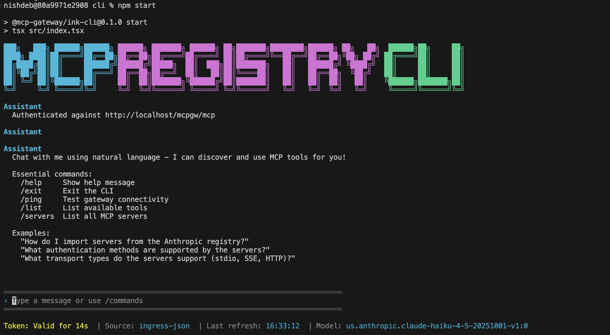

# MCP Registry CLI Guide

Interactive terminal interface for chatting with AI models and using MCP (Model Context Protocol) tools.



## Table of Contents
- [Quick Start](#quick-start)
- [Setup](#setup)
- [Available Commands](#available-commands)
- [Provider Selection](#provider-selection)
- [Available Models](#available-models)
- [Troubleshooting](#troubleshooting)

---

## Quick Start

### Build
```bash
cd cli && npm install && npm run build
```

### Configure AI provider (choose one):
1. Bedrock via AWS profile (by default)
2. Directly configured via execution role
3. Set an anthropic API key
```bash
export ANTHROPIC_API_KEY=sk-ant-xxx      
```

### Run (OAuth tokens auto-generated on first start)
```bash
npm start
```
or
```bash
npm link
registry
```

**Default model:** Claude Haiku 4.5 (fastest/cheapest)

**Change model:**
```bash
export BEDROCK_MODEL_ID=us.anthropic.claude-sonnet-4-5-20250929-v1:0  # Bedrock
export ANTHROPIC_MODEL=claude-opus-4-20250514                          # Anthropic API
```

### Status Footer

Shows real-time status at the bottom:
```
Token: Valid for 5m 23s | Source: ingress-json | Last refresh: 14:32:15 | Model: us.anthropic.claude-haiku-4-5-20251001-v1:0 | Tokens: In: 1,234 | Out: 567 | Cost: $0.01
```

- **Token:** Time remaining (green > 60s, yellow < 60s, red when expired) - auto-refreshes at < 10s
- **Source:** Token origin (`ingress-json`, `env`, `token-file`)
- **Model:** Current AI model
- **Tokens:** Input/output usage for session
- **Cost:** Estimated session cost

---

## Available Commands

| Command | Description |
|---------|-------------|
| `/help` | Show help message |
| `/exit` | Exit CLI (or Ctrl+C) |
| `/ping` | Test gateway connectivity |
| `/list` | List MCP tools |
| `/servers` | List MCP servers |
| `/refresh` | Manually refresh OAuth tokens |

**Tip:** Type `/` for autocomplete suggestions
---

## Troubleshooting

### OAuth Token Issues

**Error:** "Failed to load ingress tokens" or authentication errors

**Fix:**
1. **Auto-generate:** Run `npm start` - tokens auto-generate on first run
2. **Manual refresh:** Type `/refresh` in running CLI
3. **Manual generation:** `./credentials-provider/generate_creds.sh --ingress-only`

**Note:** Tokens stored in `.oauth-tokens/ingress.json` (project root). Auto-refresh at < 10s remaining.

### Build Errors

**Fix:**
```bash
cd cli && rm -rf dist/ node_modules/ && npm install && npm run build
```

### "Agent mode is disabled"

**Cause:** No AI credentials found

**Fix:**
```bash
# Bedrock - verify AWS credentials
aws sts get-caller-identity

# Bedrock - Execution role (check IAM role attached)
curl http://169.254.169.254/latest/meta-data/iam/security-credentials/

# Anthropic API
echo $ANTHROPIC_API_KEY  # Should show key
export ANTHROPIC_API_KEY=sk-ant-your-key
```
### Anthropic API Errors

**Rate limit (429):** Wait and retry, or use Bedrock
**Auth failed (401):** Verify `ANTHROPIC_API_KEY` is valid (starts with `sk-ant-`)

---