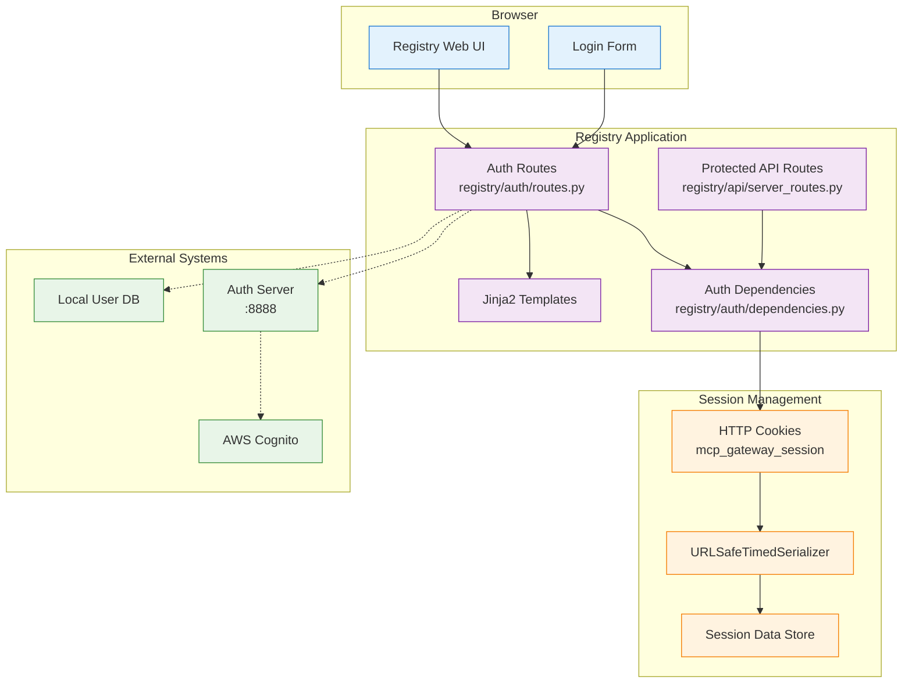
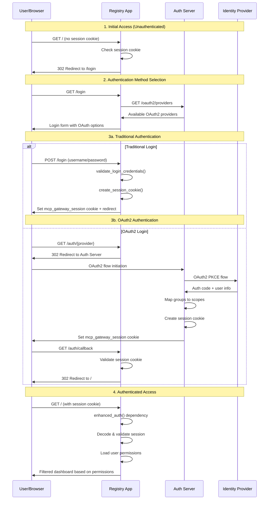
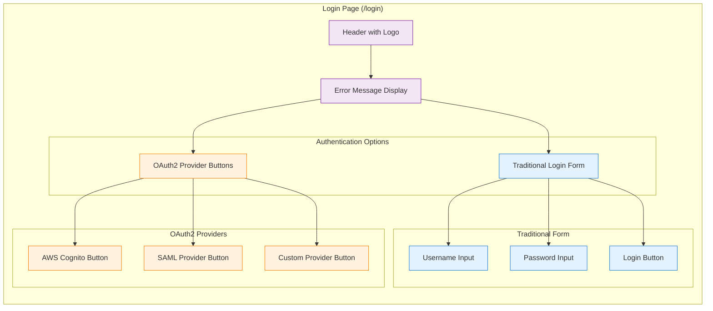
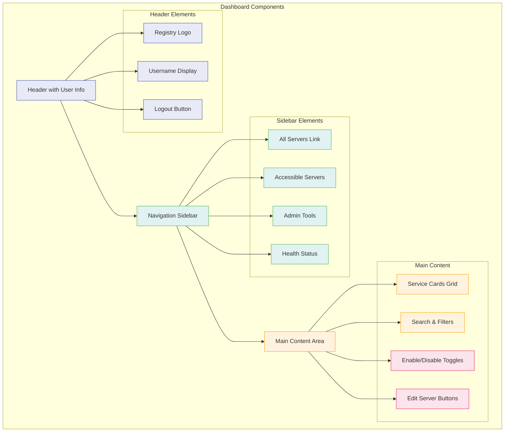
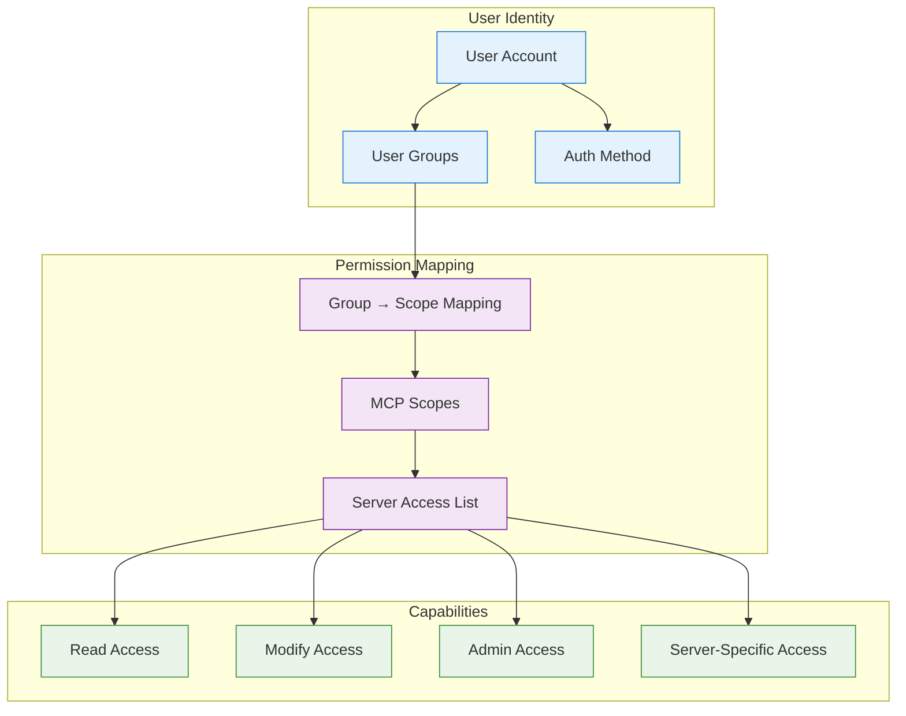
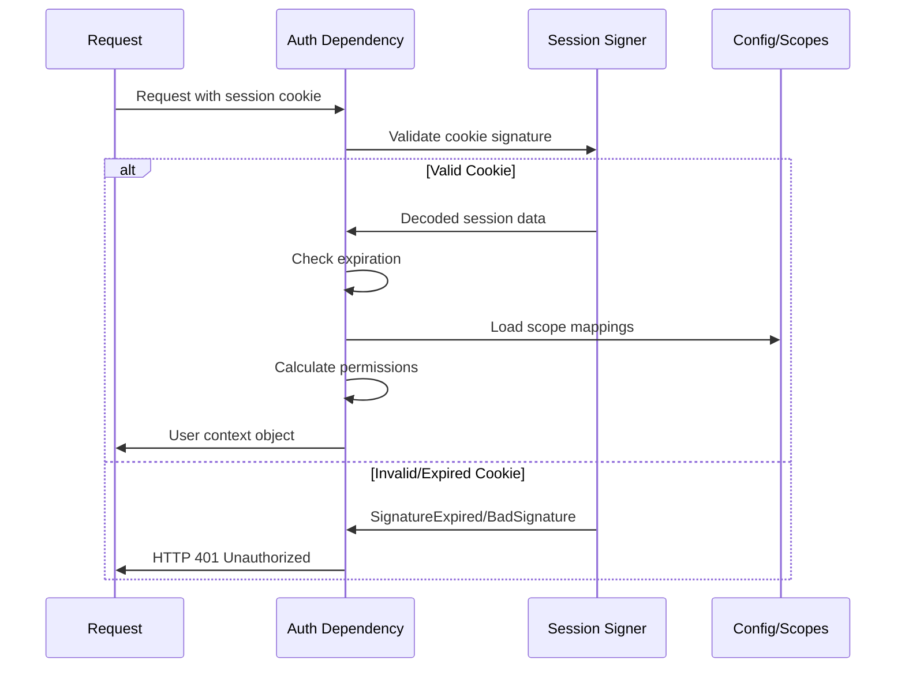
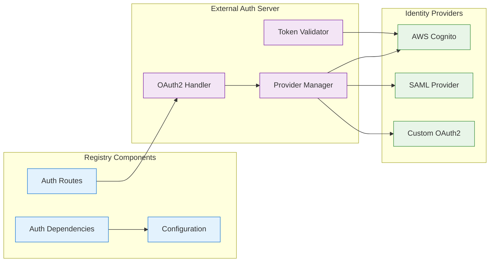

# Registry Authentication Architecture

This document provides comprehensive technical documentation for the MCP Gateway Registry's authentication and authorization system. While the main [auth.md](./auth.md) covers the overall system architecture, this document focuses specifically on the **registry application's internal authentication mechanisms**, UI-based authentication flows, and technical implementation details.

## Table of Contents

1. [Overview](#overview)
2. [Authentication Architecture](#authentication-architecture)
3. [UI Authentication System](#ui-authentication-system)
4. [Authorization & Permissions](#authorization--permissions)
5. [Technical Implementation](#technical-implementation)
6. [Configuration](#configuration)
7. [Troubleshooting](#troubleshooting)

## Overview

The MCP Gateway Registry implements a sophisticated dual-authentication system that supports:

- **Traditional username/password authentication** for local development and basic setups
- **OAuth2/SAML integration** with enterprise identity providers (Cognito, etc.)
- **Session-based authentication** using secure HTTP cookies
- **Role-based access control** with groups and scopes
- **Fine-grained permissions** for server management operations

### Key Features

- 🔐 **Dual Authentication Methods**: Traditional + OAuth2
- 🎯 **Role-Based Access Control**: Admin, User, and custom roles
- 🏢 **Enterprise Integration**: Cognito, SAML, and other IdPs
- 🔒 **Secure Session Management**: Encrypted cookies with expiration
- 🎛️ **Permission-Based UI**: Dynamic UI based on user permissions
- 📊 **Audit Trail**: Comprehensive logging of authentication events

## Authentication Architecture

### High-Level Component Overview



### Authentication Flow Architecture



## UI Authentication System

### Login Interface Components

The registry provides a modern, responsive login interface that dynamically adapts based on available authentication providers.

#### Login Form Structure



#### Dynamic Provider Loading

The login form dynamically loads available OAuth2 providers:

```python
# registry/auth/routes.py
async def get_oauth2_providers():
    """Fetch available OAuth2 providers from auth server"""
    try:
        async with httpx.AsyncClient() as client:
            response = await client.get(f"{settings.auth_server_url}/oauth2/providers")
            if response.status_code == 200:
                return response.json().get("providers", [])
    except Exception as e:
        logger.warning(f"Failed to fetch OAuth2 providers: {e}")
    return []

@router.get("/login", response_class=HTMLResponse)
async def login_form(request: Request, error: str | None = None):
    oauth_providers = await get_oauth2_providers()
    return templates.TemplateResponse("login.html", {
        "request": request, 
        "error": error,
        "oauth_providers": oauth_providers
    })
```

### Dashboard UI with Permission-Based Access

The main dashboard dynamically renders content based on user permissions:



#### Permission-Based UI Rendering

The UI dynamically shows/hides elements based on user permissions:

```html
<!-- registry/templates/index.html -->
<div class="header-right">
    <div class="user-display">
        <span>{{ username }}</span>
        
            <span class="admin-badge">Admin</span>
        
    </div>
    <form method="post" action="/logout" class="logout-form">
        <button type="submit" class="logout-button">Logout</button>
    </form>
</div>

<!-- Service management controls -->

<div class="service-card">
    <div class="card-header">
        <h2>{{ service.display_name }}</h2>
        
            <div class="header-right-items">
                <a href="/edit/{{ service.path[1:] }}" class="edit-button">Edit</a>
            </div>
        
    </div>
    
    <div class="card-footer">
        
            <!-- Toggle switch for admins/editors -->
            <form method="post" action="/toggle/{{ service.path[1:] }}" class="toggle-form">
                <label class="switch">
                    <input type="checkbox" name="enabled" 
                           checked>
                    <span class="slider round"></span>
                </label>
            </form>
        
            <!-- Read-only status for regular users -->
            <div class="read-only-status">
                <span class="status-text">
                    EnabledDisabled
                </span>
            </div>
        
    </div>
</div>

```

### WebSocket Integration for Real-Time Updates

The UI includes real-time health status updates via WebSocket:

```javascript
// Health status WebSocket connection
const ws = new WebSocket('ws://localhost:7860/ws/health_status');

ws.onmessage = function(event) {
    const healthData = JSON.parse(event.data);
    updateHealthStatusUI(healthData);
};

function updateHealthStatusUI(healthData) {
    for (const [servicePath, status] of Object.entries(healthData)) {
        const card = document.querySelector(`[data-service-path="${servicePath}"]`);
        if (card) {
            const statusElement = card.querySelector('.health-status');
            statusElement.textContent = status.status;
            statusElement.className = `health-status ${status.status}`;
            
            const toolCount = card.querySelector('.tool-count');
            toolCount.textContent = `${status.num_tools} tools`;
        }
    }
}
```

## Authorization & Permissions

### Permission Model Overview

The registry implements a sophisticated role-based access control (RBAC) system:



### Role Definitions

#### 1. Admin Role (`mcp-admin` group)
- **Full system access**: Can view, modify, create, and delete all servers
- **User management**: Can view all user sessions and permissions
- **System configuration**: Can modify global settings
- **Unrestricted scopes**: `mcp-servers-unrestricted/read`, `mcp-servers-unrestricted/execute`

#### 2. User Role (`mcp-user` group)
- **Read-only access**: Can view servers and tools they have permission for
- **No modification rights**: Cannot toggle servers or edit configurations
- **Filtered view**: Only sees servers they have explicit access to
- **Restricted scopes**: Based on group mappings

#### 3. Server-Specific Roles (`mcp-server-{name}` groups)
- **Targeted access**: Access to specific servers based on group name
- **Execute permissions**: Can use tools from assigned servers
- **Limited modification**: May have toggle permissions for specific servers

### Scope Configuration System

The system uses a YAML-based scope configuration (`auth_server/scopes.yml`):

```yaml
# Example scope configuration
group_mappings:
  mcp-admin:
    - "mcp-servers-unrestricted/read"
    - "mcp-servers-unrestricted/execute"
  
  mcp-user:
    - "mcp-servers-restricted/read"
  
  mcp-server-fininfo:
    - "mcp-servers-fininfo/read"
    - "mcp-servers-fininfo/execute"

# Scope definitions
mcp-servers-fininfo/read:
  - server: "Financial Info Proxy"
    permissions: ["read"]

mcp-servers-fininfo/execute:
  - server: "Financial Info Proxy"
    permissions: ["read", "execute"]
```

### Permission Checking Logic

```python
# registry/auth/dependencies.py
def enhanced_auth(session: str = None) -> Dict[str, Any]:
    """Enhanced authentication with full user context"""
    session_data = get_user_session_data(session)
    
    username = session_data['username']
    groups = session_data.get('groups', [])
    auth_method = session_data.get('auth_method', 'traditional')
    
    # Map groups to scopes
    if auth_method == 'oauth2':
        scopes = map_cognito_groups_to_scopes(groups)
    else:
        # Traditional users get admin scopes
        scopes = ['mcp-servers-unrestricted/read', 'mcp-servers-unrestricted/execute']
        if not groups:
            groups = ['mcp-admin']
    
    # Calculate permissions
    accessible_servers = get_user_accessible_servers(scopes)
    can_modify = user_can_modify_servers(groups, scopes)
    is_admin = 'mcp-admin' in groups
    
    return {
        'username': username,
        'groups': groups,
        'scopes': scopes,
        'auth_method': auth_method,
        'accessible_servers': accessible_servers,
        'can_modify_servers': can_modify,
        'is_admin': is_admin
    }
```

### Server Access Filtering

```python
# registry/services/server_service.py
def get_all_servers_with_permissions(self, accessible_servers: Optional[List[str]] = None) -> Dict[str, Dict[str, Any]]:
    """Get servers filtered by user permissions"""
    all_servers = self.get_all_servers()
    
    if accessible_servers is None:
        return all_servers  # Admin access
    
    filtered_servers = {}
    for path, server_info in all_servers.items():
        server_name = server_info.get("server_name", "")
        if server_name in accessible_servers:
            filtered_servers[path] = server_info
    
    return filtered_servers
```

## Technical Implementation

### Session Management Deep Dive

#### Session Cookie Structure

The registry uses `itsdangerous.URLSafeTimedSerializer` for secure session management:

```python
# registry/auth/dependencies.py
from itsdangerous import URLSafeTimedSerializer

signer = URLSafeTimedSerializer(settings.secret_key)

def create_session_cookie(username: str, auth_method: str = "traditional", 
                         provider: str = "local") -> str:
    """Create a session cookie for a user"""
    session_data = {
        "username": username,
        "auth_method": auth_method,
        "provider": provider,
        "created_at": datetime.utcnow().isoformat(),
        "groups": [],  # Populated during OAuth2 flow
        "scopes": []   # Calculated from groups
    }
    return signer.dumps(session_data)
```

#### Session Validation Flow



### Authentication Dependencies Architecture

The registry uses FastAPI's dependency injection for authentication:

```python
# registry/auth/dependencies.py

def get_current_user(session: str = Cookie(alias="mcp_gateway_session")) -> str:
    """Basic authentication - returns username only"""
    # Used for simple authentication checks
    
def get_user_session_data(session: str = Cookie(alias="mcp_gateway_session")) -> Dict[str, Any]:
    """Full session data extraction"""
    # Used when you need complete session information
    
def enhanced_auth(session: str = Cookie(alias="mcp_gateway_session")) -> Dict[str, Any]:
    """Enhanced authentication with permissions and context"""
    # Used for permission-based access control
```

### Route Protection Patterns

```python
# registry/api/server_routes.py

@router.get("/", response_class=HTMLResponse)
async def read_root(request: Request, 
                   user_context: Annotated[dict, Depends(enhanced_auth)]):
    """Main dashboard with permission-based filtering"""
    if user_context['is_admin']:
        all_servers = server_service.get_all_servers()
    else:
        all_servers = server_service.get_all_servers_with_permissions(
            user_context['accessible_servers']
        )
    # Render dashboard...

@router.post("/toggle/{service_path:path}")
async def toggle_service_route(service_path: str,
                              user_context: Annotated[dict, Depends(enhanced_auth)]):
    """Service toggle with permission checking"""
    if not user_context['can_modify_servers']:
        raise HTTPException(status_code=403, 
                          detail="You do not have permission to modify servers")
    
    if not user_context['is_admin']:
        if not server_service.user_can_access_server_path(
            service_path, user_context['accessible_servers']):
            raise HTTPException(status_code=403,
                              detail="You do not have access to this server")
    # Perform toggle...
```

### OAuth2 Integration Architecture



### WebSocket Authentication

The registry includes real-time features via WebSocket with authentication:

```python
# registry/health/routes.py
@router.websocket("/ws/health_status")
async def websocket_endpoint(websocket: WebSocket):
    """WebSocket endpoint with authentication"""
    # WebSocket authentication is handled differently
    # since cookies are automatically included in WebSocket handshake
    try:
        await health_service.add_websocket_connection(websocket)
        while True:
            await websocket.receive_text()  # Keep alive
    except WebSocketDisconnect:
        await health_service.remove_websocket_connection(websocket)
```

## Configuration

### Environment Variables

The registry authentication system requires several configuration parameters:

```bash
# Core authentication settings
SECRET_KEY=your-secure-secret-key-here
SESSION_COOKIE_NAME=mcp_gateway_session
SESSION_MAX_AGE_SECONDS=28800  # 8 hours

# Traditional authentication
ADMIN_USER=admin
ADMIN_PASSWORD=secure-password

# OAuth2/External auth server integration
AUTH_SERVER_URL=http://localhost:8888
AUTH_SERVER_EXTERNAL_URL=http://localhost:8888

# Database/storage paths (auto-configured for container vs local dev)
CONTAINER_APP_DIR=/app
CONTAINER_REGISTRY_DIR=/app/registry
CONTAINER_LOG_DIR=/app/logs
```

### Development vs Production Configuration

#### Local Development (`settings.is_local_dev = True`)
```python
# registry/core/config.py
@property
def is_local_dev(self) -> bool:
    return not Path("/app").exists()

@property
def templates_dir(self) -> Path:
    if self.is_local_dev:
        return Path.cwd() / "registry" / "templates"
    return self.container_registry_dir / "templates"
```

#### Container/Production (`settings.is_local_dev = False`)
- Paths point to `/app/registry/` structure
- Optimized logging and security settings
- External auth server integration

### Authentication Provider Configuration

#### Traditional Authentication
```python
# registry/auth/dependencies.py
def validate_login_credentials(username: str, password: str) -> bool:
    """Validate traditional login credentials"""
    return username == settings.admin_user and password == settings.admin_password
```

#### OAuth2 Provider Setup
```python
# External auth server integration
async def get_oauth2_providers():
    """Fetch available OAuth2 providers from auth server"""
    try:
        response = await client.get(f"{settings.auth_server_url}/oauth2/providers")
        return response.json().get("providers", [])
    except Exception:
        return []  # Fallback to traditional auth only
```

## Troubleshooting

### Common Authentication Issues

#### 1. Session Cookie Problems

**Issue**: User gets redirected to login page repeatedly
```python
# Debug session cookie validation
try:
    data = signer.loads(session, max_age=settings.session_max_age_seconds)
    logger.info(f"Session data: {data}")
except SignatureExpired:
    logger.warning("Session expired")
except BadSignature:
    logger.warning("Invalid session signature")
```

**Solutions**:
- Check `SECRET_KEY` consistency across restarts
- Verify cookie expiration settings
- Ensure browser accepts cookies from the domain

#### 2. OAuth2 Integration Issues

**Issue**: OAuth2 login fails or redirects incorrectly
```python
# Debug OAuth2 callback
@router.get("/auth/callback")
async def oauth2_callback(request: Request, error: str = None):
    if error:
        logger.error(f"OAuth2 error: {error}")
        return RedirectResponse(url=f"/login?error={error}")
    
    # Check session cookie validity
    session_cookie = request.cookies.get(settings.session_cookie_name)
    logger.info(f"OAuth2 callback session: {session_cookie[:20]}..." if session_cookie else "No session")
```

**Solutions**:
- Verify `AUTH_SERVER_URL` and `AUTH_SERVER_EXTERNAL_URL` settings
- Check auth server connectivity: `curl http://localhost:8888/oauth2/providers`
- Ensure redirect URIs match in OAuth2 provider configuration

#### 3. Permission Issues

**Issue**: Users can't access servers they should have permission for
```python
# Debug permission calculation
def debug_user_permissions(user_context: dict):
    logger.info(f"User: {user_context['username']}")
    logger.info(f"Groups: {user_context['groups']}")
    logger.info(f"Scopes: {user_context['scopes']}")
    logger.info(f"Accessible servers: {user_context['accessible_servers']}")
    logger.info(f"Can modify: {user_context['can_modify_servers']}")
```

**Solutions**:
- Verify group mappings in `auth_server/scopes.yml`
- Check user group assignments in identity provider
- Ensure scope configuration matches server names exactly

#### 4. WebSocket Authentication Issues

**Issue**: Real-time updates not working
```python
# Debug WebSocket connections
@router.websocket("/ws/health_status")
async def websocket_endpoint(websocket: WebSocket):
    logger.info(f"WebSocket connection from: {websocket.client}")
    try:
        await websocket.accept()
        logger.info("WebSocket connection accepted")
    except Exception as e:
        logger.error(f"WebSocket error: {e}")
```

**Solutions**:
- Check browser console for WebSocket errors
- Verify WebSocket URL scheme (ws:// vs wss://)
- Ensure firewall/proxy allows WebSocket connections

### Logging and Debugging

#### Enable Debug Logging
```python
# registry/main.py
logging.basicConfig(level=logging.DEBUG)
logger = logging.getLogger(__name__)
```

#### Authentication Event Logging
```python
# Custom auth logging
def log_auth_event(event_type: str, username: str = None, details: dict = None):
    logger.info(f"AUTH_EVENT: {event_type}", extra={
        'username': username,
        'event_type': event_type,
        'details': details,
        'timestamp': datetime.utcnow().isoformat()
    })

# Usage examples
log_auth_event('LOGIN_SUCCESS', username='admin')
log_auth_event('PERMISSION_DENIED', username='user', details={'resource': '/toggle/fininfo'})
log_auth_event('SESSION_EXPIRED', username='user')
```

#### Health Check for Auth Components
```python
@app.get("/health/auth")
async def auth_health_check():
    """Health check for authentication components"""
    health_status = {
        "session_signer": "ok",
        "auth_server": "unknown",
        "oauth2_providers": []
    }
    
    # Test auth server connectivity
    try:
        async with httpx.AsyncClient(timeout=5.0) as client:
            response = await client.get(f"{settings.auth_server_url}/health")
            if response.status_code == 200:
                health_status["auth_server"] = "ok"
                
                # Test OAuth2 providers
                providers_response = await client.get(f"{settings.auth_server_url}/oauth2/providers")
                if providers_response.status_code == 200:
                    health_status["oauth2_providers"] = providers_response.json().get("providers", [])
    except Exception as e:
        health_status["auth_server"] = f"error: {e}"
    
    return health_status
```

This comprehensive authentication architecture ensures secure, scalable, and maintainable access control for the MCP Gateway Registry while providing flexibility for both local development and enterprise deployments. 