# Registry Authentication & Authorization - Technical Deep Dive

This document provides comprehensive technical documentation for the MCP Gateway Registry's internal authentication and authorization system, focusing on the UI-based authentication flows and technical implementation details.

## Table of Contents

1. [Overview](#overview)
2. [Authentication Architecture](#authentication-architecture)
3. [UI Authentication System](#ui-authentication-system)
4. [Authorization & Permissions](#authorization--permissions)
5. [Technical Implementation](#technical-implementation)
6. [Configuration](#configuration)
7. [Troubleshooting](#troubleshooting)

## Overview

The MCP Gateway Registry implements a sophisticated dual-authentication system designed for both development and enterprise environments:

### Core Authentication Methods

- **Traditional Authentication**: Username/password for local development
- **OAuth2 Integration**: Enterprise IdP integration (Amazon Cognito, SAML, etc.)
- **Session Management**: Secure HTTP cookies with digital signatures
- **Role-Based Access Control**: Dynamic permissions based on user groups

### Key Features

- 🔐 **Dual Authentication**: Support for both traditional and OAuth2 flows
- 🎯 **RBAC System**: Fine-grained role-based access control
- 🏢 **Enterprise Ready**: Integration with Cognito and SAML providers
- 🔒 **Secure Sessions**: Encrypted, signed session cookies
- 🎛️ **Dynamic UI**: Permission-based interface rendering
- 📊 **Audit Logging**: Comprehensive authentication event tracking

## Authentication Architecture

### System Component Overview

The registry authentication system consists of several interconnected components:

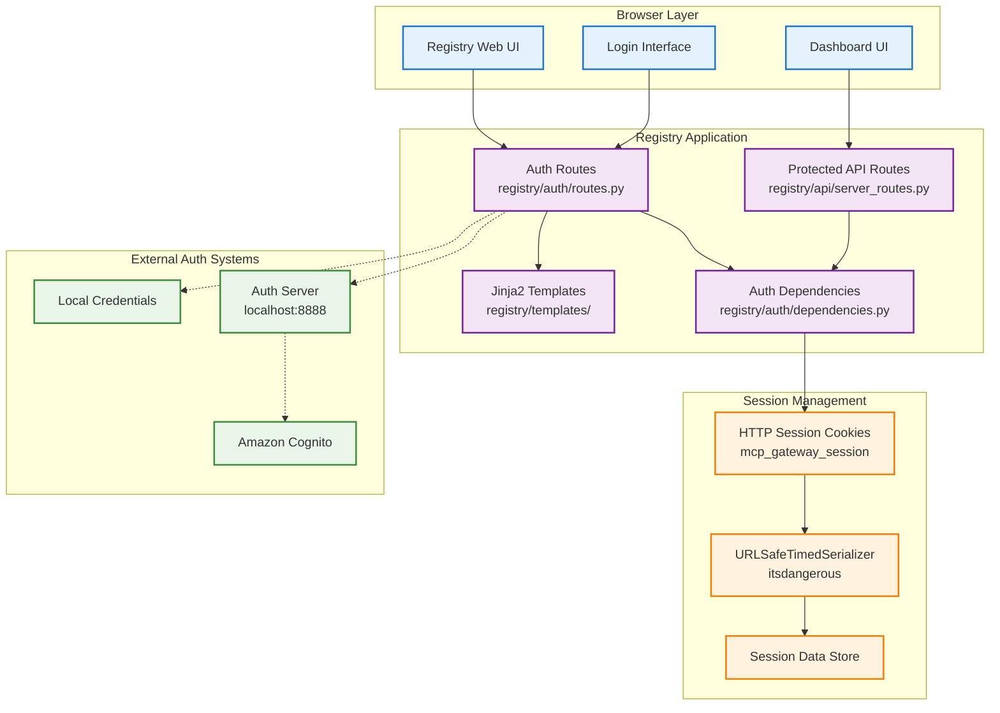

### Authentication Flow Architecture

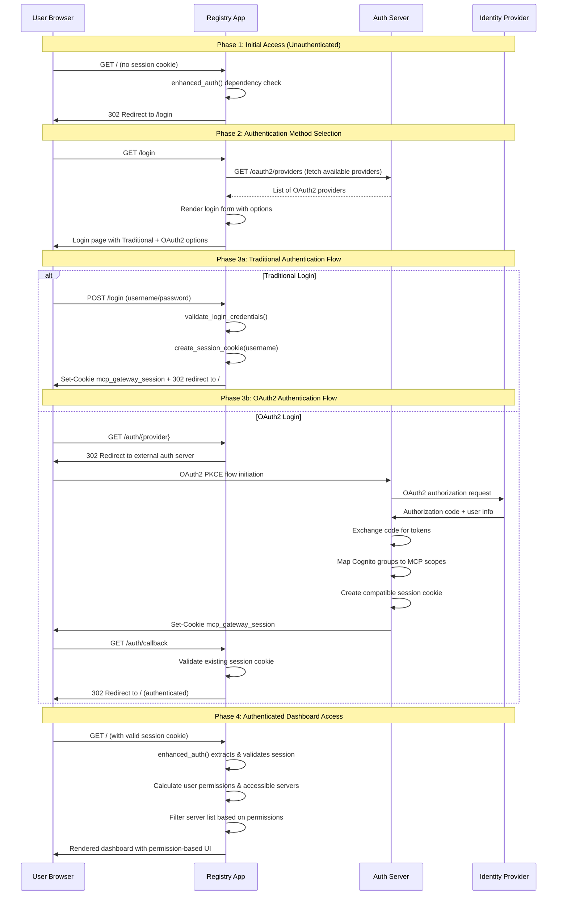

### Core Authentication Components

#### 1. Authentication Routes (`registry/auth/routes.py`)

**Purpose**: Handles all authentication-related HTTP endpoints

**Key Endpoints**:
- `GET /login` - Login form with dynamic OAuth2 provider loading
- `POST /login` - Traditional username/password authentication
- `GET /auth/{provider}` - OAuth2 provider redirect
- `GET /auth/callback` - OAuth2 callback handling
- `GET|POST /logout` - Session termination

#### 2. Authentication Dependencies (`registry/auth/dependencies.py`)

**Purpose**: FastAPI dependency injection for authentication and authorization

**Key Functions**:
- `get_current_user()` - Basic user identification
- `get_user_session_data()` - Full session data extraction
- `enhanced_auth()` - Complete user context with permissions
- `map_cognito_groups_to_scopes()` - Group-to-permission mapping

#### 3. Session Management System

**Purpose**: Secure session cookie creation, validation, and management

**Components**:
- `URLSafeTimedSerializer` from `itsdangerous` library
- Session cookie with configurable expiration
- Automatic session validation on all protected routes
- Cross-authentication-method compatibility

### Authentication Decision Tree

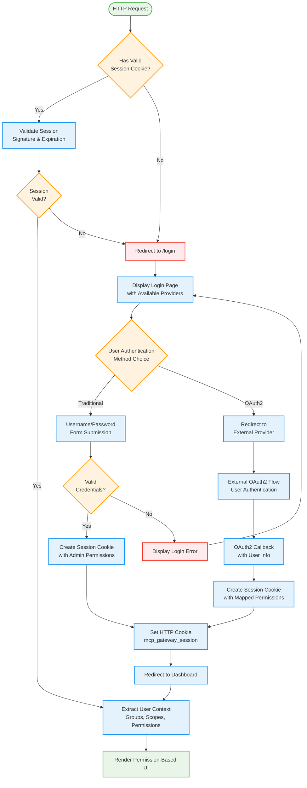

## UI Authentication System

### Login Interface Architecture

The registry provides a modern, responsive login interface that dynamically adapts based on available authentication providers.

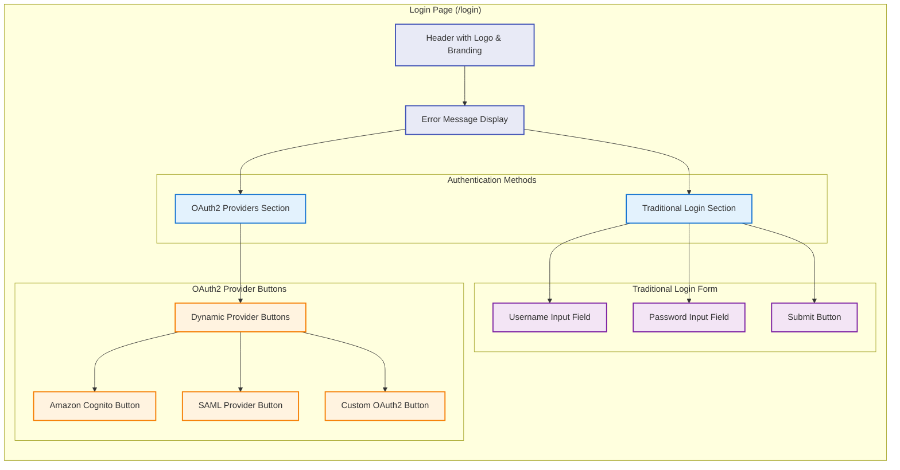

#### Dynamic Provider Loading Implementation

The login form dynamically loads available OAuth2 providers from the auth server:

```python
# registry/auth/routes.py
async def get_oauth2_providers():
    """Fetch available OAuth2 providers from auth server"""
    try:
        async with httpx.AsyncClient() as client:
            response = await client.get(
                f"{settings.auth_server_url}/oauth2/providers", 
                timeout=5.0
            )
            if response.status_code == 200:
                data = response.json()
                return data.get("providers", [])
    except Exception as e:
        logger.warning(f"Failed to fetch OAuth2 providers: {e}")
    return []

@router.get("/login", response_class=HTMLResponse)
async def login_form(request: Request, error: str | None = None):
    """Show login form with OAuth2 providers"""
    oauth_providers = await get_oauth2_providers()
    return templates.TemplateResponse("login.html", {
        "request": request, 
        "error": error,
        "oauth_providers": oauth_providers
    })
```

#### Login Template Structure

```html
<!-- registry/templates/login.html -->
<div class="login-container">
    <div class="login-header">
        
        <h2>MCP Gateway Registry</h2>
    </div>
    
    
        <div class="error-message">{{ error }}</div>
    
    
    <!-- Traditional Authentication Form -->
    <form method="post" action="/login" class="login-form">
        <div class="form-group">
            <label for="username">Username:</label>
            <input type="text" id="username" name="username" required>
        </div>
        <div class="form-group">
            <label for="password">Password:</label>
            <input type="password" id="password" name="password" required>
        </div>
        <button type="submit">Login</button>
    </form>
    
    <!-- OAuth2 Providers Section -->
    
        <div class="oauth2-section">
            <h3>Or login with:</h3>
            
                <a href="/auth/{{ provider.name }}" class="oauth2-button">
                    
                        
                    
                    Login with {{ provider.display_name }}
                </a>
            
        </div>
    
</div>
```

### Dashboard UI with Permission-Based Rendering

The main dashboard dynamically renders content based on user permissions and accessible servers:

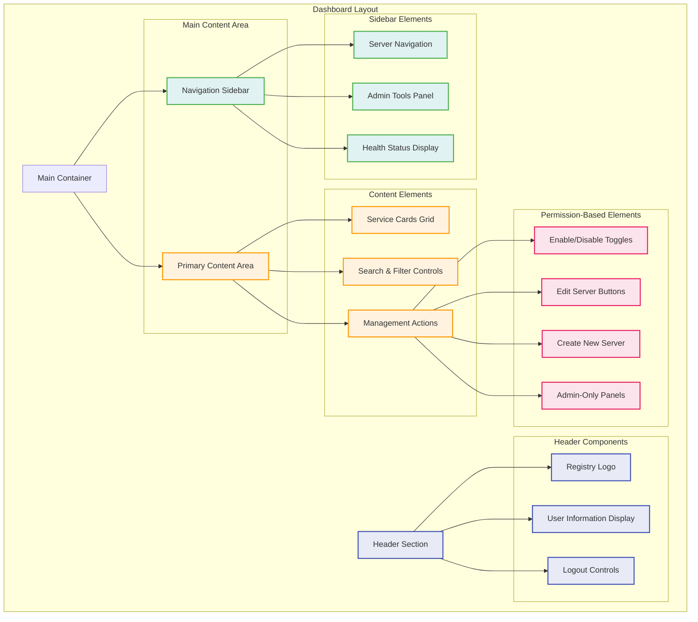

#### Permission-Based UI Rendering

The UI template conditionally renders elements based on user permissions:

```html
<!-- registry/templates/index.html -->
<header class="main-header">
    <div class="logo">
        
        <span>Registry</span>
    </div>
    
    <div class="header-right">
        <div class="user-display">
            <span>{{ username }}</span>
            
                <span class="admin-badge">Administrator</span>
            
                <span class="user-badge">{{ user_context.groups|join(', ') }}</span>
            
        </div>
        <form method="post" action="/logout" class="logout-form">
            <button type="submit" class="logout-button">Logout</button>
        </form>
    </div>
</header>

<!-- Service Cards with Permission-Based Controls -->
<div class="card-container">
    
    <div class="service-card" data-service-path="{{ service.path }}">
        <div class="card-header">
            <h2>{{ service.display_name }}</h2>
            
                <div class="header-right-items">
                    <a href="/edit/{{ service.path[1:] }}" class="edit-button">
                        Edit Configuration
                    </a>
                </div>
            
        </div>
        
        <div class="card-body">
            <p class="description">{{ service.description or "No description available." }}</p>
            
            <div class="badges">
                
                    <span class="badge">{{ tag }}</span>
                
            </div>
            
            <div class="metadata">
                <span class="tool-count">{{ service.num_tools }} tools</span>
                <span class="health-status {{ service.health_status }}">
                    {{ service.health_status }}
                </span>
                
                    <span class="timestamp">
                        Last checked: {{ service.last_checked_iso }}
                    </span>
                
            </div>
        </div>
        
        <div class="card-footer">
            
                <!-- Interactive toggle for users with modify permissions -->
                <form method="post" action="/toggle/{{ service.path[1:] }}" class="toggle-form">
                    <label class="switch">
                        <input type="checkbox" name="enabled" 
                               checked
                               onchange="this.form.submit()">
                        <span class="slider round"></span>
                    </label>
                    <span class="toggle-label">
                        EnabledDisabled
                    </span>
                </form>
            
                <!-- Read-only status display for regular users -->
                <div class="read-only-status">
                    <span class="status-indicator {{ 'enabled' if service.is_enabled else 'disabled' }}">
                        ●
                    </span>
                    <span class="status-text">
                        EnabledDisabled
                    </span>
                </div>
            
        </div>
    </div>
    
</div>

<!-- Admin-Only New Server Button -->

    <div class="controls-area">
        <button type="button" class="new" onclick="showCreateServerForm()">
            Add New Server
        </button>
    </div>

```

### Real-Time WebSocket Integration

The UI includes real-time health status updates via WebSocket connections:

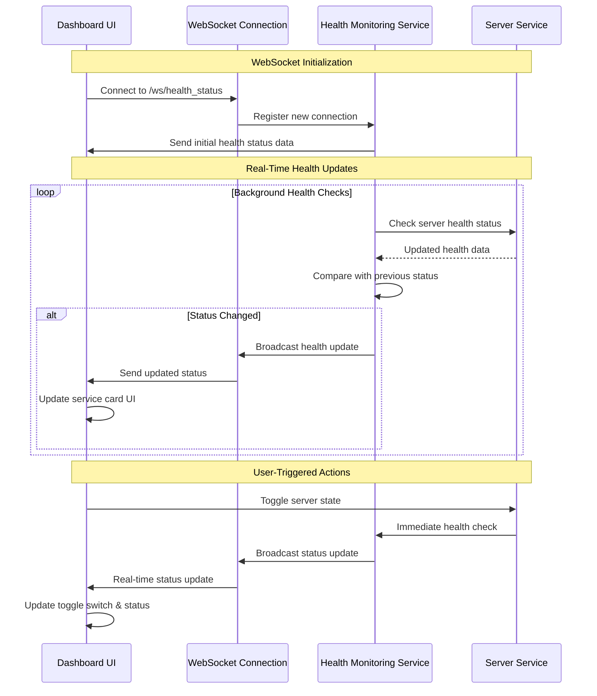

#### WebSocket Client Implementation

```javascript
// Real-time health status WebSocket connection
class HealthStatusManager {
    constructor() {
        this.ws = null;
        this.reconnectInterval = 5000;
        this.maxReconnectAttempts = 10;
        this.reconnectAttempts = 0;
    }
    
    connect() {
        const protocol = window.location.protocol === 'https:' ? 'wss:' : 'ws:';
        const wsUrl = `${protocol}//${window.location.host}/ws/health_status`;
        
        this.ws = new WebSocket(wsUrl);
        
        this.ws.onopen = () => {
            console.log('Health status WebSocket connected');
            this.reconnectAttempts = 0;
        };
        
        this.ws.onmessage = (event) => {
            try {
                const healthData = JSON.parse(event.data);
                this.updateHealthStatusUI(healthData);
            } catch (error) {
                console.error('Error parsing health status data:', error);
            }
        };
        
        this.ws.onclose = () => {
            console.log('Health status WebSocket disconnected');
            this.attemptReconnect();
        };
        
        this.ws.onerror = (error) => {
            console.error('WebSocket error:', error);
        };
    }
    
    updateHealthStatusUI(healthData) {
        for (const [servicePath, status] of Object.entries(healthData)) {
            const serviceCard = document.querySelector(`[data-service-path="${servicePath}"]`);
            if (serviceCard) {
                // Update health status indicator
                const statusElement = serviceCard.querySelector('.health-status');
                if (statusElement) {
                    statusElement.textContent = status.status;
                    statusElement.className = `health-status ${status.status.replace(/[^a-zA-Z0-9]/g, '-')}`;
                }
                
                // Update tool count
                const toolCountElement = serviceCard.querySelector('.tool-count');
                if (toolCountElement) {
                    toolCountElement.textContent = `${status.num_tools} tools`;
                }
                
                // Update timestamp
                const timestampElement = serviceCard.querySelector('.timestamp');
                if (timestampElement && status.last_checked_iso) {
                    timestampElement.textContent = `Last checked: ${status.last_checked_iso}`;
                }
            }
        }
    }
    
    attemptReconnect() {
        if (this.reconnectAttempts < this.maxReconnectAttempts) {
            this.reconnectAttempts++;
            console.log(`Attempting to reconnect (${this.reconnectAttempts}/${this.maxReconnectAttempts})...`);
            setTimeout(() => this.connect(), this.reconnectInterval);
        } else {
            console.error('Max reconnection attempts reached');
        }
    }
}

// Initialize WebSocket connection when page loads
document.addEventListener('DOMContentLoaded', () => {
    const healthManager = new HealthStatusManager();
    healthManager.connect();
});
```

### Server Management UI Workflows

#### Service Toggle Workflow

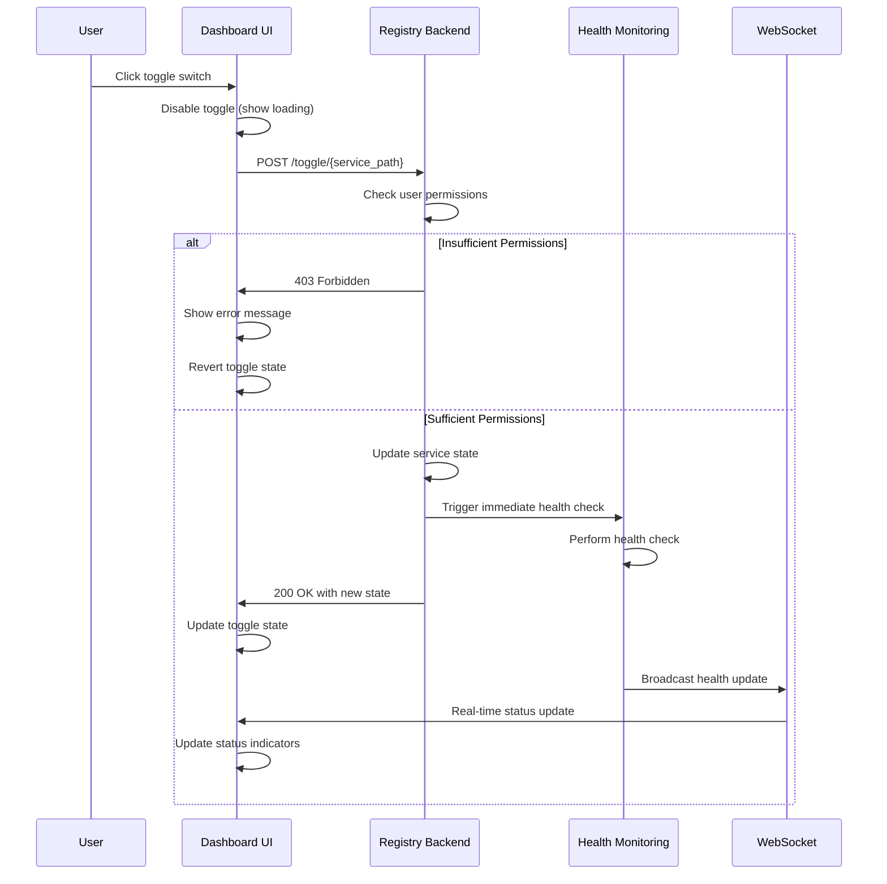

#### Server Creation Workflow (Admin Only)

```mermaid
flowchart TD
    Start([User clicks "Add Server"]) --> CheckPerms{User has<br/>modify permissions?}
    
    CheckPerms -->|No| ShowError[Show permission error]
    CheckPerms -->|Yes| ShowForm[Display server creation form]
    
    ShowForm --> UserFillsForm[User fills server details]
    UserFillsForm --> ValidateForm{Form validation<br/>passes?}
    
    ValidateForm -->|No| ShowValidationErrors[Show validation errors]
    ValidateForm -->|Yes| SubmitForm[Submit form to backend]
    
    SubmitForm --> BackendValidation[Backend validates data]
    BackendValidation --> ServerExists{Server path<br/>already exists?}
    
    ServerExists -->|Yes| ShowConflictError[Show conflict error]
    ServerExists -->|No| CreateServer[Create server entry]
    
    CreateServer --> UpdateFAISS[Update FAISS index]
    UpdateFAISS --> UpdateNginx[Regenerate Nginx config]
    UpdateNginx --> BroadcastUpdate[Broadcast health update]
    BroadcastUpdate --> Success[Redirect to dashboard]
    
    ShowError --> End([End])
    ShowValidationErrors --> ShowForm
    ShowConflictError --> ShowForm
    Success --> End
    
    classDef success fill:#e8f5e8,stroke:#4caf50,stroke-width:2px
    classDef error fill:#ffebee,stroke:#f44336,stroke-width:2px
    classDef process fill:#e3f2fd,stroke:#2196f3,stroke-width:2px
    classDef decision fill:#fff3e0,stroke:#ff9800,stroke-width:2px
    
    class Success success
    class ShowError,ShowValidationErrors,ShowConflictError error
    class ShowForm,UserFillsForm,SubmitForm,BackendValidation,CreateServer,UpdateFAISS,UpdateNginx,BroadcastUpdate process
         class CheckPerms,ValidateForm,ServerExists decision
```

## Authorization & Permissions

### Permission Model Overview

The registry implements a sophisticated role-based access control (RBAC) system with multiple layers of authorization:

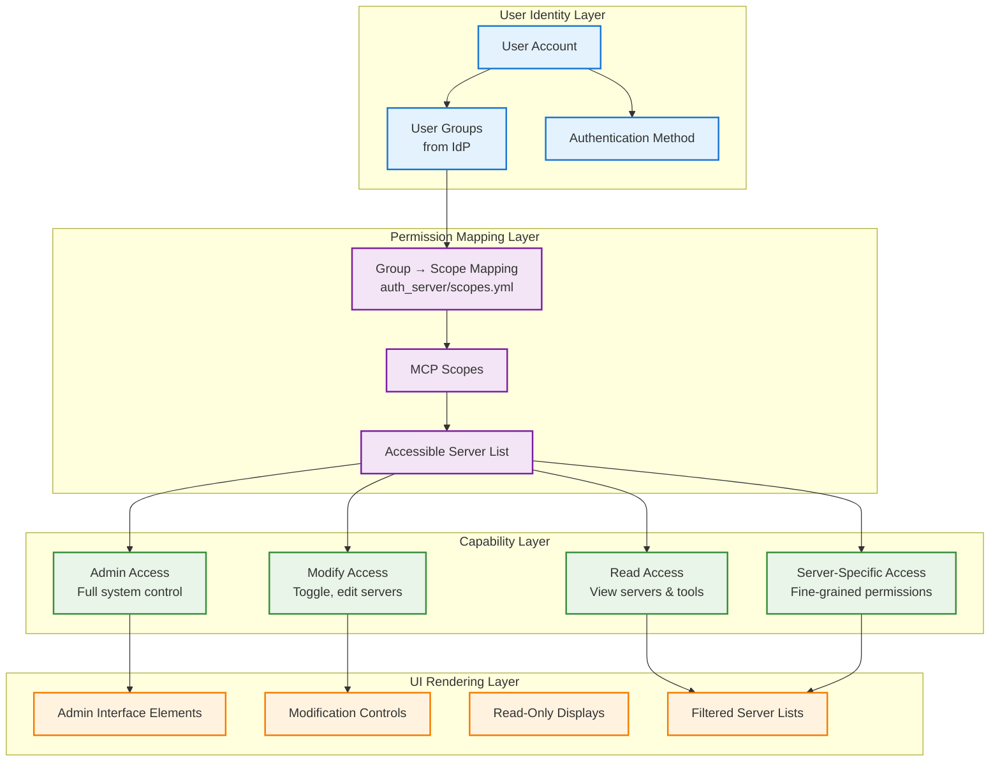

### Role Definitions & Capabilities

#### 1. Administrator Role (`mcp-admin` group)

**Full System Access**:
- View, create, edit, and delete all servers
- Access to all MCP tools regardless of server
- System configuration and user management
- Complete audit trail visibility

**Granted Scopes**:
- `mcp-servers-unrestricted/read`
- `mcp-servers-unrestricted/execute`

**UI Capabilities**:
- All server cards visible and interactive
- Edit buttons on all servers
- "Add New Server" functionality
- Toggle switches on all services
- Admin-only configuration panels

#### 2. Regular User Role (`mcp-user` group)

**Limited Read Access**:
- View only servers explicitly assigned to user
- Read-only access to server information
- Cannot modify server configurations
- Cannot toggle server states

**Granted Scopes**:
- `mcp-servers-restricted/read` (limited scope)

**UI Capabilities**:
- Filtered server list (only accessible servers)
- Read-only status indicators instead of toggles
- No edit buttons or admin controls
- Basic server information display

#### 3. Server-Specific Roles (`mcp-server-{name}` groups)

**Targeted Access**:
- Access to specific servers based on group name
- Execute permissions for assigned servers
- May include toggle permissions for specific services

**Example Scopes**:
- `mcp-servers-fininfo/read` + `mcp-servers-fininfo/execute`
- `mcp-servers-currenttime/read` + `mcp-servers-currenttime/execute`

**UI Capabilities**:
- Filtered view showing only assigned servers
- Toggle functionality for assigned servers
- Edit access may be granted for specific servers

### Scope Configuration System

The authorization system uses a YAML-based configuration file (`auth_server/scopes.yml`) to map groups to permissions:

```yaml
# Group to scope mappings
group_mappings:
  # Administrator - full access
  mcp-admin:
    - "mcp-servers-unrestricted/read"
    - "mcp-servers-unrestricted/execute"
  
  # Regular user - restricted read-only access
  mcp-user:
    - "mcp-servers-restricted/read"
  
  # Server-specific access groups
  mcp-server-fininfo:
    - "mcp-servers-fininfo/read"
    - "mcp-servers-fininfo/execute"
  
  mcp-server-currenttime:
    - "mcp-servers-currenttime/read"
    - "mcp-servers-currenttime/execute"

# Scope definitions with server mappings
mcp-servers-fininfo/read:
  - server: "Financial Info Proxy"
    permissions: ["read"]

mcp-servers-fininfo/execute:
  - server: "Financial Info Proxy"
    permissions: ["read", "execute"]

mcp-servers-currenttime/read:
  - server: "Current Time API"
    permissions: ["read"]

mcp-servers-currenttime/execute:
  - server: "Current Time API"
    permissions: ["read", "execute"]

# Unrestricted scopes (for admins)
mcp-servers-unrestricted/read:
  # Grants access to all servers
  
mcp-servers-unrestricted/execute:
  # Grants execute access to all servers
```

### Permission Checking Implementation

#### Enhanced Authentication Dependency

```python
# registry/auth/dependencies.py
def enhanced_auth(session: str = Cookie(alias="mcp_gateway_session")) -> Dict[str, Any]:
    """Enhanced authentication dependency with full permission context"""
    session_data = get_user_session_data(session)
    
    username = session_data['username']
    groups = session_data.get('groups', [])
    auth_method = session_data.get('auth_method', 'traditional')
    
    logger.info(f"Enhanced auth for {username}: groups={groups}, auth_method={auth_method}")
    
    # Map groups to scopes based on authentication method
    if auth_method == 'oauth2':
        # OAuth2 users get scopes based on Cognito group mappings
        scopes = map_cognito_groups_to_scopes(groups)
        logger.info(f"OAuth2 user {username} mapped to scopes: {scopes}")
    else:
        # Traditional users get admin privileges by default
        scopes = ['mcp-servers-unrestricted/read', 'mcp-servers-unrestricted/execute']
        if not groups:
            groups = ['mcp-admin']
    
    # Calculate accessible servers from scopes
    accessible_servers = get_user_accessible_servers(scopes)
    
    # Determine modification permissions
    can_modify = user_can_modify_servers(groups, scopes)
    
    # Check for admin privileges
    is_admin = 'mcp-admin' in groups
    
    user_context = {
        'username': username,
        'groups': groups,
        'scopes': scopes,
        'auth_method': auth_method,
        'provider': session_data.get('provider', 'local'),
        'accessible_servers': accessible_servers,
        'can_modify_servers': can_modify,
        'is_admin': is_admin
    }
    
    logger.debug(f"Final user context for {username}: {user_context}")
    return user_context
```

#### Group to Scope Mapping

```python
# registry/auth/dependencies.py
def map_cognito_groups_to_scopes(groups: List[str]) -> List[str]:
    """Map Cognito groups to MCP scopes using scopes.yml configuration"""
    scopes = []
    group_mappings = SCOPES_CONFIG.get('group_mappings', {})
    
    for group in groups:
        if group in group_mappings:
            group_scopes = group_mappings[group]
            scopes.extend(group_scopes)
            logger.debug(f"Mapped group '{group}' to scopes: {group_scopes}")
        else:
            logger.debug(f"No scope mapping found for group: {group}")
    
    # Remove duplicates while preserving order
    unique_scopes = list(dict.fromkeys(scopes))
    logger.info(f"Final mapped scopes: {unique_scopes}")
    return unique_scopes

def get_user_accessible_servers(user_scopes: List[str]) -> List[str]:
    """Get list of all servers the user has access to based on their scopes"""
    accessible_servers = set()
    
    for scope in user_scopes:
        # Check for unrestricted access
        if scope in ['mcp-servers-unrestricted/read', 'mcp-servers-unrestricted/execute']:
            return ['*']  # Special marker for all servers
        
        # Get servers for specific scopes
        server_names = get_servers_for_scope(scope)
        accessible_servers.update(server_names)
    
    return list(accessible_servers)

def user_can_modify_servers(user_groups: List[str], user_scopes: List[str]) -> bool:
    """Check if user can modify servers (toggle, edit)"""
    # Admin users can always modify
    if 'mcp-admin' in user_groups:
        return True
    
    # Users with unrestricted execute access can modify
    if 'mcp-servers-unrestricted/execute' in user_scopes:
        return True
    
    # Check for any execute permissions
    execute_scopes = [scope for scope in user_scopes if '/execute' in scope]
    return len(execute_scopes) > 0
```

### Server Access Filtering

#### Permission-Based Server Filtering

```python
# registry/services/server_service.py
def get_all_servers_with_permissions(self, accessible_servers: Optional[List[str]] = None) -> Dict[str, Dict[str, Any]]:
    """Get servers filtered by user permissions"""
    all_servers = self.get_all_servers()
    
    # Admin users or users with unrestricted access see all servers
    if accessible_servers is None or '*' in accessible_servers:
        logger.info("User has unrestricted server access")
        return all_servers
    
    # Filter servers based on accessible server names
    filtered_servers = {}
    for path, server_info in all_servers.items():
        server_name = server_info.get("server_name", "")
        if server_name in accessible_servers:
            filtered_servers[path] = server_info
            logger.debug(f"Server '{server_name}' accessible to user")
        else:
            logger.debug(f"Server '{server_name}' filtered out for user")
    
    logger.info(f"Filtered server list: {len(filtered_servers)} of {len(all_servers)} servers accessible")
    return filtered_servers

def user_can_access_server_path(self, path: str, accessible_servers: List[str]) -> bool:
    """Check if user can access a specific server path"""
    if '*' in accessible_servers:
        return True  # Unrestricted access
    
    server_info = self.get_server_info(path)
    if not server_info:
        return False
    
    server_name = server_info.get("server_name", "")
    return server_name in accessible_servers
```

### Route-Level Permission Enforcement

#### Protected Route Examples

```python
# registry/api/server_routes.py

@router.get("/", response_class=HTMLResponse)
async def read_root(request: Request, 
                   user_context: Annotated[dict, Depends(enhanced_auth)]):
    """Main dashboard with permission-based server filtering"""
    # Filter servers based on user permissions
    if user_context['is_admin']:
        all_servers = server_service.get_all_servers()
        logger.info(f"Admin user accessing all {len(all_servers)} servers")
    else:
        all_servers = server_service.get_all_servers_with_permissions(
            user_context['accessible_servers']
        )
        logger.info(f"User accessing {len(all_servers)} permitted servers")
    
    # Render dashboard with filtered content
    return templates.TemplateResponse("index.html", {
        "request": request, 
        "services": service_data, 
        "username": user_context['username'],
        "user_context": user_context
    })

@router.post("/toggle/{service_path:path}")
async def toggle_service_route(service_path: str,
                              user_context: Annotated[dict, Depends(enhanced_auth)]):
    """Service toggle with multi-level permission checking"""
    # Check global modification permission
    if not user_context['can_modify_servers']:
        logger.warning(f"User {user_context['username']} attempted toggle without modify permissions")
        raise HTTPException(status_code=403, 
                          detail="You do not have permission to modify servers")
    
    # For non-admin users, check specific server access
    if not user_context['is_admin']:
        if not server_service.user_can_access_server_path(
            service_path, user_context['accessible_servers']):
            logger.warning(f"User {user_context['username']} attempted to access {service_path} without permission")
            raise HTTPException(status_code=403,
                              detail="You do not have access to this server")
    
    # Proceed with toggle operation
    return perform_toggle_operation(service_path, user_context)

@router.get("/api/server_details/{service_path:path}")
async def get_server_details(service_path: str,
                            user_context: Annotated[dict, Depends(enhanced_auth)]):
    """Server details with permission-based filtering"""
    # Handle special '/all' endpoint for admins
    if service_path == '/all':
        if user_context['is_admin']:
            return server_service.get_all_servers()
        else:
            return server_service.get_all_servers_with_permissions(
                user_context['accessible_servers']
            )
    
    # Check individual server access
    server_info = server_service.get_server_info(service_path)
    if not server_info:
        raise HTTPException(status_code=404, detail="Service not found")
    
    if not user_context['is_admin']:
        if not server_service.user_can_access_server_path(
            service_path, user_context['accessible_servers']):
            raise HTTPException(status_code=403, 
                              detail="Access denied to this server")
    
    return server_info
```

### Permission Validation Flow

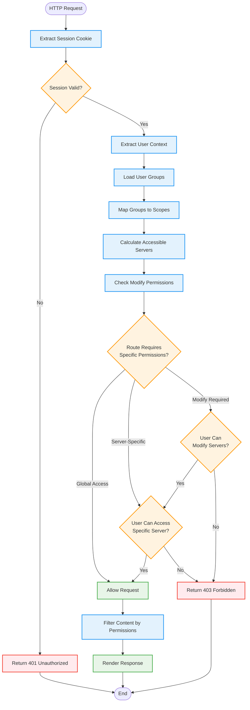

## Technical Implementation

### Session Management Deep Dive

#### Session Cookie Architecture

The registry uses `itsdangerous.URLSafeTimedSerializer` for secure, stateless session management:

```python
# registry/auth/dependencies.py
from itsdangerous import URLSafeTimedSerializer, SignatureExpired, BadSignature

# Initialize session signer with secret key
signer = URLSafeTimedSerializer(settings.secret_key)

def create_session_cookie(username: str, auth_method: str = "traditional", 
                         provider: str = "local") -> str:
    """Create a secure session cookie for a user"""
    session_data = {
        "username": username,
        "auth_method": auth_method,  # 'traditional' or 'oauth2'
        "provider": provider,        # 'local', 'cognito', 'saml', etc.
        "created_at": datetime.utcnow().isoformat(),
        "groups": [],               # Populated during OAuth2 flow
        "scopes": []                # Calculated from groups
    }
    
    # Create signed, time-limited cookie
    return signer.dumps(session_data)
```

#### Session Validation Implementation

```python
def get_user_session_data(session: str = Cookie(alias="mcp_gateway_session")) -> Dict[str, Any]:
    """Extract and validate session data from cookie"""
    if not session:
        raise HTTPException(status_code=401, detail="Authentication required")
    
    try:
        # Validate signature and expiration
        data = signer.loads(session, max_age=settings.session_max_age_seconds)
        
        if not data.get('username'):
            raise HTTPException(status_code=401, detail="Invalid session data")
        
        # Set defaults for traditional auth users
        if data.get('auth_method') != 'oauth2':
            data.setdefault('groups', ['mcp-admin'])
            data.setdefault('scopes', [
                'mcp-servers-unrestricted/read', 
                'mcp-servers-unrestricted/execute'
            ])
        
        return data
        
    except SignatureExpired:
        raise HTTPException(status_code=401, detail="Session has expired")
    except BadSignature:
        raise HTTPException(status_code=401, detail="Invalid session")
    except Exception as e:
        logger.error(f"Session validation error: {e}")
        raise HTTPException(status_code=401, detail="Authentication failed")
```

### OAuth2 Integration Architecture

#### External Auth Server Communication

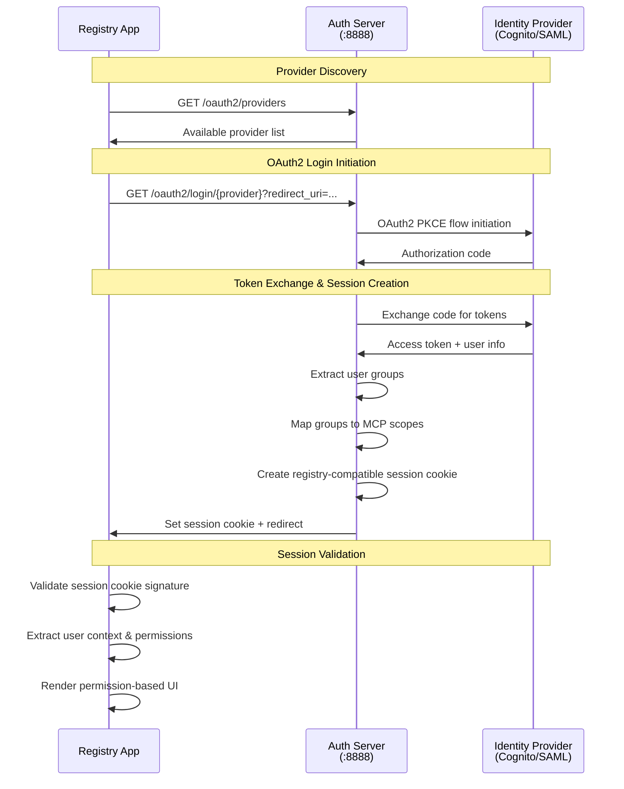

#### Provider Configuration Management

```python
# registry/auth/routes.py
async def get_oauth2_providers():
    """Dynamically fetch available OAuth2 providers from auth server"""
    try:
        async with httpx.AsyncClient() as client:
            response = await client.get(
                f"{settings.auth_server_url}/oauth2/providers", 
                timeout=5.0
            )
            if response.status_code == 200:
                data = response.json()
                providers = data.get("providers", [])
                logger.info(f"Loaded {len(providers)} OAuth2 providers")
                return providers
    except httpx.TimeoutException:
        logger.warning("Timeout fetching OAuth2 providers from auth server")
    except httpx.ConnectError:
        logger.warning("Cannot connect to auth server for provider discovery")
    except Exception as e:
        logger.warning(f"Failed to fetch OAuth2 providers: {e}")
    
    return []  # Fallback to traditional auth only
```

### Authentication Dependencies System

#### Dependency Injection Hierarchy

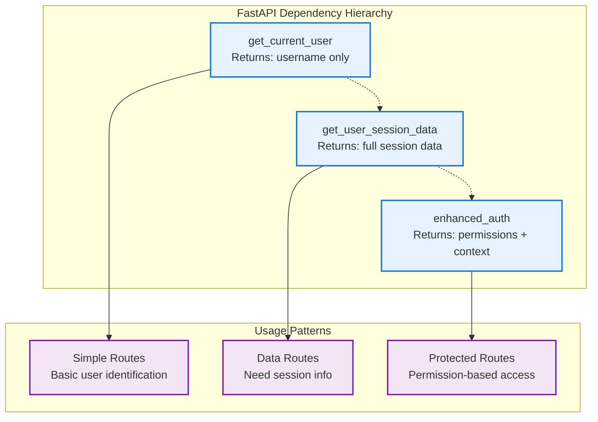

#### Implementation Examples

```python
# registry/auth/dependencies.py

# Level 1: Basic Authentication
def get_current_user(session: str = Cookie(alias="mcp_gateway_session")) -> str:
    """Basic authentication - returns username only"""
    if not session:
        raise HTTPException(status_code=401, detail="Authentication required")
    
    try:
        data = signer.loads(session, max_age=settings.session_max_age_seconds)
        username = data.get('username')
        if not username:
            raise HTTPException(status_code=401, detail="Invalid session data")
        return username
    except (SignatureExpired, BadSignature):
        raise HTTPException(status_code=401, detail="Invalid or expired session")

# Level 2: Session Data Extraction  
def get_user_session_data(session: str = Cookie(alias="mcp_gateway_session")) -> Dict[str, Any]:
    """Full session data extraction with validation"""
    # Implementation shown above
    pass

# Level 3: Enhanced Authentication with Permissions
def enhanced_auth(session: str = Cookie(alias="mcp_gateway_session")) -> Dict[str, Any]:
    """Complete user context with permissions and authorization"""
    session_data = get_user_session_data(session)
    
    # Calculate permissions and accessible servers
    # Implementation shown in Authorization section
    return user_context
```

### WebSocket Authentication Handling

#### WebSocket Session Validation

```python
# registry/health/routes.py
@router.websocket("/ws/health_status")
async def websocket_endpoint(websocket: WebSocket):
    """WebSocket endpoint with automatic session validation"""
    connection_added = False
    try:
        # WebSocket cookies are automatically included in handshake
        # Validate session before accepting connection
        session_cookie = None
        for cookie in websocket.cookies:
            if cookie.name == settings.session_cookie_name:
                session_cookie = cookie.value
                break
        
        if session_cookie:
            try:
                # Validate session
                session_data = signer.loads(
                    session_cookie, 
                    max_age=settings.session_max_age_seconds
                )
                username = session_data.get('username')
                if username:
                    logger.info(f"WebSocket connection from authenticated user: {username}")
                else:
                    raise ValueError("No username in session")
            except Exception as e:
                logger.warning(f"WebSocket authentication failed: {e}")
                await websocket.close(code=1008, reason="Authentication failed")
                return
        else:
            logger.warning("WebSocket connection without valid session cookie")
            await websocket.close(code=1008, reason="Authentication required")
            return
        
        # Accept connection after successful authentication
        connection_added = await health_service.add_websocket_connection(websocket)
        if not connection_added:
            return  # Connection rejected (server at capacity)
        
        # Keep connection alive
        while True:
            try:
                await asyncio.wait_for(websocket.receive_text(), timeout=30.0)
            except asyncio.TimeoutError:
                await websocket.ping()  # Keep-alive ping
            
    except WebSocketDisconnect:
        logger.debug(f"WebSocket client disconnected")
    except Exception as e:
        logger.warning(f"WebSocket error: {e}")
    finally:
        if connection_added:
            await health_service.remove_websocket_connection(websocket)
```

### Database-Free Architecture

The registry implements a **stateless, file-based architecture** that doesn't require a traditional database:

#### Server Data Storage

```python
# registry/services/server_service.py
class ServerService:
    """File-based server management service"""
    
    def __init__(self):
        self.servers: Dict[str, Dict[str, Any]] = {}
        self.enabled_services: Set[str] = set()
    
    def load_servers_and_state(self):
        """Load server definitions from JSON files and state from state file"""
        # Load individual server definitions
        servers_dir = settings.servers_dir
        for json_file in servers_dir.glob("*.json"):
            if json_file.name == "server_state.json":
                continue  # Skip state file
            
            try:
                with open(json_file, "r") as f:
                    server_data = json.load(f)
                    path = server_data.get("path")
                    if path:
                        self.servers[path] = server_data
                        logger.info(f"Loaded server definition: {path}")
            except Exception as e:
                logger.error(f"Error loading {json_file}: {e}")
        
        # Load service state
        self._load_service_state()
    
    def _load_service_state(self):
        """Load enabled/disabled state from server_state.json"""
        state_file = settings.state_file_path
        if state_file.exists():
            try:
                with open(state_file, "r") as f:
                    state_data = json.load(f)
                    for path, enabled in state_data.items():
                        if enabled and path in self.servers:
                            self.enabled_services.add(path)
                logger.info(f"Loaded service state for {len(state_data)} services")
            except Exception as e:
                logger.error(f"Error loading service state: {e}")
    
    def save_service_state(self):
        """Save current enabled/disabled state to file"""
        state_data = {}
        for path in self.servers:
            state_data[path] = path in self.enabled_services
        
        try:
            with open(settings.state_file_path, "w") as f:
                json.dump(state_data, f, indent=2)
            logger.info("Service state saved successfully")
        except Exception as e:
            logger.error(f"Error saving service state: {e}")
```

#### Configuration Management

```python
# registry/core/config.py
class Settings(BaseSettings):
    """Centralized configuration with environment variable support"""
    
    # Development vs Production path detection
    @property
    def is_local_dev(self) -> bool:
        """Detect if running in local development mode"""
        return not Path("/app").exists()
    
    @property
    def servers_dir(self) -> Path:
        """Dynamic path resolution for server definitions"""
        if self.is_local_dev:
            return Path.cwd() / "registry" / "servers"
        return self.container_registry_dir / "servers"
    
    @property
    def templates_dir(self) -> Path:
        """Dynamic path resolution for templates"""
        if self.is_local_dev:
            return Path.cwd() / "registry" / "templates"
        return self.container_registry_dir / "templates"
```

## Configuration

### Environment Variables Reference

#### Core Authentication Settings

```bash
# Session Management
SECRET_KEY=your-secure-random-secret-key-here
SESSION_COOKIE_NAME=mcp_gateway_session
SESSION_MAX_AGE_SECONDS=28800  # 8 hours default

# Traditional Authentication (for local development)
ADMIN_USER=admin
ADMIN_PASSWORD=secure-password-here

# External Auth Server Integration
AUTH_SERVER_URL=http://localhost:8888
AUTH_SERVER_EXTERNAL_URL=http://localhost:8888  # For browser redirects

# Path Configuration (auto-detected in most cases)
CONTAINER_APP_DIR=/app
CONTAINER_REGISTRY_DIR=/app/registry
CONTAINER_LOG_DIR=/app/logs
```

#### OAuth2 Provider Configuration

```bash
# Amazon Cognito Integration (if using Cognito directly)
COGNITO_DOMAIN=your-cognito-domain
COGNITO_CLIENT_ID=your-cognito-client-id
COGNITO_REGION=us-east-1

# Custom OAuth2 Providers (configured in auth server)
# These are typically configured in the auth_server application
```

### Development vs Production Configuration

#### Local Development Setup

```python
# Automatic detection and configuration
# registry/core/config.py

@property
def is_local_dev(self) -> bool:
    """Check if running in local development mode"""
    return not Path("/app").exists()

# Development paths
if settings.is_local_dev:
    # Paths resolve to ./registry/ subdirectories
    servers_dir = Path.cwd() / "registry" / "servers"
    templates_dir = Path.cwd() / "registry" / "templates"
    static_dir = Path.cwd() / "registry" / "static"
    log_file = Path.cwd() / "logs" / "registry.log"
```

#### Container/Production Setup

```python
# Production paths (when /app exists)
else:
    # Paths resolve to /app/registry/ structure
    servers_dir = Path("/app/registry/servers")
    templates_dir = Path("/app/registry/templates")
    static_dir = Path("/app/registry/static")
    log_file = Path("/app/logs/registry.log")
```

### Authentication Provider Setup

#### Traditional Authentication Configuration

```python
# registry/auth/dependencies.py
def validate_login_credentials(username: str, password: str) -> bool:
    """Validate traditional login credentials against environment variables"""
    return (username == settings.admin_user and 
            password == settings.admin_password)
```

#### OAuth2 Integration Setup

1. **Configure Auth Server** (separate application):
   ```yaml
   # auth_server/config.yml
   providers:
     cognito:
       domain: your-cognito-domain
       client_id: your-client-id
       region: us-east-1
       
     saml:
       endpoint: https://your-saml-provider.com/saml
       entity_id: your-entity-id
   ```

2. **Configure Group Mappings**:
   ```yaml
   # auth_server/scopes.yml
   group_mappings:
     mcp-admin:
       - "mcp-servers-unrestricted/read"
       - "mcp-servers-unrestricted/execute"
   ```

### Security Configuration

#### Secret Key Management

```python
# registry/core/config.py
def __init__(self, **kwargs):
    super().__init__(**kwargs)
    # Generate secret key if not provided
    if not self.secret_key:
        self.secret_key = secrets.token_hex(32)
        logger.warning("Generated random SECRET_KEY - sessions will not persist across restarts")
```

#### Session Security Settings

```python
# Session cookie configuration
response.set_cookie(
    key=settings.session_cookie_name,
    value=session_data,
    max_age=settings.session_max_age_seconds,
    httponly=True,        # Prevent XSS access
    samesite="lax",       # CSRF protection
    secure=False          # Set to True in production with HTTPS
)
```

### Deployment Configuration Examples

#### Docker Compose Setup

```yaml
# docker-compose.yml
services:
  registry:
    build: .
    environment:
      - SECRET_KEY=${SECRET_KEY}
      - ADMIN_USER=${ADMIN_USER}
      - ADMIN_PASSWORD=${ADMIN_PASSWORD}
      - AUTH_SERVER_URL=http://auth-server:8888
      - AUTH_SERVER_EXTERNAL_URL=http://localhost:8888
    volumes:
      - ./registry/servers:/app/registry/servers
      - ./logs:/app/logs
    ports:
      - "7860:7860"
  
  auth-server:
    build: ./auth_server
    environment:
      - COGNITO_DOMAIN=${COGNITO_DOMAIN}
      - COGNITO_CLIENT_ID=${COGNITO_CLIENT_ID}
    ports:
      - "8888:8888"
```

#### Environment File Template

```bash
# .env file template
SECRET_KEY=generate-a-secure-random-key-here
ADMIN_USER=admin
ADMIN_PASSWORD=change-this-secure-password

# Auth Server Configuration
AUTH_SERVER_URL=http://localhost:8888
AUTH_SERVER_EXTERNAL_URL=http://localhost:8888

# OAuth2 Provider Settings (if applicable)
COGNITO_DOMAIN=your-cognito-domain
COGNITO_CLIENT_ID=your-client-id
COGNITO_REGION=us-east-1

# Optional: Custom paths (usually auto-detected)
# CONTAINER_REGISTRY_DIR=/custom/path/registry
# CONTAINER_LOG_DIR=/custom/path/logs
```

## Troubleshooting

### Common Authentication Issues

#### 1. Session Cookie Problems

**Issue**: Users get redirected to login page repeatedly

**Diagnosis**:
```python
# Add debug logging to session validation
def get_user_session_data(session: str = None) -> Dict[str, Any]:
    logger.info(f"Session cookie received: {session[:20] if session else 'None'}...")
    
    try:
        data = signer.loads(session, max_age=settings.session_max_age_seconds)
        logger.info(f"Session data valid for user: {data.get('username')}")
        return data
    except SignatureExpired:
        logger.warning("Session cookie has expired")
        raise HTTPException(status_code=401, detail="Session has expired")
    except BadSignature:
        logger.warning("Invalid session cookie signature")
        raise HTTPException(status_code=401, detail="Invalid session")
```

**Common Solutions**:
- **Inconsistent SECRET_KEY**: Ensure `SECRET_KEY` is consistent across application restarts
- **Clock Skew**: Check system time if using multiple servers
- **Cookie Domain Issues**: Verify cookie domain matches request domain
- **Browser Issues**: Clear browser cookies and try again

#### 2. OAuth2 Integration Issues

**Issue**: OAuth2 login fails or redirects incorrectly

**Diagnosis**:
```python
# Debug OAuth2 callback handling
@router.get("/auth/callback")
async def oauth2_callback(request: Request, error: str = None, details: str = None):
    logger.info(f"OAuth2 callback received - Error: {error}, Details: {details}")
    
    if error:
        logger.error(f"OAuth2 authentication error: {error} - {details}")
        return RedirectResponse(url=f"/login?error={urllib.parse.quote(error)}")
    
    # Check session cookie from auth server
    session_cookie = request.cookies.get(settings.session_cookie_name)
    logger.info(f"OAuth2 callback session cookie: {'Present' if session_cookie else 'Missing'}")
    
    if session_cookie:
        try:
            session_data = signer.loads(session_cookie, max_age=settings.session_max_age_seconds)
            logger.info(f"OAuth2 session valid for: {session_data.get('username')}")
            return RedirectResponse(url="/", status_code=302)
        except Exception as e:
            logger.error(f"OAuth2 session validation failed: {e}")
    
    return RedirectResponse(url="/login?error=oauth2_session_invalid", status_code=302)
```

**Common Solutions**:
- **Auth Server Connectivity**: Test auth server: `curl http://localhost:8888/oauth2/providers`
- **URL Configuration**: Verify `AUTH_SERVER_URL` and `AUTH_SERVER_EXTERNAL_URL` settings
- **Provider Configuration**: Check OAuth2 client configuration in identity provider
- **Redirect URI Mismatch**: Ensure redirect URIs match in provider configuration

#### 3. Permission and Authorization Issues

**Issue**: Users can't access servers they should have permission for

**Diagnosis**:
```python
# Debug permission calculation
def debug_user_permissions(user_context: dict):
    logger.info("=== USER PERMISSION DEBUG ===")
    logger.info(f"Username: {user_context['username']}")
    logger.info(f"Auth Method: {user_context['auth_method']}")
    logger.info(f"Groups: {user_context['groups']}")
    logger.info(f"Scopes: {user_context['scopes']}")
    logger.info(f"Accessible Servers: {user_context['accessible_servers']}")
    logger.info(f"Can Modify: {user_context['can_modify_servers']}")
    logger.info(f"Is Admin: {user_context['is_admin']}")
    logger.info("============================")

# Add to enhanced_auth function
def enhanced_auth(session: str = None) -> Dict[str, Any]:
    # ... existing code ...
    
    user_context = {
        # ... context building ...
    }
    
    debug_user_permissions(user_context)  # Add this line
    return user_context
```

**Common Solutions**:
- **Group Mapping Issues**: Verify `auth_server/scopes.yml` configuration
- **User Group Assignment**: Check user group assignments in identity provider (Cognito)
- **Server Name Mismatch**: Ensure server names in scopes.yml exactly match server definitions
- **Scope Configuration**: Verify scope definitions reference correct server names

#### 4. WebSocket Authentication Issues

**Issue**: Real-time updates not working, WebSocket connections failing

**Diagnosis**:
```python
# Debug WebSocket authentication
@router.websocket("/ws/health_status")
async def websocket_endpoint(websocket: WebSocket):
    logger.info(f"WebSocket connection attempt from: {websocket.client}")
    
    # Debug cookie extraction
    session_cookie = None
    logger.info(f"WebSocket cookies: {list(websocket.cookies.keys())}")
    
    for cookie_name, cookie_value in websocket.cookies.items():
        logger.info(f"Cookie: {cookie_name} = {cookie_value[:20]}...")
        if cookie_name == settings.session_cookie_name:
            session_cookie = cookie_value
    
    if not session_cookie:
        logger.warning("WebSocket connection without session cookie")
        await websocket.close(code=1008, reason="No session cookie")
        return
    
    try:
        session_data = signer.loads(session_cookie, max_age=settings.session_max_age_seconds)
        username = session_data.get('username')
        logger.info(f"WebSocket authenticated for user: {username}")
        await websocket.accept()
    except Exception as e:
        logger.error(f"WebSocket authentication failed: {e}")
        await websocket.close(code=1008, reason="Authentication failed")
```

**Common Solutions**:
- **Browser Cookie Issues**: Check browser developer tools for cookie presence
- **WebSocket URL**: Verify WebSocket URL scheme (ws:// vs wss://)
- **Proxy Configuration**: Ensure reverse proxy supports WebSocket upgrades
- **Firewall Issues**: Check if WebSocket ports are accessible

### Health Check and Monitoring

#### Authentication Health Endpoint

```python
# registry/main.py or separate health module
@app.get("/health/auth")
async def auth_health_check():
    """Comprehensive authentication system health check"""
    health_status = {
        "timestamp": datetime.utcnow().isoformat(),
        "components": {
            "session_signer": "unknown",
            "auth_server": "unknown",
            "oauth2_providers": [],
            "scope_config": "unknown"
        }
    }
    
    # Test session signer
    try:
        test_data = {"test": "data"}
        test_cookie = signer.dumps(test_data)
        decoded_data = signer.loads(test_cookie, max_age=60)
        if decoded_data == test_data:
            health_status["components"]["session_signer"] = "ok"
        else:
            health_status["components"]["session_signer"] = "error: data mismatch"
    except Exception as e:
        health_status["components"]["session_signer"] = f"error: {e}"
    
    # Test auth server connectivity
    try:
        async with httpx.AsyncClient(timeout=5.0) as client:
            response = await client.get(f"{settings.auth_server_url}/health")
            if response.status_code == 200:
                health_status["components"]["auth_server"] = "ok"
                
                # Test OAuth2 providers endpoint
                providers_response = await client.get(f"{settings.auth_server_url}/oauth2/providers")
                if providers_response.status_code == 200:
                    providers_data = providers_response.json()
                    health_status["components"]["oauth2_providers"] = providers_data.get("providers", [])
                else:
                    health_status["components"]["oauth2_providers"] = "error: provider endpoint failed"
            else:
                health_status["components"]["auth_server"] = f"error: HTTP {response.status_code}"
    except httpx.TimeoutException:
        health_status["components"]["auth_server"] = "error: timeout"
    except httpx.ConnectError:
        health_status["components"]["auth_server"] = "error: connection failed"
    except Exception as e:
        health_status["components"]["auth_server"] = f"error: {e}"
    
    # Test scope configuration
    try:
        from .auth.dependencies import SCOPES_CONFIG
        if SCOPES_CONFIG and "group_mappings" in SCOPES_CONFIG:
            group_count = len(SCOPES_CONFIG["group_mappings"])
            health_status["components"]["scope_config"] = f"ok: {group_count} group mappings"
        else:
            health_status["components"]["scope_config"] = "warning: no scope configuration loaded"
    except Exception as e:
        health_status["components"]["scope_config"] = f"error: {e}"
    
    # Overall health determination
    error_components = [k for k, v in health_status["components"].items() if str(v).startswith("error")]
    if error_components:
        health_status["status"] = "unhealthy"
        health_status["errors"] = error_components
    else:
        health_status["status"] = "healthy"
    
    return health_status
```

#### Authentication Event Logging

```python
# Enhanced logging for authentication events
def log_auth_event(event_type: str, username: str = None, details: dict = None, 
                   request: Request = None):
    """Comprehensive authentication event logging"""
    log_data = {
        'event_type': event_type,
        'username': username,
        'timestamp': datetime.utcnow().isoformat(),
        'details': details or {}
    }
    
    if request:
        log_data.update({
            'client_ip': request.client.host if request.client else 'unknown',
            'user_agent': request.headers.get('user-agent', 'unknown'),
            'request_path': str(request.url.path),
            'request_method': request.method
        })
    
    logger.info(f"AUTH_EVENT: {event_type}", extra=log_data)

# Usage examples throughout the application
log_auth_event('LOGIN_SUCCESS', username='admin', request=request)
log_auth_event('LOGIN_FAILED', details={'reason': 'invalid_credentials'}, request=request)
log_auth_event('PERMISSION_DENIED', username='user', 
               details={'resource': '/toggle/fininfo', 'required_permission': 'modify'}, 
               request=request)
log_auth_event('SESSION_EXPIRED', username='user', request=request)
log_auth_event('OAUTH2_LOGIN_START', details={'provider': 'cognito'}, request=request)
log_auth_event('OAUTH2_LOGIN_SUCCESS', username='user@example.com', 
               details={'provider': 'cognito', 'groups': ['mcp-user']}, request=request)
```

### Common Configuration Mistakes

#### 1. Incorrect Path Configuration
```bash
# Wrong - mixing local and container paths
CONTAINER_REGISTRY_DIR=/app/registry
# But running locally where paths should be ./registry/

# Solution: Let the application auto-detect paths or set correctly
# For local development, omit these variables entirely
```

#### 2. Secret Key Issues
```bash
# Wrong - using a weak or default secret key
SECRET_KEY=mysecret

# Correct - use a strong, randomly generated key
SECRET_KEY=$(python -c "import secrets; print(secrets.token_hex(32))")
```

#### 3. Auth Server URL Mismatch
```bash
# Wrong - internal and external URLs are the same in Docker
AUTH_SERVER_URL=http://localhost:8888
AUTH_SERVER_EXTERNAL_URL=http://localhost:8888

# Correct - distinguish internal vs external access
AUTH_SERVER_URL=http://auth-server:8888          # Internal Docker communication
AUTH_SERVER_EXTERNAL_URL=http://localhost:8888   # Browser-accessible URL
```

This comprehensive documentation provides complete coverage of the registry's authentication and authorization system, from high-level architecture to specific implementation details and troubleshooting guidance. 