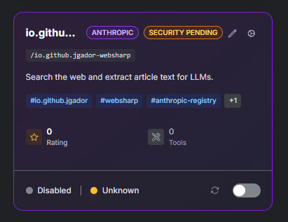

# MCP Security Scanner - Supply Chain Security for MCP Servers

## Introduction

As organizations integrate Model Context Protocol (MCP) servers into their AI workflows, supply chain security becomes critical. MCP servers are third-party components that provide tools and capabilities to AI agents, making them potential vectors for security vulnerabilities, malicious code injection, and data exfiltration.

The MCP Gateway Registry addresses this challenge by integrating automated security scanning powered by the **Cisco AI Defence MCP Scanner**. This open-source security tool performs deep analysis of MCP server tools to identify vulnerabilities before they can be exploited in production environments.

**GitHub Repository:** https://github.com/cisco-ai-defense/mcp-scanner

### Security Scanning Workflows

The registry implements two complementary security scanning workflows:

1. **Automated Scanning During Server Addition** - Every new server is scanned before being made available to AI agents
2. **Periodic Registry Scans** - Comprehensive security audits across all enabled servers in the registry

These workflows ensure continuous security monitoring throughout the MCP server lifecycle, from initial registration through ongoing operations.

## Security Scanning During Server Addition

When adding a new MCP server to the registry, a security scan is automatically performed as part of the registration workflow. This pre-deployment scanning prevents vulnerable or malicious servers from being exposed to AI agents.

### Command Format

```bash
./cli/service_mgmt.sh add <config-file> [analyzers]
```

**Parameters:**
- `<config-file>`: JSON configuration file containing server details
- `[analyzers]`: Optional comma-separated list of analyzers to use (default: `yara`)
  - `yara` - Fast pattern-based detection (no API key required)
  - `llm` - AI-powered deep analysis (requires API key)
  - `yara,llm` - Both analyzers for comprehensive coverage

### Example: Adding Cloudflare Documentation Server

**Configuration File** (`cli/examples/cloudflare-docs-server-config.json`):

```json
{
  "server_name": "Cloudflare Documentation MCP Server",
  "description": "Search Cloudflare documentation and get migration guides",
  "path": "/cloudflare-docs",
  "proxy_pass_url": "https://docs.mcp.cloudflare.com/mcp",
  "supported_transports": ["streamable-http"]
}
```

**Adding the Server with Security Scan:**

```bash
# Add with default YARA analyzer (fast, no API key required)
./cli/service_mgmt.sh add cli/examples/cloudflare-docs-server-config.json

# Add with both YARA and LLM analyzers (comprehensive scan)
./cli/service_mgmt.sh add cli/examples/cloudflare-docs-server-config.json yara,llm
```

### Security Scan Results

The scanner analyzes each tool provided by the MCP server and generates a detailed security report. Here's an example of scan results for the Cloudflare Documentation server:

**Scan Output** (`security_scans/docs.mcp.cloudflare.com_mcp.json`):

```json
{
  "analysis_results": {
    "yara_analyzer": {
      "findings": [
        {
          "tool_name": "search_cloudflare_documentation",
          "severity": "SAFE",
          "threat_names": [],
          "threat_summary": "No threats detected",
          "is_safe": true
        },
        {
          "tool_name": "migrate_pages_to_workers_guide",
          "severity": "SAFE",
          "threat_names": [],
          "threat_summary": "No threats detected",
          "is_safe": true
        }
      ]
    }
  },
  "tool_results": [
    {
      "tool_name": "search_cloudflare_documentation",
      "tool_description": "Search the Cloudflare documentation...",
      "status": "completed",
      "is_safe": true,
      "findings": {
        "yara_analyzer": {
          "severity": "SAFE",
          "threat_names": [],
          "threat_summary": "No threats detected",
          "total_findings": 0
        }
      }
    },
    {
      "tool_name": "migrate_pages_to_workers_guide",
      "tool_description": "ALWAYS read this guide before migrating Pages projects to Workers.",
      "status": "completed",
      "is_safe": true,
      "findings": {
        "yara_analyzer": {
          "severity": "SAFE",
          "threat_names": [],
          "threat_summary": "No threats detected",
          "total_findings": 0
        }
      }
    }
  ]
}
```

### What Happens When a Scan Fails

If the security scan detects critical or high severity vulnerabilities:

1. **Server is Added but Disabled** - The server is registered in the database but marked as `disabled`
2. **Security-Pending Tag** - The server receives a `security-pending` tag to flag it for review
3. **AI Agents Cannot Access** - Disabled servers are excluded from agent discovery and tool routing
4. **Visible in UI** - The server appears in the registry UI with clear indicators of its security status
5. **Detailed Report Generated** - A comprehensive JSON report is saved to `security_scans/` directory

**Console Output for Failed Scan:**

```
=== Security Scan ===
Scanning server for security vulnerabilities...
Security scan failed - Server has critical or high severity issues
Server will be registered but marked as UNHEALTHY with security-pending status

Security Issues Found:
  Critical: 2
  High: 3
  Medium: 1
  Low: 0

Detailed report: security_scans/scan_example.com_mcp_20251022_103045.json

=== Security Status Update ===
Marking server as UNHEALTHY due to failed security scan...
Server registered but flagged as security-pending
Review the security scan report before enabling this server

Service example-server successfully added and verified
WARNING: Server failed security scan - Review required before use
```

**Screenshot:**



*Servers that fail security scans are automatically added in disabled state with a `security-pending` tag, requiring administrator review before being enabled.*

This workflow ensures that vulnerable servers never become accessible to AI agents without explicit administrator review and remediation.

## Periodic Registry Scans

Beyond initial registration security checks, the registry supports comprehensive periodic scans of all enabled servers. This ongoing monitoring detects newly discovered vulnerabilities and ensures continued security compliance.

### Command to Run Periodic Scans

```bash
cd /home/ubuntu/repos/mcp-gateway-registry
uv run cli/scan_all_servers.py --base-url https://mcpgateway.example.com
```

**Command Options:**

```bash
# Scan with default YARA analyzer
uv run cli/scan_all_servers.py --base-url https://mcpgateway.example.com

# Scan with both YARA and LLM analyzers (requires API key in .env)
uv run cli/scan_all_servers.py --base-url https://mcpgateway.example.com --analyzers yara,llm

# Specify custom output directory
uv run cli/scan_all_servers.py --base-url https://mcpgateway.example.com --output-dir custom_scans
```

### Generated Report

The periodic scan generates a comprehensive markdown report that provides an executive summary and detailed vulnerability breakdown for each server in the registry.

**Report Locations:**
- **Latest Report:** `security_scans/scan_report.md` (always current)
- **Archived Reports:** `security_scans/reports/scan_report_YYYYMMDD_HHMMSS.md` (timestamped history)

For a complete example of the report format and structure, see [scan_report_example.md](scan_report_example.md).

### Report Contents

The generated security report includes:

1. **Executive Summary**
   - Total servers scanned
   - Pass/fail statistics
   - Overall security posture metrics

2. **Aggregate Vulnerability Statistics**
   - Total count by severity level (Critical, High, Medium, Low)
   - Trend analysis across multiple scans

3. **Per-Server Vulnerability Breakdown**
   - Individual server security status
   - Severity distribution per server
   - Scan timestamp and analyzer information

4. **Detailed Findings for Vulnerable Tools**
   - Specific tool names and descriptions
   - Threat categories and taxonomy
   - AI Security Framework (AITech) classification
   - Remediation guidance

**Example Report Summary:**

---

# MCP Server Security Scan Report

**Scan Date:** 2025-10-21 23:50:03 UTC
**Analyzers Used:** yara

## Executive Summary

- **Total Servers Scanned:** 6
- **Passed:** 2 (33.3%)
- **Failed:** 4 (66.7%)

### Aggregate Vulnerability Statistics

| Severity | Count |
|----------|-------|
| Critical | 0 |
| High | 3 |
| Medium | 0 |
| Low | 0 |

---

These reports enable security teams to track vulnerability trends, prioritize remediation efforts, and maintain compliance with organizational security policies.

## Analyzers

The MCP Scanner supports two analyzer types, each with distinct capabilities and use cases:

### YARA Analyzer

**Type:** Pattern-based detection
**Speed:** Fast (seconds per server)
**API Key Required:** No
**Best For:** Known threat patterns, common vulnerabilities

The YARA analyzer uses signature-based detection rules to identify known security threats including:
- SQL injection patterns
- Command injection vulnerabilities
- Cross-site scripting (XSS) vectors
- Path traversal attempts
- Hardcoded credentials
- Malicious code patterns

YARA scanning is ideal for automated workflows and continuous integration pipelines due to its speed and zero-configuration requirements.

### LLM Analyzer

**Type:** AI-powered semantic analysis
**Speed:** Slower (requires API calls)
**API Key Required:** Yes (OpenAI-compatible API)
**Best For:** Sophisticated threats, zero-day vulnerabilities, context-aware analysis

The LLM analyzer uses large language models to perform deep semantic analysis of tool code and descriptions. It can detect:
- Subtle logic vulnerabilities
- Context-dependent security issues
- Novel attack patterns
- Business logic flaws
- Privacy concerns in data handling

LLM scanning is recommended for high-value or high-risk MCP servers where comprehensive security analysis justifies the additional time and API costs.

### Analyzer Comparison

| Feature | YARA | LLM | Both |
|---------|------|-----|------|
| **Speed** | Fast (seconds) | Slower (minutes) | Slower |
| **API Key** | Not required | Required | Required |
| **Detection Type** | Pattern-based | Semantic analysis | Comprehensive |
| **False Positives** | Low | Medium | Low |
| **Coverage** | Known threats | Known + novel threats | Maximum |
| **Use Case** | Automated scans, CI/CD | Critical servers, deep analysis | High-security environments |

### Configuring LLM Analyzer

To use the LLM analyzer, set the API key in your `.env` file:

```bash
# Add to .env file
MCP_SCANNER_LLM_API_KEY=sk-your-openai-api-key
```

**Using Both Analyzers:**

```bash
# During server addition
./cli/service_mgmt.sh add config.json yara,llm

# During periodic scans
uv run cli/scan_all_servers.py --base-url https://mcpgateway.example.com --analyzers yara,llm
```

### Recommendation

- **Default (YARA only):** Suitable for most use cases, provides fast scanning with no API costs
- **Add LLM:** For critical production servers, sensitive data environments, or when unknown threats are a concern
- **Both analyzers:** Recommended for maximum security coverage in high-stakes deployments

The combination of both analyzers provides defense-in-depth, with YARA catching known threats quickly and LLM performing deeper analysis for sophisticated attacks.

## Prerequisites

### Set LLM API Key (Optional)

Only required if using the LLM analyzer:

```bash
# Add to .env file (recommended)
echo "MCP_SCANNER_LLM_API_KEY=sk-your-api-key" >> .env
```

## Troubleshooting

### API Key Issues

If you see errors about missing API keys when using the LLM analyzer:

```bash
# Verify the key is set
echo $MCP_SCANNER_LLM_API_KEY

# Add to .env file
echo "MCP_SCANNER_LLM_API_KEY=sk-your-key" >> .env
```

Note: The scanner uses `MCP_SCANNER_LLM_API_KEY`, not `OPENAI_API_KEY`.

### Permission Issues

Ensure the `security_scans/` directory is writable:

```bash
mkdir -p security_scans
chmod 755 security_scans
```

## Additional Resources

- **Cisco AI Defence MCP Scanner:** https://github.com/cisco-ai-defense/mcp-scanner
- **Service Management Script:** `cli/service_mgmt.sh`
- **Security Scanner CLI:** `cli/mcp_security_scanner.py`
- **Periodic Scan Script:** `cli/scan_all_servers.py`
- **Example Report:** [scan_report_example.md](scan_report_example.md)
