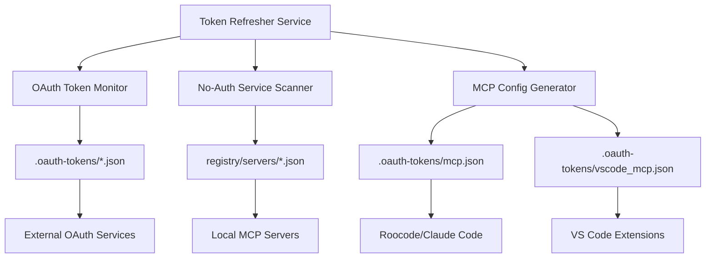
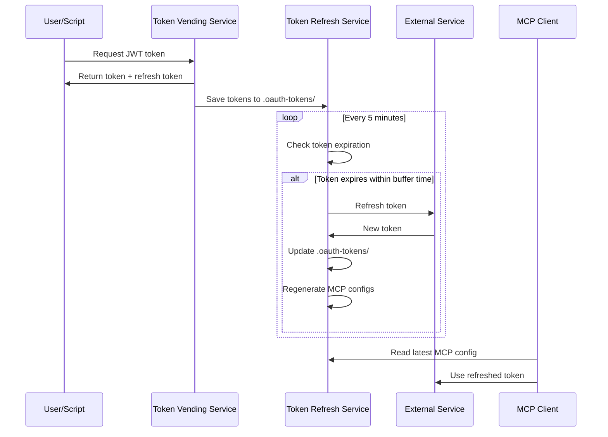

# Token Refresh Service

The MCP Gateway Registry includes an automated token refresh service that maintains continuous authentication by monitoring token expiration and proactively refreshing them. This service ensures uninterrupted access to external services and generates MCP client configurations for coding assistants.

## Overview

The token refresh service provides:

- **Automated Token Monitoring** - Continuously monitors OAuth tokens for expiration
- **Proactive Token Refresh** - Refreshes tokens before they expire using configurable buffer times
- **MCP Configuration Generation** - Creates client configs for VS Code, Cursor, and other coding assistants
- **Service Discovery** - Automatically includes both OAuth-authenticated and no-auth services
- **Background Operation** - Runs as a daemon service with comprehensive logging

## Architecture



The service integrates with:
- **External OAuth services** (Atlassian, SRE Gateway, etc.)
- **Local MCP servers** (Current Time, Real Server Fake Tools, etc.)
- **MCP clients** (VS Code extensions, Claude Code, etc.)

## Setup and Configuration

### Prerequisites

- Python 3.11+ with `uv` package manager
- Valid OAuth tokens in `.oauth-tokens/` directory
- MCP server configurations in `registry/servers/`

### Environment Variables

| Variable | Description | Default |
|----------|-------------|---------|
| `TOKEN_REFRESH_INTERVAL` | Check interval in seconds | 300 (5 minutes) |
| `TOKEN_EXPIRY_BUFFER` | Refresh buffer time in seconds | 3600 (1 hour) |

### Starting the Service

#### Option 1: Using the Launch Script (Recommended)

```bash
# Start with interactive prompts
./start_token_refresher.sh

# Start with custom configuration
export TOKEN_REFRESH_INTERVAL=180  # 3 minutes
export TOKEN_EXPIRY_BUFFER=1800    # 30 minutes
./start_token_refresher.sh
```

#### Option 2: Direct Python Execution

```bash
# Start with default settings
uv run python credentials-provider/token_refresher.py

# Start with custom settings
uv run python credentials-provider/token_refresher.py \
    --interval 300 \
    --buffer 3600
```

### Command Line Options

```
usage: token_refresher.py [-h] [--interval INTERVAL] [--buffer BUFFER]
                         [--log-level {DEBUG,INFO,WARNING,ERROR}]

MCP Gateway OAuth Token Refresher Service

options:
  -h, --help            show this help message and exit
  --interval INTERVAL   Token check interval in seconds (default: 300)
  --buffer BUFFER       Token expiry buffer in seconds (default: 3600)
  --log-level {DEBUG,INFO,WARNING,ERROR}
                        Set the logging level (default: INFO)
```

## Service Management

### Monitoring Service Status

```bash
# Check if service is running
pgrep -f "token_refresher.py"

# View recent logs
tail -f token_refresher.log

# Monitor real-time activity
tail -f token_refresher.log | grep -E "(REFRESH|CONFIG|ERROR)"
```

### Stopping the Service

```bash
# Graceful shutdown
pkill -f "token_refresher.py"

# Force kill if needed
pkill -9 -f "token_refresher.py"
```

### Service Health Checks

The service creates a PID file (`token_refresher.pid`) for process management and logs all activities to `token_refresher.log`.

## Generated Configurations

### MCP Client Configurations

The service automatically generates two MCP configuration files:

#### Roocode/Claude Code Configuration
**File**: `.oauth-tokens/mcp.json`
```json
{
  "mcpServers": {
    "sre-gateway": {
      "command": "uv",
      "args": ["--directory", "/path/to/project", "run", "mcp"],
      "env": {
        "MCP_SERVER_URL": "https://gateway.example.com/mcp/sre-gateway/mcp",
        "MCP_SERVER_AUTH_TOKEN": "Bearer <token>"
      }
    }
  }
}
```

#### VS Code Extension Configuration  
**File**: `.oauth-tokens/vscode_mcp.json`
```json
{
  "mcpServers": {
    "sre-gateway": {
      "command": "npx",
      "args": ["-y", "@modelcontextprotocol/server-fetch"],
      "env": {
        "FETCH_BASE_URL": "https://gateway.example.com/mcp/sre-gateway/mcp",
        "FETCH_HEADERS": "{\"Authorization\": \"Bearer <token>\"}"
      }
    }
  }
}
```

### Service Types

The service automatically includes:

1. **OAuth Services** - Services requiring external authentication (e.g., Atlassian, SRE Gateway)
2. **No-Auth Services** - Local services with `auth_type: "none"` (e.g., Current Time, Real Server Fake Tools)

## Integration Examples

### With JWT Token Vending Service

The token refresh service complements the [JWT Token Vending Service](jwt-token-vending.md) by:

1. **Monitoring vended tokens** for expiration
2. **Automatically refreshing** tokens using stored refresh tokens
3. **Updating MCP configurations** with new tokens
4. **Maintaining continuous service** without manual intervention

### With Existing Authentication Flow



## Monitoring and Logging

### Log Levels

- **INFO** - Normal operations, token refreshes, config generation
- **WARNING** - Token refresh failures, missing services
- **ERROR** - Critical failures, authentication errors
- **DEBUG** - Detailed trace information for troubleshooting

### Sample Log Output

```
2024-09-06 15:30:00,123 - Token refresh check starting...
2024-09-06 15:30:00,124 - Found 2 egress token files to check
2024-09-06 15:30:00,125 - bedrock-agentcore-sre-gateway-egress.json: expires in 2 hours, no refresh needed
2024-09-06 15:30:00,126 - atlassian-atlassian-egress.json: expires in 45 minutes, refreshing...
2024-09-06 15:30:01,234 - Successfully refreshed token for atlassian-atlassian-
2024-09-06 15:30:01,235 - Scanning for no-auth services...
2024-09-06 15:30:01,236 - Found 3 no-auth services: mcpgw, currenttime, realserverfaketools
2024-09-06 15:30:01,237 - Generating MCP configurations...
2024-09-06 15:30:01,345 - Generated Roocode config with 5 servers
2024-09-06 15:30:01,346 - Generated VSCode config with 5 servers
2024-09-06 15:30:01,347 - Token refresh cycle completed successfully
```

## Troubleshooting

### Common Issues

#### Service Won't Start

**Symptoms**: Service exits immediately or fails to start
**Causes**: 
- Missing dependencies
- Invalid OAuth token files
- Permission issues

**Solutions**:
```bash
# Check dependencies
uv run python -c "import httpx, json, time, argparse, asyncio"

# Verify token files
ls -la .oauth-tokens/*.json

# Check permissions
chmod +x credentials-provider/token_refresher.py
chmod +x start_token_refresher.sh
```

#### Token Refresh Failures

**Symptoms**: Tokens not being refreshed, authentication errors
**Causes**:
- Expired refresh tokens
- Invalid OAuth configuration
- Network connectivity issues

**Solutions**:
```bash
# Check token validity
cat .oauth-tokens/*egress.json | jq '.expires_at'

# Test network connectivity
curl -v https://your-oauth-provider.com/token

# Re-run initial OAuth flow
./credentials-provider/oauth/egress_oauth.py
```

#### MCP Configuration Issues

**Symptoms**: MCP clients can't connect, missing services
**Causes**:
- Invalid service configurations
- Missing environment variables
- Incorrect file paths

**Solutions**:
```bash
# Validate generated configs
cat .oauth-tokens/mcp.json | jq '.'
cat .oauth-tokens/vscode_mcp.json | jq '.'

# Check service definitions
ls -la registry/servers/*.json

# Verify environment variables
env | grep -E "(MCP|TOKEN)"
```

### Debug Mode

Enable detailed logging for troubleshooting:

```bash
# Start with debug logging
uv run python credentials-provider/token_refresher.py --log-level DEBUG

# Or set environment variable
export LOG_LEVEL=DEBUG
./start_token_refresher.sh
```

## Security Considerations

### Token Storage

- Token files are stored in `.oauth-tokens/` directory (excluded from Git)
- File permissions are set to `600` (owner read/write only)
- Refresh tokens are encrypted in transit and at rest

### Network Security

- All OAuth communication uses HTTPS/TLS
- Tokens are transmitted using secure headers
- Failed authentication attempts are logged and monitored

### Access Control

- Service runs with minimal required permissions
- No network listeners (outbound connections only)
- Process isolation using dedicated service account (recommended in production)

## Production Deployment

### Systemd Service (Linux)

Create `/etc/systemd/system/token-refresher.service`:

```ini
[Unit]
Description=MCP Gateway Token Refresh Service
After=network.target
Wants=network.target

[Service]
Type=simple
User=mcp-gateway
WorkingDirectory=${HOME}/mcp-gateway-registry
Environment=TOKEN_REFRESH_INTERVAL=300
Environment=TOKEN_EXPIRY_BUFFER=3600
ExecStart=${HOME}/mcp-gateway-registry/.venv/bin/python credentials-provider/token_refresher.py
Restart=always
RestartSec=10

[Install]
WantedBy=multi-user.target
```

Enable and start:
```bash
sudo systemctl enable token-refresher
sudo systemctl start token-refresher
sudo systemctl status token-refresher
```

### Docker Deployment

```dockerfile
FROM python:3.12-slim

WORKDIR /app
COPY . .
RUN pip install uv && uv install

CMD ["uv", "run", "python", "credentials-provider/token_refresher.py"]
```

### Health Monitoring

Set up monitoring for production:

```bash
# Create health check script
cat > /opt/scripts/check-token-refresher.sh << 'EOF'
#!/bin/bash
if ! pgrep -f "token_refresher.py" > /dev/null; then
    echo "CRITICAL: Token refresher service is not running"
    exit 2
fi
echo "OK: Token refresher service is running"
exit 0
EOF
```

## API Reference

### Service Methods

The token refresher service provides these internal methods:

- `_check_token_expiry()` - Check if token needs refresh
- `_refresh_oauth_token()` - Refresh an expired token
- `_scan_noauth_services()` - Discover no-auth services
- `_generate_mcp_configs()` - Generate MCP client configurations
- `_save_configurations()` - Write config files to disk

### Configuration Schema

#### Egress Token File Format
```json
{
  "access_token": "eyJ...",
  "refresh_token": "eyJ...", 
  "expires_at": 1725634800,
  "token_type": "Bearer",
  "scope": "read write"
}
```

#### MCP Server Configuration Format
```json
{
  "server_name": "example-service",
  "auth_type": "oauth" | "none",
  "path": "/mcp/example-service/mcp",
  "supported_transports": ["streamable-http", "sse"]
}
```

## Related Documentation

- [Authentication Guide](auth.md) - OAuth setup and configuration
- [JWT Token Vending](jwt-token-vending.md) - Token generation and management  
- [AI Coding Assistants Setup](ai-coding-assistants-setup.md) - Client configuration
- [Configuration Reference](configuration.md) - Environment variables and settings

## Support

For issues with the token refresh service:

1. Check the [Troubleshooting Guide](FAQ.md)
2. Enable debug logging to gather detailed information
3. Search existing [GitHub Issues](https://github.com/agentic-community/mcp-gateway-registry/issues)
4. Create a new issue with logs and configuration details